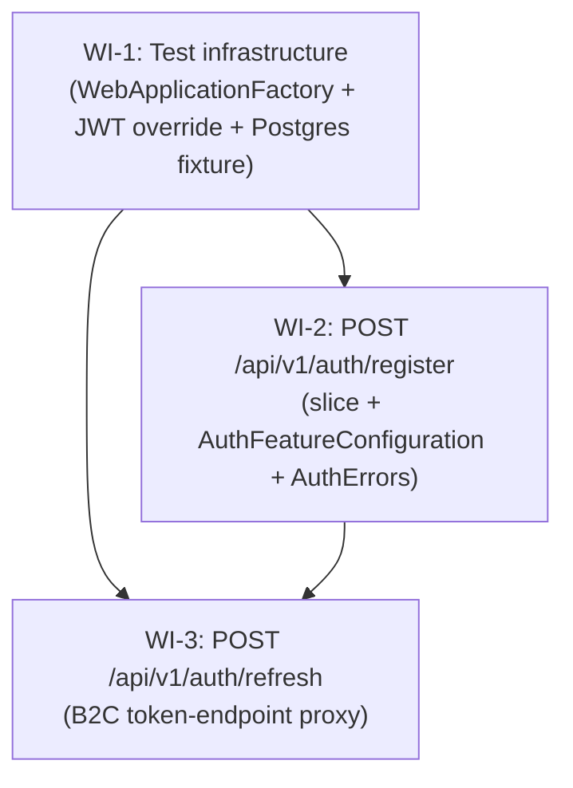

# UC-201 Auth — Work Items

## Assumptions

1. **The User entity, DbContext, and migration already exist and are applied.** Phase 2.1/2.2 landed `users` with a unique index on `azure_ad_b2c_id`, plus AuditableEntity. No new entity, no new migration in scope here.
2. **No new `Common/` or `Authorization/` plumbing is required.** `Program.cs` already wires JwtBearer (RS256, audience optional until ClientId is configured), the `AuthEndpoints` rate-limit policy (10 req/min/IP), the `UsersOnly` authorization policy, FastEndpoints route prefix `api/v1`, and feature auto-discovery.
3. **`AuthFeatureConfiguration` lives next to the slices, not separately.** It is created in WI-2 along with the first endpoint that needs it; WI-3 extends it (registers the named HttpClient) without recreating it. This is why WI-3 depends on WI-2.
4. **No `IRefreshTokenStore` / no backend-stored refresh tokens.** Per spec out-of-scope: refresh is a stateless proxy to Azure AD B2C. The endpoint owns one HttpClient call and a tiny request mapping.
5. **Refresh endpoint is anonymous (`AllowAnonymous`).** The refresh token IS the credential — requiring a valid access token to refresh would defeat the purpose. The `AuthEndpoints` rate limit covers brute-force.
6. **`UserDto` is inlined as `RegisterResponse` for now.** Only one endpoint emits it in this UC. When the second consumer lands (e.g. `GET /me`), promote to `Features/Auth/Shared/UserDto.cs` per `rules/architecture.md#vertical-slice-layout` (`Shared/` is allowed for DTOs reused by 2+ endpoints). Premature extraction would cost a rename later anyway.
7. **Shared integration-test infrastructure is its own WI.** Spec ACs explicitly require Testcontainers + Respawn + a JWT-bearer test override (test signing key on the existing JwtBearer pipeline). None of that exists yet — neither register-happy-path nor refresh-happy-path can be implemented without it. Building it inline in WI-2 would block WI-3 silently and bloat the slice. The fixture also pins `FakeTimeProvider` so `LastActiveAt` assertions are deterministic.
8. **No external identity-handler library is added.** `JwtBearerOptions` + RSA keys from `Microsoft.IdentityModel.Tokens` are already on the dependency graph via `Microsoft.AspNetCore.Authentication.JwtBearer` — sufficient for both production validation and the test signing-key override.
9. **HttpClient is registered as a named `AddHttpClient("AzureAdB2C", ...)` client in `Program.cs` (or in `AuthFeatureConfiguration.AddFeatureDependencies`).** No Polly, no resilience handlers — spec does not call for them. Endpoint resolves via `IHttpClientFactory.CreateClient("AzureAdB2C")`.
10. **`AzureAdB2COptions` is a new record bound from the existing `AzureAdB2C` config section** (Instance, TenantId, PolicyId, ClientId — already present in `appsettings.json`). Endpoint reads via `IOptions<AzureAdB2COptions>`. The 503 path triggers when any of Instance/TenantId/PolicyId is empty (matches what `Program.cs` already treats as "not configured").
11. **Pre-check existence rather than catching `DbUpdateException`** for the duplicate-AzureAdB2CId case. Spec non-functional explicitly says no `DbUpdateException` catch. There is a tiny TOCTOU window — acceptable for this endpoint because the unique index on `azure_ad_b2c_id` (set in `UserConfiguration`) is the ultimate guard, and a 500 from a unique-violation race is preferable to swallowing a legitimate insert error in production.
12. **Validator class is FastEndpoints `Validator<T>`, not FluentValidation `AbstractValidator<T>`.** Banned per CLAUDE.md / `rules/validation.md#validator-class`.

## Dependency Graph

WI-1 is independent. WI-2 is the first slice and creates `AuthFeatureConfiguration` + `AuthErrors` shared scaffolding. WI-3 extends both, so it depends on WI-2. WI-1 is required by both for integration tests.

---

## WI-1: Shared integration-test infrastructure

### Required Reads
- `src/WanderMeet.Api/Program.cs` — to mirror the JwtBearer pipeline shape in test override
- `src/WanderMeet.Api/Infrastructure/EntityFramework/WanderMeetDbContext.cs`
- `src/WanderMeet.Api/Features/Health/GetHealth/GetHealthEndpoint.cs` — smoke target
- `tests/WanderMeet.Api.IntegrationTests/WanderMeet.Api.IntegrationTests.csproj` — packages already referenced

### Deliverables
- `tests/WanderMeet.Api.IntegrationTests/Infrastructure/TestConstants.cs` — `Collections.PipelineTest` const string
- `tests/WanderMeet.Api.IntegrationTests/Infrastructure/PipelineTestCollection.cs` — `[CollectionDefinition]` wiring the fixture
- `tests/WanderMeet.Api.IntegrationTests/Infrastructure/WanderMeetApiFactory.cs` — `WebApplicationFactory<Program>`
  - Override `DefaultConnection` to point at the Testcontainers PostgreSQL connection string.
  - In `ConfigureTestServices`, replace the `JwtBearerOptions` configuration: same RS256, but Authority is null (offline) and `IssuerSigningKey` is the test RSA public key, `ValidIssuer = "wandermeet-tests"`, `ValidateIssuerSigningKey = true`, `ValidateAudience = false`.
  - Register `FakeTimeProvider` as singleton, replacing `TimeProvider.System`.
- `tests/WanderMeet.Api.IntegrationTests/Infrastructure/IntegrationTestFixture.cs` — async lifetime fixture
  - Starts Postgres container, applies EF migrations on first use.
  - Exposes `ResetDatabaseAsync()` (Respawn).
  - Exposes `Services` for direct EF assertions / seeding.
  - Exposes `HttpClient CreateAnonymousClient()` and `HttpClient CreateAuthenticatedClient(string azureAdB2CId)` — the latter signs a token via `TestJwtTokenFactory`.
- `tests/WanderMeet.Api.IntegrationTests/Infrastructure/TestJwtTokenFactory.cs` — issues RS256 JWTs with a configurable `sub` claim, signed by the same in-process RSA key the factory configured into JwtBearer.
- `tests/WanderMeet.Api.IntegrationTests/Infrastructure/IntegrationTestBase.cs` — derives from `FastEndpoints.Testing.TestBase`, primary-ctor `IntegrationTestFixture app`, `SetupAsync` first line `await app.ResetDatabaseAsync();`.
- `tests/WanderMeet.Api.IntegrationTests/Smoke/HealthSmokeTests.cs` — single test calling `GET api/v1/health` to prove the fixture boots.

### Error Paths
- Test JWT override leaking to production: avoided — `ConfigureTestServices` is test-only; `Program.cs` is not modified.
- Test container leaking between collections: each collection has its own fixture instance; Respawn resets between tests in the same collection.

### Tests (this WI's own tests)
- `GetHealth_WithFixture_Returns200` — fixture boots, DB is reachable, ResetDatabaseAsync runs cleanly.
- `TestJwtTokenFactory_IssuedToken_PassesJwtBearerValidation` — issued token reaches an authenticated route as 200; an unsigned/forged token returns 401.

### Verification
`dotnet test --filter "FullyQualifiedName~WanderMeet.Api.IntegrationTests.Smoke"`

---

## WI-2: POST /api/v1/auth/register — Register slice

### Required Reads
- `docs/specs/in-progress/01_UC_201_auth.md`
- `src/WanderMeet.Api/Features/Health/HealthFeatureConfiguration.cs` — canonical shape
- `src/WanderMeet.Api/Features/Health/GetHealth/GetHealthEndpoint.cs` — endpoint pattern in this codebase
- `src/WanderMeet.Api/Database/Entities/User.cs`
- `src/WanderMeet.Api/Infrastructure/EntityFramework/Configurations/UserConfiguration.cs` — confirms unique index on AzureAdB2CId
- `src/WanderMeet.Api/Infrastructure/EntityFramework/WanderMeetDbContext.cs`
- `src/WanderMeet.Api/Common/IFeatureConfiguration.cs`, `RateLimitPolicies.cs`
- `src/WanderMeet.Api/Authorization/AuthorizationPolicies.cs`
- `src/WanderMeet.Shared/ValidationConstants.cs`, `ErrorCodes.cs`

### Deliverables
- `src/WanderMeet.Api/Features/Auth/AuthFeatureConfiguration.cs` — `internal sealed`, parameterless ctor, `FeatureInfo new("Auth", "Sign-up + token refresh via Azure AD B2C")`. `AddFeatureDependencies` registers nothing yet (HttpClient added in WI-3).
- `src/WanderMeet.Api/Features/Auth/Errors/AuthErrors.cs` — central place for `Auth.AlreadyRegistered` (and reserves the namespace for `Auth.B2CNotConfigured` added by WI-3). May be a static class or nested in `WanderMeet.Shared.ErrorCodes` — pick one consistent with existing convention; spec asks for stable codes.
- `src/WanderMeet.Shared/ErrorCodes.cs` — add `Validation.FirstNameRequired`, `Validation.FirstNameTooLong`.
- `src/WanderMeet.Api/Features/Auth/Register/RegisterRequest.cs` — record `(string FirstName)` (or class with `required init`).
- `src/WanderMeet.Api/Features/Auth/Register/RegisterResponse.cs` — record matching spec UserDto: `(Guid Id, string FirstName, bool IsIdVerified, bool IsOpenToday, bool IsOpenToRomance, int TrustScore, int MeetupCount, int CitiesCount, DateTimeOffset CreatedAt)`.
- `src/WanderMeet.Api/Features/Auth/Register/RegisterValidator.cs` — `internal sealed : Validator<RegisterRequest>`; `NotEmpty().WithErrorCode(Validation.FirstNameRequired)`, `MaximumLength(FirstNameMaxLength).WithErrorCode(Validation.FirstNameTooLong)`.
- `src/WanderMeet.Api/Features/Auth/Register/RegisterEndpoint.cs` — `internal sealed Endpoint<RegisterRequest, RegisterResponse>`; primary ctor `(WanderMeetDbContext dbContext, TimeProvider timeProvider)`; `private readonly AuthFeatureConfiguration _featureConfiguration = new();`.
  - `Configure()`: `Post("auth/register")`; `Description(b => b.WithName(nameof(RegisterEndpoint)).WithTags(_featureConfiguration.Info.Name).RequireRateLimiting(RateLimitPolicies.AuthEndpoints))`; `DontCatchExceptions()`; `Policies(nameof(AuthorizationPolicies.UsersOnly))`; Summary covers 201/400/401/409/429.
  - `HandleAsync()`: read sub from `User.FindFirstValue(ClaimTypes.NameIdentifier)`, guard null/empty → `Send.UnauthorizedAsync`. Pre-check existence: `await dbContext.Users.AsNoTracking().AnyAsync(u => u.AzureAdB2CId == sub, ct)`. If true: `AddError(...)` + `Send.ErrorsAsync(409, ct)`; return. Else: `var now = timeProvider.GetUtcNow(); var user = new User { Id = Guid.NewGuid(), AzureAdB2CId = sub, FirstName = req.FirstName, CreatedAt = now, LastActiveAt = now };` (note: `CreatedAt` is set explicitly because no audit interceptor exists yet; check `UserConfiguration` / `AuditableEntity` for default) → `dbContext.Users.Add(user); await dbContext.SaveChangesAsync(ct);` → `await Send.CreatedAtAsync<RegisterEndpoint>(routeValues: null, response: ToResponse(user), cancellation: ct);` or `Send.OkAsync` with 201 if no GET endpoint exists yet (no `GET /auth/register/{id}`). Pragmatic choice: `Send.CreatedAsync` with explicit Location header omitted, OR straight `Send.OkAsync` after manually setting `HttpContext.Response.StatusCode = 201`. **Designer note:** confer with developer on the CreatedAt convention currently shipping in the codebase.

### Error Paths
| Status | Code | Trigger |
|--------|------|---------|
| 400 | `Validation.FirstNameRequired` | FirstName missing/whitespace |
| 400 | `Validation.FirstNameTooLong` | FirstName length > `FirstNameMaxLength` (80) |
| 401 | — | Bearer missing/invalid (JwtBearer middleware) |
| 409 | `Auth.AlreadyRegistered` | Existing User with `AzureAdB2CId == sub` |
| 429 | — | `AuthEndpoints` rate limit (10/min/IP) |

### Tests
- **Unit (`tests/WanderMeet.Api.UnitTests/Features/Auth/Register/`):**
  - `Validate_FirstNameEmpty_FailsWithValidationFirstNameRequired`
  - `Validate_FirstNameWhitespace_FailsWithValidationFirstNameRequired`
  - `Validate_FirstNameExceedsMaxLength_FailsWithValidationFirstNameTooLong`
  - `Validate_FirstNameAtMaxLength_Passes`
- **Integration (`tests/WanderMeet.Api.IntegrationTests/Features/Auth/Register/` — uses WI-1 fixture):**
  - `HandleAsync_FirstRegistration_Returns201AndPersistsUser` — happy path, asserts HTTP, body, and DB row (AzureAdB2CId, FirstName, LastActiveAt = FakeTimeProvider.UtcNow).
  - `HandleAsync_NoBearerToken_Returns401` — anonymous client.
  - `HandleAsync_DuplicateAzureAdB2CId_Returns409WithAuthAlreadyRegistered` — seed user with sub=X, call with token sub=X.
  - `HandleAsync_RateLimitExceeded_Returns429WithRetryAfter` — 11 calls, last one is 429 with Retry-After header.

### Verification
`dotnet test --filter "FullyQualifiedName~Features.Auth.Register"`

---

## WI-3: POST /api/v1/auth/refresh — RefreshToken slice

### Required Reads
- `docs/specs/in-progress/01_UC_201_auth.md`
- `src/WanderMeet.Api/Features/Auth/AuthFeatureConfiguration.cs` (from WI-2)
- `src/WanderMeet.Api/Features/Auth/Errors/AuthErrors.cs` (from WI-2)
- `src/WanderMeet.Api/Features/Auth/Register/RegisterEndpoint.cs` — endpoint shape reference
- `src/WanderMeet.Api/Program.cs` — to add HttpClient registration + `AzureAdB2COptions` binding
- `src/WanderMeet.Api/appsettings.json` — section `AzureAdB2C: { Instance, TenantId, PolicyId, ClientId }` already exists
- `src/WanderMeet.Shared/ErrorCodes.cs`

### Deliverables
- `src/WanderMeet.Api/Features/Auth/AzureAdB2COptions.cs` — record/class with `Instance`, `TenantId`, `PolicyId`, `ClientId`.
- `src/WanderMeet.Api/Program.cs` (edit) — `services.AddOptions<AzureAdB2COptions>().Bind(configuration.GetSection("AzureAdB2C"));` and `services.AddHttpClient("AzureAdB2C")` (or place inside `AuthFeatureConfiguration.AddFeatureDependencies` — feature owns its dep). Single source of truth: WI-3 picks one.
- `src/WanderMeet.Shared/ErrorCodes.cs` — add `Validation.RefreshTokenRequired` and (under a new `Auth` nested class) `Auth.B2CNotConfigured`. Update `AuthErrors.cs` to expose the same.
- `src/WanderMeet.Api/Features/Auth/RefreshToken/RefreshRequest.cs` — record `(string RefreshToken)`.
- `src/WanderMeet.Api/Features/Auth/RefreshToken/RefreshResponse.cs` — record `(string AccessToken, string RefreshToken)`.
- `src/WanderMeet.Api/Features/Auth/RefreshToken/RefreshValidator.cs` — `RuleFor(x => x.RefreshToken).NotEmpty().WithErrorCode(Validation.RefreshTokenRequired)`.
- `src/WanderMeet.Api/Features/Auth/RefreshToken/RefreshEndpoint.cs` — `internal sealed Endpoint<RefreshRequest, RefreshResponse>`; primary ctor `(IHttpClientFactory httpClientFactory, IOptions<AzureAdB2COptions> options)`; `private readonly AuthFeatureConfiguration _featureConfiguration = new();`.
  - `Configure()`: `Post("auth/refresh")`; `AllowAnonymous()`; `Description(b => b.WithName(nameof(RefreshEndpoint)).WithTags(_featureConfiguration.Info.Name).RequireRateLimiting(RateLimitPolicies.AuthEndpoints))`; `DontCatchExceptions()`; Summary covers 200/400/401/429/503.
  - `HandleAsync()`:
    1. If `Instance`/`TenantId`/`PolicyId` empty → `AddError(...)` + `Send.ErrorsAsync(503, ct)` + return.
    2. `var client = httpClientFactory.CreateClient("AzureAdB2C");`
    3. Build URL: `$"{Instance}/{TenantId}/{PolicyId}/oauth2/v2.0/token"`.
    4. POST `application/x-www-form-urlencoded` with `grant_type=refresh_token`, `client_id={ClientId}`, `refresh_token={req.RefreshToken}`.
    5. If `!response.IsSuccessStatusCode` → `Send.UnauthorizedAsync(ct)` (do not read upstream body into response).
    6. Else deserialize `{ access_token, refresh_token }` → `Send.OkAsync(new RefreshResponse(accessToken, refreshToken), ct)`.
    7. All async calls forward `ct`.

### Error Paths
| Status | Code | Trigger |
|--------|------|---------|
| 400 | `Validation.RefreshTokenRequired` | RefreshToken missing/whitespace |
| 401 | — | B2C token endpoint returns non-success; upstream body never leaked |
| 429 | — | `AuthEndpoints` rate limit |
| 503 | `Auth.B2CNotConfigured` | `AzureAdB2C` section missing required keys at startup |

### Tests
- **Unit (`tests/WanderMeet.Api.UnitTests/Features/Auth/RefreshToken/`):**
  - `Validate_RefreshTokenEmpty_FailsWithValidationRefreshTokenRequired`
  - `Validate_RefreshTokenWhitespace_FailsWithValidationRefreshTokenRequired`
  - `HandleAsync_AzureAdB2CSectionMissing_Returns503WithAuthB2CNotConfigured` — FakeItEasy `IOptions<AzureAdB2COptions>` returning empty values.
  - `HandleAsync_B2CTokenEndpointReturnsNonSuccess_Returns401AndDoesNotLeakUpstreamBody` — FakeItEasy `HttpMessageHandler` returns 400/500 with a body; assert response body never contains upstream content.
- **Integration (`tests/WanderMeet.Api.IntegrationTests/Features/Auth/RefreshToken/` — uses WI-1 fixture):**
  - `HandleAsync_ValidRefreshToken_Returns200WithAccessAndRefreshTokens` — `WanderMeetApiFactory.ConfigureTestServices` swaps the named HttpClient's primary handler to a fake handler returning `{access_token, refresh_token}`; assert 200 and both tokens flow through.
  - `HandleAsync_RateLimitExceeded_Returns429`.

### Verification
`dotnet test --filter "FullyQualifiedName~Features.Auth.RefreshToken"`
