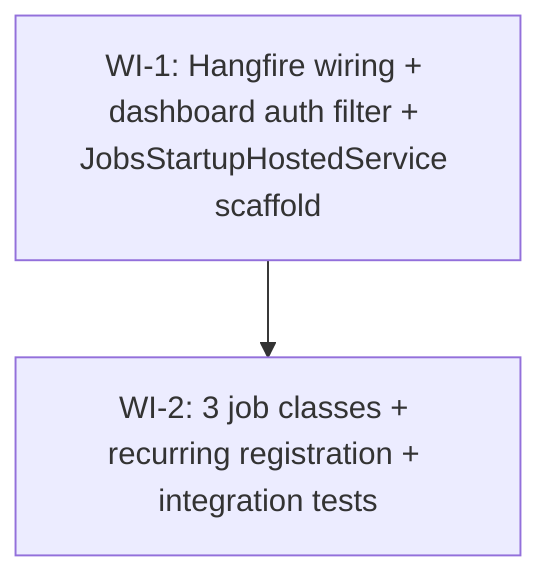

# UC-308 Background Jobs — Work Items

Spec: `docs/specs/todo/11_UC_308_background-jobs.md`
UC ID: UC-308

## Assumptions

1. Hangfire runs single-instance (one Hangfire server per WanderMeet.Api node). MVP does not require distributed-lock guarantees — `WorkerCount = 1` already serialises per node and the job DB transitions (`Invite.Status`, `Meetup.PromptSent`, atomic `ExecuteUpdateAsync`) are the idempotency anchors.
2. Hangfire stores its job state in the same Postgres database as application data, in its own schema. No new connection string is introduced; `DefaultConnection` is reused.
3. Tests do NOT spin up the Hangfire `BackgroundJobServer`. Job classes are POCOs and are exercised by direct DI resolution — `App.Services.CreateScope().GetRequiredService<TJob>().ExecuteAsync(ct)`. This avoids polling-loop flakiness and keeps tests fast.
4. The Hangfire dashboard is read-only for end users. Admin-grade actions (manual trigger, retry-from-failed, delete) remain disabled in this UC; that is a future Phase 4 concern.
5. `IFcmClient` is registered by `PushFeatureConfiguration` (UC-307) and `IInviteNotifier` is the Composite registered by `InvitesFeatureConfiguration` (UC-307). Both consume `WanderMeetDbContext` so jobs run inside a per-job DI scope (Scoped registration).
6. The 3-hour review-prompt delay is added to `WanderMeet.Shared.ValidationConstants` as a `public static readonly TimeSpan ReviewPromptDelay = TimeSpan.FromHours(3)` — same shape as the existing `InviteExpiryWindow`.
7. `ReviewPromptJob` does not translate `m.MetAt + ValidationConstants.ReviewPromptDelay <= now` directly inside the EF Core `Where(...)`. Instead it computes `var threshold = now - ValidationConstants.ReviewPromptDelay` in C# and filters `m.MetAt <= threshold` — keeps the SQL translation predictable.
8. `ReviewPromptJob`'s push template (`"How did it go?"` + `"You met {otherFirstName} — let them know how it was."`) lives in a NEW `Features/Meetups/Realtime/MeetupPushTemplates.cs`, not inside the existing `Features/Invites/Realtime/PushTemplates.cs`. This keeps vertical-slice isolation (Invites vs. Meetups) per `rules/architecture.md#no-horizontal-layers`.
9. WI-1 ships Hangfire wiring + the dashboard filter + an empty `JobsStartupHostedService` (logs only). WI-2 adds the three job classes and updates `JobsStartupHostedService.StartAsync` to call `IRecurringJobManager.AddOrUpdate<TJob>` for each. WI-2 depends on WI-1.
10. Test IPs: 10.110.x.y range reserved for any HTTP-touching tests in this UC (e.g. dashboard auth filter integration test).

## Dependency Graph

## WI-1: Hangfire wiring + dashboard auth filter + JobsStartupHostedService scaffold

Complexity: **L** | Verification: `dotnet test --filter "FullyQualifiedName~HangfireDashboardAuthorizationFilter"` | needs_library_research: **true**

### Required Reads

- `src/WanderMeet.Api/Program.cs`
- `src/WanderMeet.Api/WanderMeet.Api.csproj`
- `src/WanderMeet.Api/Common/IFeatureConfiguration.cs`
- `src/WanderMeet.Api/Common/FeatureConfigurationExtensions.cs`
- `src/WanderMeet.Api/Authorization/AuthorizationPolicies.cs`
- `src/WanderMeet.Api/Features/Push/PushFeatureConfiguration.cs` (template for the Features-config + Infrastructure-impl split)
- `tests/WanderMeet.Api.IntegrationTests/Infrastructure/WanderMeetApiFactory.cs`
- `tests/WanderMeet.Api.IntegrationTests/Infrastructure/IntegrationTestFixture.cs`
- `tests/WanderMeet.Api.IntegrationTests/Infrastructure/IntegrationTestBase.cs`
- `docs/specs/todo/11_UC_308_background-jobs.md`

### Deliverables

1. **NuGet refs** in `src/WanderMeet.Api/WanderMeet.Api.csproj`: `Hangfire.AspNetCore` + `Hangfire.PostgreSql` (latest stable matching .NET 10). `Hangfire.Core` flows in transitively. Pin explicit versions only if Haiku research surfaces a compat trap.
2. **Program.cs** registers Hangfire:
   - `builder.Services.AddHangfire(c => c.UsePostgreSqlStorage(connectionString))`
   - `builder.Services.AddHangfireServer(opts => { opts.WorkerCount = 1; opts.Queues = ["default"]; })` — guarded behind `if (!builder.Environment.IsEnvironment("IntegrationTest"))` so tests do not run a worker loop
   - `app.MapHangfireDashboard("/hangfire", new DashboardOptions { Authorization = [new HangfireDashboardAuthorizationFilter()] })` — wired AFTER `UseAuthentication` / `UseAuthorization`
3. **`src/WanderMeet.Api/Infrastructure/Jobs/HangfireDashboardAuthorizationFilter.cs`** — `internal sealed`, implements `Hangfire.Dashboard.IDashboardAuthorizationFilter`. `Authorize(DashboardContext context)` returns `context.GetHttpContext().User.Identity?.IsAuthenticated == true`.
4. **`src/WanderMeet.Api/Features/Jobs/JobsFeatureConfiguration.cs`** — `internal sealed IFeatureConfiguration`. `FeatureInfo("Jobs", "Recurring background jobs (invite expiry, review prompt, sink inactive)")`. `AddFeatureDependencies` registers `services.AddHostedService<JobsStartupHostedService>()`.
5. **`src/WanderMeet.Api/Infrastructure/Jobs/JobsStartupHostedService.cs`** — `internal sealed IHostedService`, primary ctor `(IRecurringJobManager recurringJobs, ILogger<JobsStartupHostedService> logger)`. `StartAsync` returns `Task.CompletedTask` and logs an Info line. `StopAsync` returns `Task.CompletedTask`. AddOrUpdate calls are wired in WI-2.
6. **`tests/WanderMeet.Api.IntegrationTests/Infrastructure/WanderMeetApiFactory.cs`** — `ConfigureWebHost` calls `builder.UseEnvironment("IntegrationTest")` so the Hangfire server is skipped under tests.

### Error Paths

- Postgres connection failure during Hangfire schema initialisation → propagates as a startup exception (caught by the global exception handler in production; surfaces as a fast-fail in tests).
- Dashboard request without an authenticated user → filter returns `false` → Hangfire returns 401/403 (its built-in dashboard handling).

### Tests

- `HangfireDashboardAuthorizationFilter_AuthenticatedUser_ReturnsTrue` (unit) — FakeItEasy `A.Fake<HttpContext>` with `User.Identity.IsAuthenticated = true`; assert filter returns `true`.
- `HangfireDashboardAuthorizationFilter_AnonymousUser_ReturnsFalse` (unit) — FakeItEasy `A.Fake<HttpContext>` with `User.Identity.IsAuthenticated = false`; assert filter returns `false`.
- `JobsStartupHostedService_StartAsync_DoesNotThrow_WhenNoJobTypesYet` (integration) — resolves the host service from `App.Services`, awaits `StartAsync`, asserts no exception.
- `WanderMeetApiFactory_BootsCleanly_WithHangfireRegistered` (smoke integration in `tests/.../Smoke/HangfireWiringSmokeTests.cs`) — asserts `IRecurringJobManager` is resolvable and the factory boots without exception.

### Verification

`dotnet test --filter "FullyQualifiedName~HangfireDashboardAuthorizationFilter"` and `dotnet build -warnaserror`.

---

## WI-2: Three job classes (InviteExpiry, ReviewPrompt, SinkInactiveProfiles) + recurring registration + integration tests

Complexity: **L** | Verification: `dotnet test --filter "FullyQualifiedName~Infrastructure.Jobs"` | needs_library_research: **false** (depends on WI-1's Hangfire wiring)

### Required Reads

- `src/WanderMeet.Api/Database/Entities/Invite.cs`, `Meetup.cs`, `User.cs`
- `src/WanderMeet.Api/Features/Invites/Shared/IInviteNotifier.cs`
- `src/WanderMeet.Api/Features/Invites/Realtime/CompositeInviteNotifier.cs` (for the try/catch + LogWarning pattern)
- `src/WanderMeet.Api/Features/Invites/Realtime/PushTemplates.cs` (mirror its tuple-returning shape in the new `MeetupPushTemplates`)
- `src/WanderMeet.Api/Infrastructure/Push/IFcmClient.cs`
- `src/WanderMeet.Api/Features/Push/PushFeatureConfiguration.cs`
- `src/WanderMeet.Shared/ValidationConstants.cs` (add `ReviewPromptDelay` here)
- `src/WanderMeet.Api/Features/Jobs/JobsFeatureConfiguration.cs` (from WI-1)
- `src/WanderMeet.Api/Infrastructure/Jobs/JobsStartupHostedService.cs` (from WI-1)
- `tests/WanderMeet.Api.IntegrationTests/Infrastructure/RecordingInviteNotifier.cs`
- `tests/WanderMeet.Api.IntegrationTests/Infrastructure/RecordingFcmClient.cs`
- `tests/WanderMeet.Api.IntegrationTests/Infrastructure/IntegrationTestFixture.cs`
- `tests/WanderMeet.Api.IntegrationTests/Infrastructure/IntegrationTestBase.cs`
- `docs/specs/todo/11_UC_308_background-jobs.md`

### Deliverables

1. **`ValidationConstants.ReviewPromptDelay`** — `public static readonly TimeSpan ReviewPromptDelay = TimeSpan.FromHours(3);` in `src/WanderMeet.Shared/ValidationConstants.cs` with XML doc.
2. **`Infrastructure/Jobs/InviteExpiryJob.cs`** — `internal sealed`, primary ctor `(WanderMeetDbContext dbContext, IInviteNotifier notifier, TimeProvider timeProvider, ILogger<InviteExpiryJob> logger)`. `public Task ExecuteAsync(CancellationToken ct)`:
   - Load Pending invites with `ExpiresAt <= now`, `Take(500)`, **tracked** (no `AsNoTracking`) — we need to mutate.
   - Set `Status = Expired` and `RespondedAt = now` per row, single `SaveChangesAsync(ct)`.
   - Then per newly-expired invite: `try { await notifier.InviteExpiredAsync(invite, ct); } catch (Exception ex) { logger.LogWarning(ex, ...); }` — notifier failure does NOT roll back persisted state.
   - `LogInformation` with the affected count.
3. **`Infrastructure/Jobs/ReviewPromptJob.cs`** — `internal sealed`, primary ctor `(WanderMeetDbContext dbContext, IFcmClient fcmClient, TimeProvider timeProvider, ILogger<ReviewPromptJob> logger)`. `public Task ExecuteAsync(CancellationToken ct)`:
   - `var threshold = now - ValidationConstants.ReviewPromptDelay`; filter `m.MetAt <= threshold && !m.PromptSent`.
   - `AsNoTracking()` projection (`Take(100)`) joining `Users` twice to fetch BOTH participants' `FcmToken` + the OTHER participant's `FirstName`.
   - Per non-null token: call `IFcmClient.SendAsync` with `MeetupPushTemplates.ReviewPrompt(otherFirstName)`. Wrap each in try/catch + LogWarning.
   - Flip `PromptSent = true` on the entire batch via single `dbContext.Meetups.Where(m => batchIds.Contains(m.Id)).ExecuteUpdateAsync(s => s.SetProperty(m => m.PromptSent, true), ct)` — regardless of FCM outcome.
4. **`Features/Meetups/Realtime/MeetupPushTemplates.cs`** — `internal static class` with `ReviewPrompt(string otherFirstName) => ("How did it go?", $"You met {otherFirstName} — let them know how it was.")`.
5. **`Infrastructure/Jobs/SinkInactiveProfilesJob.cs`** — `internal sealed`, primary ctor `(WanderMeetDbContext dbContext, TimeProvider timeProvider, ILogger<SinkInactiveProfilesJob> logger)`. Single statement: `var cutoff = timeProvider.GetUtcNow() - TimeSpan.FromHours(24); var affected = await dbContext.Users.Where(u => u.IsOpenToday && u.LastActiveAt < cutoff).ExecuteUpdateAsync(s => s.SetProperty(u => u.IsOpenToday, false), ct); logger.LogInformation("SinkInactiveProfiles flipped {Count} users", affected);`.
6. **`Features/Jobs/JobsFeatureConfiguration.cs`** — add `services.AddScoped<InviteExpiryJob>(); services.AddScoped<ReviewPromptJob>(); services.AddScoped<SinkInactiveProfilesJob>();`.
7. **`Infrastructure/Jobs/JobsStartupHostedService.cs`** — fill in the three `IRecurringJobManager.AddOrUpdate<TJob>` calls:
   - `("invite-expiry", j => j.ExecuteAsync(CancellationToken.None), "*/5 * * * *")`
   - `("review-prompt", j => j.ExecuteAsync(CancellationToken.None), "*/5 * * * *")`
   - `("sink-inactive-profiles", j => j.ExecuteAsync(CancellationToken.None), "0 * * * *")`
8. **Tests** under `tests/WanderMeet.Api.IntegrationTests/Infrastructure/Jobs/` — see Tests section below.

### Error Paths

| Path | Behaviour |
|------|-----------|
| `IInviteNotifier.InviteExpiredAsync` throws | Caught, LogWarning emitted, persisted `Status=Expired` flip retained. |
| `IFcmClient.SendAsync` throws | Caught per recipient, LogWarning emitted, `PromptSent=true` still set. |
| Both participants have `FcmToken=null` | No FCM sends recorded; `PromptSent=true` still set (DB transition is the idempotency anchor). |
| Job class throws (unexpected) | Hangfire's default automatic retry kicks in (3 attempts, exponential backoff). After exhaustion the job lands in the `failed` bucket and is triaged via the dashboard. |
| Concurrent re-tick before previous tick completes | `WorkerCount=1` serialises — no risk in MVP. |
| User reactivates between `SinkInactiveProfilesJob` query and update | `ExecuteUpdateAsync` filters atomically; race is benign (next API request flips them back via `LastActiveAt`). |

### Tests

All tests in `tests/WanderMeet.Api.IntegrationTests/Infrastructure/Jobs/`, decorated with `[Collection(TestConstants.Collections.PipelineTest)]` and inheriting `IntegrationTestBase`. Resolution: `using var scope = App.Services.CreateScope(); var job = scope.ServiceProvider.GetRequiredService<TJob>(); await job.ExecuteAsync(TestContext.Current.CancellationToken);`.

**InviteExpiryJobTests**
- `InviteExpiryJob_ExecuteAsync_PendingInvitesPastExpiry_AreFlippedToExpiredAndNotifierFires`
- `InviteExpiryJob_ExecuteAsync_PendingInvitesNotYetExpired_LeftAlone`
- `InviteExpiryJob_ExecuteAsync_NotifierThrows_PersistedStateUnchanged`
- `InviteExpiryJob_ExecuteAsync_AlreadyExpiredOrNonPending_Skipped`
- `InviteExpiryJob_ExecuteAsync_SecondRunAfterSuccess_IsNoOp`

**ReviewPromptJobTests**
- `ReviewPromptJob_ExecuteAsync_MeetupOver3hAndPromptNotSent_FiresFcmPushAndSetsPromptSent`
- `ReviewPromptJob_ExecuteAsync_BothParticipantsHaveNoFcmToken_StillSetsPromptSentTrue`
- `ReviewPromptJob_ExecuteAsync_FcmThrows_PromptSentStillFlippedTrue`
- `ReviewPromptJob_ExecuteAsync_MeetupUnder3h_LeftAlone`
- `ReviewPromptJob_ExecuteAsync_PromptSentTrue_Skipped`
- `ReviewPromptJob_ExecuteAsync_PushBodyContainsOtherParticipantFirstName`
- `ReviewPromptJob_ExecuteAsync_SecondRunAfterSuccess_IsNoOp`

**SinkInactiveProfilesJobTests**
- `SinkInactiveProfilesJob_ExecuteAsync_UsersOpenTodayWithLastActiveBeyond24h_AreFlippedToFalse`
- `SinkInactiveProfilesJob_ExecuteAsync_UsersWithRecentActivity_LeftAlone`
- `SinkInactiveProfilesJob_ExecuteAsync_UsersAlreadyClosed_Untouched`

**JobsStartupHostedServiceTests**
- `JobsStartupHostedService_StartAsync_RegistersAllThreeJobs_WithCorrectCronSchedules` — call `StartAsync`, then enumerate via `JobStorage.Current.GetConnection().GetAllItemsFromSet("recurring-jobs")` and assert all three IDs are present with the expected cron strings.

### Verification

`dotnet test --filter "FullyQualifiedName~Infrastructure.Jobs"` and `dotnet build -warnaserror`.
