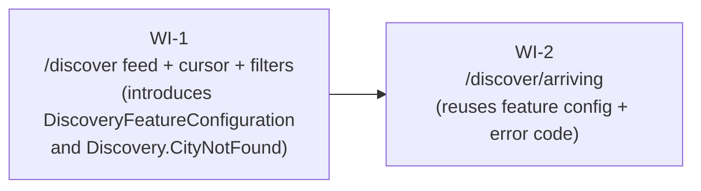

# UC-205 Discovery — Work Items

Two work items split a single `Features/Discovery/` slice between the cursor-paginated feed (large) and the simpler arriving-soon list (small). Both endpoints share `DiscoveryFeatureConfiguration`, the `Discovery.CityNotFound` error code, the `RateLimitPolicies.Discovery` policy, the `UsersOnly` authorization policy, and the existing `PublicUserDto` shape.

## Assumptions

1. **Cursor signing is out of scope.** The cursor carries only `(LastActiveAt, TrustScore, Id, IsOpenToday)` — no PII, no auth context, no entity payload. A tampering client could only skip ahead in their own discovery feed (which they could already do by paginating linearly), so HMAC signing adds key-management complexity for negligible value at MVP. Encoding stays plain base64 over canonical JSON. This matches UC-205 `non_functional` notes and is reversible later as a non-breaking change.
2. **Single `Features/Discovery/` slice for both endpoints.** They share the feature configuration, error code, caller-resolution flow, and `PublicUserDto` shape. Splitting into two UCs would duplicate the feature config and the city/caller guard. Two subfolders (`Feed/` and `Arriving/`) keep one type per file and keep the slice navigable.
3. **No EXPLAIN-plan integration test.** Phase 2.1/2.2 already created the GiST and composite indexes. An EXPLAIN test asserts planner behaviour (an implementation detail) and is brittle to data shape; functional tests are sufficient for MVP. Manual verification or load-test stage covers the non-functional P95 target. Flagged in Test plan as a follow-up only.
4. **Pending-invite filter uses `EXISTS (Any)` directly inside the discovery `Where`.** EF Core 9/10 emits a single correlated `EXISTS` subquery on Postgres for `!dbContext.Invites.Any(...)`, so there is no extra round-trip. The shape is `!dbContext.Invites.Any(i => i.Status == InviteStatus.Pending && ((i.SenderId == caller.Id && i.ReceiverId == u.Id) || (i.SenderId == u.Id && i.ReceiverId == caller.Id)))`. Verified functionally; no `ToQueryString()` assertion in the test suite (developer can sanity-check during implementation).
5. **PublicUserDto reuse.** The discover-feed items array is `IReadOnlyList<PublicUserDto>` (the existing record at `src/WanderMeet.Api/Features/Users/Shared/PublicUserDto.cs`). The arriving list wraps it: `record ArrivingUserDto(PublicUserDto User, DateTimeOffset ArrivingAt)`. No DTO duplication.
6. **Read-only feed.** Neither endpoint bumps the caller's `LastActiveAt` and neither calls `SaveChangesAsync`. UC-205 explicitly excludes `/discover` from the last-active path.
7. **Validator-level "city id required"** uses an existing or newly-named code (`Validation.CityIdRequired` or reuse `UserValidation.CityIdNotFound`). Implementer picks one and applies it identically across both validators; the unit-test method names assume `CityIdRequired` but the assertion target is whichever code the validator emits.
8. **Global route prefix `api/v1` is applied centrally** by FastEndpoints (`c.Endpoints.RoutePrefix = "api/v1"` in `Program.cs`). Endpoints declare bare routes (`Get("discover")`, `Get("discover/arriving")`).
9. **Rate-limit cross-talk in tests** is avoided by setting a unique `X-Forwarded-For` per test, mirroring the established pattern in `GetByIdEndpointTests`.

## Dependency Graph

WI-2 depends on WI-1 only because WI-1 introduces `DiscoveryFeatureConfiguration` and `ErrorCodes.Discovery.CityNotFound`. The two endpoints can otherwise be exercised independently.

## WI-1: /discover feed + cursor + filters

### Required Reads

- `docs/specs/in-progress/03_UC_205_discovery.md`
- `src/WanderMeet.Api/Features/Users/UsersFeatureConfiguration.cs` — feature-configuration shape
- `src/WanderMeet.Api/Features/Users/GetById/GetByIdEndpoint.cs` — read-only projection pattern, `PublicUserDto` reuse
- `src/WanderMeet.Api/Features/Users/AddCity/AddCityEndpoint.cs` — JWT `sub` resolution, `User.NotRegistered` AddError pattern
- `src/WanderMeet.Api/Features/Users/AddCity/AddCityValidator.cs` — FastEndpoints `Validator<T>` shape
- `src/WanderMeet.Api/Features/Users/Shared/PublicUserDto.cs` — reused for the items array
- `src/WanderMeet.Api/Database/Entities/{User,City,Invite,HangoutTag,UserHangoutTag}.cs`
- `src/WanderMeet.Api/Infrastructure/EntityFramework/WanderMeetDbContext.cs`
- `src/WanderMeet.Api/Common/RateLimitPolicies.cs`, `src/WanderMeet.Api/Authorization/AuthorizationPolicies.cs`
- `src/WanderMeet.Shared/{ErrorCodes,ValidationConstants}.cs`, `src/WanderMeet.Shared/Enums/{HangoutTagSlug,InviteStatus}.cs`
- `tests/WanderMeet.Api.IntegrationTests/Infrastructure/{IntegrationTestBase,IntegrationTestFixture}.cs`
- `tests/WanderMeet.Api.IntegrationTests/Features/Users/GetById/GetByIdEndpointTests.cs` — happy/401/404 pattern, X-Forwarded-For per test
- `tests/WanderMeet.Api.UnitTests/Features/Users/AddCity/AddCityValidatorTests.cs` — validator unit-test pattern

### Deliverables

**Slice scaffold** under `src/WanderMeet.Api/Features/Discovery/`:

- `DiscoveryFeatureConfiguration.cs` — `internal sealed`, parameterless ctor, `FeatureInfo("Discovery", "...")`, no feature dependencies to register.
- `Feed/DiscoverFeedEndpoint.cs` — `internal sealed Endpoint<DiscoverFeedRequest, DiscoverFeedResponse>`. Primary-ctor injects `WanderMeetDbContext` and `TimeProvider` only. Owns the entire flow.
- `Feed/DiscoverFeedRequest.cs` — record with `Guid CityId`, `HangoutTagSlug? HangoutTagSlug`, `int Limit = 20`, `string? Cursor`. FromQuery binding.
- `Feed/DiscoverFeedResponse.cs` — `public record DiscoverFeedResponse(IReadOnlyList<PublicUserDto> Items, string? NextCursor)`.
- `Feed/DiscoverFeedValidator.cs` — `internal sealed Validator<DiscoverFeedRequest>` (FastEndpoints).
- `Feed/DiscoveryCursor.cs` — `internal readonly record struct DiscoveryCursor(DateTimeOffset LastActiveAt, int TrustScore, Guid Id, bool IsOpenToday)` with static `Encode` / `TryDecode`. Plain base64 over canonical JSON; no signing.

**Error codes** — append to `src/WanderMeet.Shared/ErrorCodes.cs`:

- `ErrorCodes.Validation.LimitOutOfRange = "Validation.LimitOutOfRange"`
- `ErrorCodes.Validation.HangoutTagSlugInvalid = "Validation.HangoutTagSlugInvalid"`
- `ErrorCodes.Validation.CursorMalformed = "Validation.CursorMalformed"`
- New nested class `ErrorCodes.Discovery` with `CityNotFound = "Discovery.CityNotFound"`

**Endpoint flow:**

1. `Get("discover")` (the `api/v1` prefix is applied globally), `WithName(nameof(DiscoverFeedEndpoint))`, `WithTags(_featureConfiguration.Info.Name)`, `RequireRateLimiting(RateLimitPolicies.Discovery)`, `DontCatchExceptions()`, `Policies(nameof(AuthorizationPolicies.UsersOnly))`.
2. Resolve `sub` claim via `User.FindFirstValue(ClaimTypes.NameIdentifier)`. Empty → `Send.UnauthorizedAsync`.
3. Load caller `User` filtered by `AzureAdB2CId == sub && DeletedAt == null`. Project to `(Id)` only — caller's other fields are not used here. Missing → `AddError(ErrorCodes.User.NotRegistered, ...) + Send.ErrorsAsync(404)`.
4. Load `City` (`Id`, `Location`) filtered by `Id == req.CityId && DeletedAt == null`. Missing → `AddError(ErrorCodes.Discovery.CityNotFound, ...) + Send.ErrorsAsync(404)`.
5. Build the discovery query (`AsNoTracking`) on `dbContext.Users` with predicates: location set, within 50 km via `EF.Functions.IsWithinDistance`, `IsOpenToday`, fresh within 72 h, `Id != caller.Id`, not deleted, hangout-tag match (when supplied), pending-invite EXISTS-not exclusion (see Assumption 4).
6. Sort: `IsOpenToday DESC, TrustScore DESC, LastActiveAt DESC, Id DESC`.
7. If a cursor was supplied, decode and add a keyset predicate strictly after the cursor row across the full sort tuple (chained OR/AND on the four columns).
8. `.Take(req.Limit + 1).Select(u => new PublicUserDto(...))`.
9. If `Limit + 1` rows returned: drop the sentinel, encode `NextCursor` from the LAST returned row. Else `NextCursor = null`.
10. `Send.OkAsync(new DiscoverFeedResponse(items, nextCursor), ct)`.

### Error Paths

| Code | Status | Trigger |
|------|--------|---------|
| `Validation.CityIdRequired` (validator-level naming, see Assumption 7) | 400 | `cityId` empty Guid |
| `Validation.LimitOutOfRange` | 400 | `limit < 1` or `limit > 50` |
| `Validation.HangoutTagSlugInvalid` | 400 | `hangoutTagSlug` not a defined enum value |
| `Validation.CursorMalformed` | 400 | cursor not base64-decodable into the expected JSON shape |
| `User.NotRegistered` | 404 | JWT `sub` maps to no non-deleted User row |
| `Discovery.CityNotFound` | 404 | `cityId` references a non-existent or soft-deleted City |
| (none) | 401 | no Bearer token (handled by `UsersOnly` policy) |
| (none) | 429 | `RateLimitPolicies.Discovery` quota exceeded (handled by middleware) |

### Tests

**Validator unit tests** (`tests/WanderMeet.Api.UnitTests/Features/Discovery/Feed/DiscoverFeedValidatorTests.cs`) using `FluentValidation.TestHelper.TestValidate` — empty city id, limit < 1, limit > 50, limit omitted defaults to 20, unknown hangout-tag slug, malformed cursor (non-base64), base64 cursor that fails to deserialise, happy path.

**Cursor codec unit tests** (`tests/WanderMeet.Api.UnitTests/Features/Discovery/Feed/DiscoveryCursorTests.cs`) — encode/decode round-trip preserves all four fields lossless; `TryDecode` returns false for non-base64 and for base64 that does not match the JSON shape.

**Integration tests** (`tests/WanderMeet.Api.IntegrationTests/Features/Discovery/Feed/DiscoverFeedEndpointTests.cs`, `[Collection(TestConstants.Collections.PipelineTest)]`, `IntegrationTestBase`):

- 401 when no Bearer token
- 404 + `User.NotRegistered` when JWT `sub` has no User row
- 404 + `Discovery.CityNotFound` for unknown city, and for soft-deleted city
- Happy path returns up to default-20 `PublicUserDto`s
- One user inside / one outside 50 km radius — only inside returned
- One user fresh / one stale (LastActiveAt older than 72 h) — only fresh returned
- `IsOpenToday=false` user excluded
- `hangoutTagSlug` filter restricts to matching tag; non-matching user excluded
- Caller never returned in own feed
- Soft-deleted candidate excluded
- Pending invite caller→candidate: candidate excluded
- Pending invite candidate→caller: candidate excluded
- Accepted/Declined invite between pair: candidate STILL returned
- Sort order verified across `IsOpenToday DESC, TrustScore DESC, LastActiveAt DESC` with three controlled users
- Cursor pagination: 25 matching users, `limit=10` → page 1 (10 items, non-null cursor), page 2 via cursor (10 items, non-null cursor, no overlap with page 1, no skips), page 3 via cursor (5 items, null cursor)
- Cursor past last row → 200 with `items: []`, `nextCursor: null`
- No matches → 200 with `items: []`, `nextCursor: null`
- After `/discover` call, caller's `LastActiveAt` is unchanged
- Reflection-based `DiscoveryFeatureConfiguration` discovery: `App.Services.GetServices<IFeatureConfiguration>()` (or equivalent) includes the new config — soft check that the slice is wired

Each test sets a unique `X-Forwarded-For` IP per the established convention.

### Verification

`{ "tool": "dotnet-test", "filter": "Discovery.Feed" }` → `dotnet test --filter "FullyQualifiedName~Discovery.Feed"`

---

## WI-2: /discover/arriving

### Required Reads

- `docs/specs/in-progress/03_UC_205_discovery.md`
- `src/WanderMeet.Api/Features/Discovery/DiscoveryFeatureConfiguration.cs` (created in WI-1)
- `src/WanderMeet.Api/Features/Discovery/Feed/DiscoverFeedEndpoint.cs` (mirror caller-resolution + city-existence guards)
- `src/WanderMeet.Api/Features/Users/Shared/PublicUserDto.cs`
- `src/WanderMeet.Api/Database/Entities/{UserCity,User}.cs`
- `src/WanderMeet.Api/Infrastructure/EntityFramework/WanderMeetDbContext.cs`
- `src/WanderMeet.Shared/ErrorCodes.cs` (Discovery.CityNotFound from WI-1)
- `tests/WanderMeet.Api.IntegrationTests/Features/Users/AddCity/AddCityEndpointTests.cs`

### Deliverables

Under `src/WanderMeet.Api/Features/Discovery/Arriving/`:

- `DiscoverArrivingEndpoint.cs` — `internal sealed Endpoint<DiscoverArrivingRequest, DiscoverArrivingResponse>`. Primary-ctor injects `WanderMeetDbContext` and `TimeProvider`. Field `private readonly DiscoveryFeatureConfiguration _featureConfiguration = new();` reuses the WI-1 config.
- `DiscoverArrivingRequest.cs` — record with `Guid CityId` (FromQuery).
- `DiscoverArrivingResponse.cs` — `public record DiscoverArrivingResponse(IReadOnlyList<ArrivingUserDto> Items)`.
- `ArrivingUserDto.cs` — `public record ArrivingUserDto(PublicUserDto User, DateTimeOffset ArrivingAt)`.
- `DiscoverArrivingValidator.cs` — `internal sealed Validator<DiscoverArrivingRequest>` with `CityId NotEmpty` (same code as WI-1's validator-level "city id required").

**Endpoint flow:**

1. `Get("discover/arriving")`, same Description / Policies / DontCatchExceptions / RequireRateLimiting as WI-1.
2. Same `sub` resolution and `User.NotRegistered` guard as WI-1.
3. City existence check via `dbContext.Cities.AsNoTracking().AnyAsync(c => c.Id == req.CityId && c.DeletedAt == null, ct)`. Missing → `AddError(ErrorCodes.Discovery.CityNotFound, ...) + Send.ErrorsAsync(404)`.
4. Query: `dbContext.UserCities.AsNoTracking().Where(uc => uc.CityId == req.CityId && uc.ArrivedAt > now && uc.ArrivedAt <= now.AddDays(30) && uc.DepartedAt == null && uc.UserId != caller.Id && uc.User!.DeletedAt == null).OrderBy(uc => uc.ArrivedAt).Select(uc => new ArrivingUserDto(new PublicUserDto(...uc.User..., uc.User.HangoutTags.Select(ht => ht.HangoutTagId).ToList()), uc.ArrivedAt))`.
5. `Send.OkAsync(new DiscoverArrivingResponse(items), ct)`.

### Error Paths

| Code | Status | Trigger |
|------|--------|---------|
| `Validation.CityIdRequired` (validator-level) | 400 | `cityId` empty Guid |
| `User.NotRegistered` | 404 | JWT `sub` maps to no non-deleted User row |
| `Discovery.CityNotFound` | 404 | `cityId` unknown or soft-deleted |
| (none) | 401 | no Bearer token |
| (none) | 429 | rate-limit quota exceeded |

### Tests

**Validator unit tests** (`tests/WanderMeet.Api.UnitTests/Features/Discovery/Arriving/DiscoverArrivingValidatorTests.cs`) — empty city id, happy path.

**Integration tests** (`tests/WanderMeet.Api.IntegrationTests/Features/Discovery/Arriving/DiscoverArrivingEndpointTests.cs`):

- 401 anonymous
- 404 + `User.NotRegistered`
- 404 + `Discovery.CityNotFound` (unknown and soft-deleted)
- Happy path: returns users with `UserCity.ArrivedAt` in the next 30 days, `DepartedAt == null`, owner not caller, owner not deleted, ordered by `ArrivedAt` ascending
- `ArrivedAt` in the past → excluded
- `ArrivedAt` beyond 30 days → excluded
- `DepartedAt` not null → excluded
- Owner is caller → excluded
- Owner soft-deleted → excluded
- No matches → 200 with empty items
- After call, caller's `LastActiveAt` unchanged

Unique `X-Forwarded-For` per test; `App.FakeTimeProvider.GetUtcNow()` for `now` and `Add/Subtract` for fixture timestamps.

### Verification

`{ "tool": "dotnet-test", "filter": "Discovery.Arriving" }` → `dotnet test --filter "FullyQualifiedName~Discovery.Arriving"`
