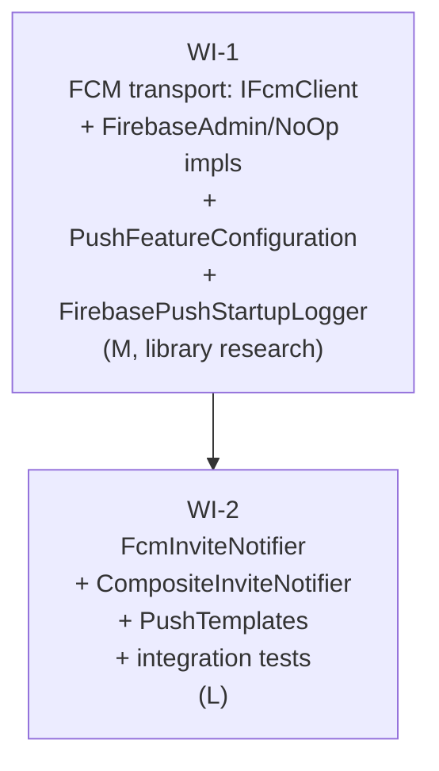

# UC-307 — FCM push notifications: work items

This UC adds Firebase Cloud Messaging push for invite-lifecycle events on top of the SignalR notifier shipped in UC-306. The transport split into 2 WIs keeps the FirebaseAdmin SDK research isolated from the (much larger) feature-wiring changes.

## Assumptions

- **2 WIs, not 1.** WI-1 ships only the `IFcmClient` abstraction + 2 impls + a new `PushFeatureConfiguration` slice + the `FirebaseAdmin` NuGet package. WI-2 layers `FcmInviteNotifier`, `CompositeInviteNotifier`, push-template formatting, and integration tests on top. Splitting isolates the library-research pass (`needs_library_research: true` only on WI-1) and keeps WI-2 free of any Firebase SDK code — its only contact with Firebase is via the `IFcmClient` abstraction.
- **`PushFeatureConfiguration` is a new slice.** UC-308 (review-prompt push) will also consume `IFcmClient`. `rules/architecture.md#common-infrastructure` permits a feature slice for shared infrastructure once 2+ features depend on it. The Push slice owns the `IFcmClient` registration, the `FirebaseOptions` binding, and the `FirebasePushStartupLogger` hosted service. The Invites slice consumes `IFcmClient` through DI by interface only (no cross-feature reference).
- **Singleton lifetime for `IFcmClient`.** `FirebaseApp.Create(...)` is a process-wide bootstrap and the client itself holds no per-request state. Singleton is correct. `FcmInviteNotifier` stays Scoped (it consumes `WanderMeetDbContext`).
- **Lazy `FirebaseApp.Create` in production client; fail-once soft-degradation.** `FirebaseAdminFcmClient`'s constructor is side-effect-free. The SDK bootstrap runs on first `SendAsync` under a `System.Threading.Lock` (C# 13 type — fully qualified) + a once-flag. The flag flips on the FIRST attempt regardless of outcome. If `FirebaseApp.Create` throws (bad credentials, missing file, malformed JSON), the exception is logged ONCE at Error level and an `_initFailed` flag is set; ALL subsequent `SendAsync` calls log Warning and return without re-attempting init. Bad credentials = permanent soft-degradation per process lifetime — no retry storm. Trade-off: the first push call carries a one-time ~50 ms cold start; the alternative (eager init in `Program.cs`) couples the API startup to a Firebase reachability check, which we don't want.
- **Startup warning surfaces through the real ILogger pipeline.** A new `FirebasePushStartupLogger : IHostedService` registered alongside `IFcmClient` emits the missing-credentials Warning via the host's `ILogger<T>` during `StartAsync`. No temporary `LoggerFactory.Create` (App Insights / Serilog must see the log).
- **Soft-deleted users are filtered out — both sides of `InviteAcceptedAsync`.** Both `InviteSentAsync` (Receiver) and `InviteAcceptedAsync` (Sender AND Receiver) projections include `DeletedAt != null` checks. The Accepted push body interpolates `Receiver.FirstName`, so a soft-deleted Receiver must NOT trigger the push to the Sender — that would leak PII. A soft-deleted user gets no push, even if their `FcmToken` is still on the row.
- **Explicit projection records.** Both `FcmInviteSentProjection` and `FcmInviteAcceptedProjection` are private `internal sealed record` types in `FcmInviteNotifier.cs`. Anonymous projections are forbidden — null-state of every member must be auditable.
- **404 (`Unregistered`) is silently swallowed by the FCM client.** Per the spec, stale-token cleanup is out of scope; the client logs a Warning and returns without throwing. All other `FirebaseMessagingException` values rethrow so the composite's per-child catch records the failure and stops it from reaching the endpoint.
- **`NoOpFcmClient` logs a SHA-256 truncated hash, never the raw token.** Tokens are sensitive (long-lived device identifiers). Log only the first 8 hex chars (lowercase) of `SHA-256(fcmToken)` — never the raw token, never a substring of it.
- **No new index on `User.FcmToken`.** The read pattern is by nav-prop hop from `Invite` (Receiver/Sender), not by filtering on `FcmToken`. An index would never be hit. Documented as an explicit AC so impl-reviewer does not flag it.
- **Composite resilience is the contract; concrete child types are intentional.** `CompositeInviteNotifier` invokes SignalR first, then FCM, with a per-child try/catch + LogWarning, **on every one of the four `IInviteNotifier` methods** — including `InviteDeclinedAsync` and `InviteExpiredAsync` where FCM is a no-op (the call still happens inside its try/catch so future notifiers stay symmetric, and the SignalR call still runs in its own try/catch). One failing child must NEVER cause the other to be skipped, and the composite method itself never throws. The composite takes the **concrete** `SignalRInviteNotifier` and `FcmInviteNotifier` types (not `IEnumerable<IInviteNotifier>`) by design — injecting the interface collection would self-recurse since the composite is itself registered as `IInviteNotifier`. An XML `<remarks>` block on the class documents the trade-off and the steps required to add a third notifier.
- **PII discipline asserted via positive equality.** Each `PushTemplates_*` test asserts the generated `Title` and `Body` equal EXACTLY the expected string for a given fixture. Substring negatives (no `@`, no `Bio:`, no `oid|`, no AzureAdB2C-id-shaped substring) are supplementary, not the primary check.
- **SignalR-throws coverage is unit-only.** The integration variant of `CompositeInviteNotifier_SignalRThrows_FcmStillFires` is dropped to avoid test-DI gymnastics. Coverage lives in `CompositeInviteNotifierTests.cs` (unit) using FakeItEasy doubles for both children. The `FcmThrows` direction stays as an integration test because asserting the real SignalR WebSocket path adds value.
- **Test-mode default = `RecordingFcmClient` (internal sealed).** The base `WanderMeetApiFactory.ConfigureWebHost` swaps `IFcmClient` for `RecordingFcmClient` for every test. `IntegrationTestBase.SetupAsync` calls `App.FcmClient.Reset()` immediately after `ResetDatabaseAsync()`. `Reset()` clears BOTH the `Sends` list AND sets `ThrowOnSend = null`.
- **No production code change to `SendInviteEndpoint` / `AcceptInviteEndpoint` / `DeclineInviteEndpoint`.** They already call `IInviteNotifier`; swapping in the composite via DI is the only production-code change to the endpoint side.
- **FK indexes on `Invite` must be verified.** Multi-nav projections in `FcmInviteNotifier` need indexes on `ReceiverId`, `SenderId`, `PlaceId`, `HangoutTagId`. UC-301 should have added them — the WI explicitly verifies and adds any missing one with a migration `AddMissingFkIndexesToInvites`.
- **Test IP allocation:** `10.100.x.y` reserved for UC-307 FCM tests. Each test uses a distinct IP on `X-Forwarded-For` to avoid rate-limit cross-talk.
- **`FirebaseAdmin` 3.5.0 is the latest stable as of 2026-05.** WI-1 must verify it builds against .NET 10 during the research pass; if it conflicts with an existing transitive dep, pin to the highest stable that builds.

## Dependency Graph



---

## WI-1: FCM transport (IFcmClient + impls + PushFeatureConfiguration)

**Complexity:** M
**Depends on:** none
**Verification:** `dotnet build -warnaserror`
**Library research:** YES (FirebaseAdmin SDK)

### Required reads

- `docs/specs/in-progress/10_UC_307_fcm-push.md`
- `src/WanderMeet.Api/Program.cs`
- `src/WanderMeet.Api/Features/Invites/InvitesFeatureConfiguration.cs`
- `src/WanderMeet.Infrastructure/Blob/BlobStorageServiceCollectionExtensions.cs` — closest precedent for binding an external SDK from config
- `src/WanderMeet.Api/WanderMeet.Api.csproj`
- `src/WanderMeet.Api/Common/IFeatureConfiguration.cs`

### Deliverables

1. **`IFcmClient` interface** (`Infrastructure/Push/IFcmClient.cs`) — `Task SendAsync(string fcmToken, string title, string body, CancellationToken ct)`. internal. XML docs.
2. **`FirebaseAdminFcmClient`** (`Infrastructure/Push/FirebaseAdminFcmClient.cs`) — `internal sealed`, primary ctor `(IOptions<FirebaseOptions>, ILogger<FirebaseAdminFcmClient>)`. Lazy-init Firebase app via a private static `System.Threading.Lock` (C# 13 — fully qualify the namespace) + a `bool _initAttempted` once-flag + a `bool _initFailed` outcome flag. The first `SendAsync` to observe `_initAttempted == false` enters the Lock, flips `_initAttempted = true` UNCONDITIONALLY, then attempts `FirebaseApp.Create(new AppOptions { Credential = GoogleCredential.FromFile(options.Value.CredentialsPath!), ProjectId = options.Value.ProjectId })`. On exception, log Error ONCE and set `_initFailed = true`. ALL subsequent `SendAsync` calls (including the one whose attempt failed) check `_initFailed` and, if true, log Warning and return without re-attempting init. Once successfully initialised: build `Message { Token, Notification { Title, Body } }` → `await FirebaseMessaging.DefaultInstance.SendAsync(message, ct)`. Catch `FirebaseMessagingException` with `MessagingErrorCode.Unregistered` → log Warning + swallow. Other codes rethrow.
3. **`NoOpFcmClient`** (`Infrastructure/Push/NoOpFcmClient.cs`) — `internal sealed`, primary ctor `(ILogger<NoOpFcmClient>)`. LogDebug with `tokenHash` = first 8 hex chars (lowercase) of `SHA-256(fcmToken)`; return `Task.CompletedTask`. Never log the raw token or any substring of it.
4. **`FirebaseOptions`** (`Infrastructure/Push/FirebaseOptions.cs`) — `internal sealed { string? CredentialsPath; string? ProjectId; }`. XML docs.
5. **`FirebasePushStartupLogger`** (`Infrastructure/Push/FirebasePushStartupLogger.cs`) — `internal sealed : IHostedService`, primary ctor `(IOptions<FirebaseOptions>, ILogger<FirebasePushStartupLogger>)`. `StartAsync`: if `CredentialsPath` is null/whitespace OR `!File.Exists(credentialsPath)` → `logger.LogWarning("[FCM] Firebase credentials missing — push notifications disabled (using NoOp client).")`. `StopAsync` returns `Task.CompletedTask`. The warning MUST flow through the host's real `ILogger` pipeline (App Insights / Serilog).
6. **`PushFeatureConfiguration`** (`Features/Push/PushFeatureConfiguration.cs`) — NEW slice. `internal sealed`, parameterless ctor, `IFeatureConfiguration`. `FeatureInfo Info => new("Push", "FCM push transport for invite/review notifications")`. `AddFeatureDependencies` binds `FirebaseOptions` from the `Firebase` config section; if `File.Exists(credentialsPath)` register `FirebaseAdminFcmClient` as `IFcmClient` (singleton); else register `NoOpFcmClient` (singleton). UNCONDITIONALLY register `services.AddHostedService<FirebasePushStartupLogger>()`.
7. **NuGet package** — add `<PackageReference Include="FirebaseAdmin" Version="3.5.0" />` to `WanderMeet.Api.csproj` (verify version in research pass).

### Error paths

- **`Firebase:CredentialsPath` empty / file missing** → `NoOpFcmClient` selected at config time; `FirebasePushStartupLogger` emits the single startup Warning through the host's `ILogger` pipeline.
- **`MessagingErrorCode.Unregistered`** → Warning log; SendAsync returns; no rethrow. Token cleanup is future work.
- **All other Firebase failures** → propagate. Caller (composite, then endpoint) catches.
- **First-send init failure (bad credentials JSON, missing file at runtime)** → init flag flips, init-failed flag set, Error logged ONCE. All subsequent SendAsync calls log Warning and skip — permanent soft-degradation per process lifetime.

### Tests

- `NoOpFcmClient_SendAsync_LogsDebugAndReturnsCompletedTask` (unit)
- `NoOpFcmClient_SendAsync_LogsTruncatedSha256TokenHashNotRawToken` (unit)
- `FirebaseAdminFcmClient_Constructor_DoesNotEagerlyInitFirebaseApp` (unit)
- `FirebaseAdminFcmClient_FirstSendAsyncWithBadCredentials_LogsErrorOnceAndSkips` (unit)
- `FirebaseAdminFcmClient_SubsequentSendAsyncAfterInitFailure_LogsWarningAndDoesNotReattemptInit` (unit)
- `FirebasePushStartupLogger_CredentialsMissing_EmitsWarningThroughILogger` (unit)
- `FirebasePushStartupLogger_CredentialsPresent_DoesNotLogWarning` (unit)
- `PushFeatureConfiguration_NoFirebaseConfig_RegistersNoOpFcmClient` (integration)
- `PushFeatureConfiguration_FirebaseCredentialsPathPointsToNonExistentFile_RegistersNoOpFcmClient` (integration)

### Verification

```
dotnet build -warnaserror
```

---

## WI-2: FcmInviteNotifier + CompositeInviteNotifier + PushTemplates + integration tests

**Complexity:** L
**Depends on:** WI-1
**Verification:** `dotnet test --filter "FullyQualifiedName~FcmInviteNotifier"`
**Library research:** no

### Required reads

- `docs/specs/in-progress/10_UC_307_fcm-push.md`
- `src/WanderMeet.Api/Features/Invites/Realtime/SignalRInviteNotifier.cs`
- `src/WanderMeet.Api/Features/Invites/Shared/IInviteNotifier.cs`
- `src/WanderMeet.Api/Features/Invites/Shared/NoOpInviteNotifier.cs`
- `src/WanderMeet.Api/Features/Invites/InvitesFeatureConfiguration.cs`
- `src/WanderMeet.Api/Features/Invites/SendInvite/SendInviteEndpoint.cs`
- `src/WanderMeet.Api/Features/Invites/AcceptInvite/AcceptInviteEndpoint.cs`
- `src/WanderMeet.Api/Features/Invites/DeclineInvite/DeclineInviteEndpoint.cs`
- `src/WanderMeet.Api/Database/Entities/Invite.cs`
- `src/WanderMeet.Api/Database/Entities/User.cs`
- `src/WanderMeet.Api/Database/Entities/HangoutTag.cs`
- `src/WanderMeet.Api/Infrastructure/EntityFramework/Configurations/InviteConfiguration.cs`
- `src/WanderMeet.Shared/Enums/HangoutTagSlug.cs`
- `tests/WanderMeet.Api.IntegrationTests/Infrastructure/RecordingInviteNotifier.cs`
- `tests/WanderMeet.Api.IntegrationTests/Infrastructure/IntegrationTestFixture.cs`
- `tests/WanderMeet.Api.IntegrationTests/Infrastructure/WanderMeetApiFactory.cs`
- `tests/WanderMeet.Api.IntegrationTests/Features/Invites/Realtime/InviteHubTests.cs`
- `tests/WanderMeet.Api.IntegrationTests/Features/Invites/InvitesFeatureConfigurationTests.cs`

### Deliverables

1. **`PushTemplates`** (`Features/Invites/Realtime/PushTemplates.cs`) — `internal static`. Three methods returning `(string Title, string Body)`:
   - `Standard(senderName, placeName, slug)` — Title pattern `'{display} at {placeName}?'` where display ∈ {Coffee, Walk, Food, Explore, Cowork} per the slug switch; Body is slug-independent: `'{senderName} wants to meet you at {placeName}.'` Per-slug expected pairs are spelled out below in the AC matrix.
   - `ImThere(senderName, placeName, slug)` — Title `'{senderName} is at {placeName} ☕'`, Body `'They're there right now and would love some company.'` Slug currently unused in output but kept on the signature for symmetry; future iterations may swap the trailing emoji by slug.
   - `Accepted(receiverName, placeName)` — Title `'See you there!'`, Body `'{receiverName} accepted — they're on their way to {placeName}.'`

   **Per-slug Standard-template title matrix** (Body unchanged across all five slugs):

   | Slug                   | Display name | Title                   | Body                                          |
   |------------------------|--------------|-------------------------|-----------------------------------------------|
   | `HangoutTagSlug.Coffee`  | Coffee       | `Coffee at {placeName}?`  | `{senderName} wants to meet you at {placeName}.` |
   | `HangoutTagSlug.Walk`    | Walk         | `Walk at {placeName}?`    | `{senderName} wants to meet you at {placeName}.` |
   | `HangoutTagSlug.Food`    | Food         | `Food at {placeName}?`    | `{senderName} wants to meet you at {placeName}.` |
   | `HangoutTagSlug.Explore` | Explore      | `Explore at {placeName}?` | `{senderName} wants to meet you at {placeName}.` |
   | `HangoutTagSlug.Cowork`  | Cowork       | `Cowork at {placeName}?`  | `{senderName} wants to meet you at {placeName}.` |

2. **`FcmInviteNotifier`** (`Features/Invites/Realtime/FcmInviteNotifier.cs`) — `internal sealed`, primary ctor `(IFcmClient, WanderMeetDbContext, ILogger<FcmInviteNotifier>)`. Implements `IInviteNotifier`. Defines two file-private records:
   - `internal sealed record FcmInviteSentProjection(string? FcmToken, bool ReceiverDeleted, string SenderFirstName, string PlaceName, HangoutTagSlug Slug, bool SenderIsThere)`
   - `internal sealed record FcmInviteAcceptedProjection(string? FcmToken, bool SenderDeleted, bool ReceiverDeleted, string ReceiverFirstName, string PlaceName)`

   Both projection records replace anonymous types so each member's null-state is explicit. `InviteSentAsync` skip-order: projection null → ReceiverDeleted → FcmToken null/empty. `InviteAcceptedAsync` skip-order: projection null → SenderDeleted → ReceiverDeleted (would leak `Receiver.FirstName` to Sender) → FcmToken null/empty. `Declined` and `Expired` are no-ops in this UC.

3. **`CompositeInviteNotifier`** (`Features/Invites/Realtime/CompositeInviteNotifier.cs`) — `internal sealed`, primary ctor `(SignalRInviteNotifier, FcmInviteNotifier, ILogger<CompositeInviteNotifier>)`. XML `<remarks>` documents the concrete-types-by-design trade-off and the steps to add a third notifier. Each of the FOUR `IInviteNotifier` methods (`InviteSentAsync`, `InviteAcceptedAsync`, `InviteDeclinedAsync`, `InviteExpiredAsync`) wraps EACH child call in its own try/catch + LogWarning — symmetrically, even on `Declined`/`Expired` where FCM is no-op (the SignalR call still runs in its try/catch). Outer method never throws.

4. **DI swap in `InvitesFeatureConfiguration.AddFeatureDependencies`** — remove the existing `AddScoped<IInviteNotifier, SignalRInviteNotifier>()`; add `AddScoped<SignalRInviteNotifier>()`, `AddScoped<FcmInviteNotifier>()`, `AddScoped<IInviteNotifier, CompositeInviteNotifier>()`. **Do NOT** register `IFcmClient`, `FirebaseOptions`, or `FirebasePushStartupLogger` here — those live in `PushFeatureConfiguration` (WI-1).

5. **FK index verification on `Invite`.** Read `InviteConfiguration.cs`. Confirm indexes on `ReceiverId`, `SenderId`, `PlaceId`, `HangoutTagId` already exist (UC-301 should have added them). If any is missing, add `builder.HasIndex(x => x.<Fk>)` and ship a migration `AddMissingFkIndexesToInvites`. If all four are present, document "verified — no migration needed" in impl notes.

6. **`RecordingFcmClient`** (`tests/.../Infrastructure/RecordingFcmClient.cs`) + `RecordedFcmSend` record. **`internal sealed`** (mirrors `RecordingInviteNotifier`). `IReadOnlyList<RecordedFcmSend> Sends`, `Exception? ThrowOnSend`, `void Reset()` that clears BOTH `Sends` AND sets `ThrowOnSend = null`.

7. **WanderMeetApiFactory + IntegrationTestFixture wiring** — base factory swaps `IFcmClient` for the singleton `RecordingFcmClient`. Fixture exposes `FcmClient`. `IntegrationTestBase.SetupAsync` calls `App.FcmClient.Reset()` immediately after `ResetDatabaseAsync()`.

8. **Integration tests** in `tests/.../Features/Invites/Push/FcmInviteNotifierTests.cs` (full list under "Tests" below).

9. **Update `InvitesFeatureConfigurationTests`** — assert composite registration.

10. **Unit tests** — `PushTemplatesTests` (per-slug positive equality + PII positive equality + supplementary substring negatives) and `CompositeInviteNotifierTests` (FakeItEasy-mocked children, including the SignalR-throws path).

### Error paths

- **Receiver `FcmToken` null/empty** → silent skip + LogDebug. Persisted invite unaffected.
- **Receiver soft-deleted between send and notification (InviteSent)** → silent skip + LogDebug.
- **Receiver soft-deleted between accept and notification (InviteAccepted)** → silent skip + LogDebug — push body would interpolate `Receiver.FirstName` to Sender, so a soft-deleted receiver must NOT trigger the push.
- **Sender soft-deleted between accept and notification** → silent skip + LogDebug.
- **`IFcmClient.SendAsync` throws** → composite logs Warning, continues to FCM-or-SignalR sibling, returns. Endpoint's outer try/catch covers anything that escapes.
- **Receiver/sender FCM SDK rejects token (404 unregistered)** → handled inside `FirebaseAdminFcmClient` (WI-1); not visible to `FcmInviteNotifier`.
- **`InviteDeclined`** → no FCM push (intentional silent decline). SignalR push still fires inside its own try/catch.
- **`InviteExpired`** → no FCM push in this UC (deferred to a future iteration). SignalR push still fires inside its own try/catch.

### Tests

Integration (in `Features/Invites/Push/FcmInviteNotifierTests.cs`, IPs in `10.100.x.y`):

- `FcmInviteNotifier_InviteSent_HappyPath_FiresReceiverPushWithStandardTitle`
- `FcmInviteNotifier_InviteSent_SenderIsThereTrue_FiresImTherePushTitle`
- `FcmInviteNotifier_InviteSent_ReceiverFcmTokenNull_SilentlySkipsPush`
- `FcmInviteNotifier_InviteSent_ReceiverFcmTokenEmpty_SilentlySkipsPush`
- `FcmInviteNotifier_InviteSent_ReceiverSoftDeleted_SilentlySkipsPush`
- `FcmInviteNotifier_InviteAccepted_HappyPath_FiresSenderPushWithAcceptedTitle`
- `FcmInviteNotifier_InviteAccepted_SenderFcmTokenNull_SilentlySkipsPush`
- `FcmInviteNotifier_InviteAccepted_ReceiverSoftDeleted_SilentlySkipsPush`
- `FcmInviteNotifier_InviteAccepted_SenderSoftDeleted_SilentlySkipsPush`
- `FcmInviteNotifier_InviteDeclined_FiresNoFcmPush`
- `FcmInviteNotifier_InviteExpired_FiresNoFcmPush`
- `CompositeInviteNotifier_FcmThrows_SignalRStillFiresAndEndpointReturns201` (uses real SignalR HubConnection)
- `InvitesFeatureConfigurationTests.Discover_FeatureConfiguration_RegistersIInviteNotifierAsCompositeInviteNotifier` (rename + retype the existing assertion)

> **Note on `SignalR-throws` coverage:** the integration variant has been DROPPED. Coverage lives in the unit-test class below using FakeItEasy doubles for both children — same coverage, no test-DI gymnastics. The `FcmThrows` direction stays integration because the real SignalR WebSocket assertion adds value.

Unit:

- `PushTemplates_StandardCoffee_TitleEqualsCoffeeAtPlaceQuestionMark` (positive equality)
- `PushTemplates_StandardWalk_TitleEqualsWalkAtPlaceQuestionMark` (positive equality)
- `PushTemplates_StandardFood_TitleEqualsFoodAtPlaceQuestionMark` (positive equality)
- `PushTemplates_StandardExplore_TitleEqualsExploreAtPlaceQuestionMark` (positive equality)
- `PushTemplates_StandardCowork_TitleEqualsCoworkAtPlaceQuestionMark` (positive equality)
- `PushTemplates_StandardAllSlugs_BodyEqualsSenderWantsToMeetYouAtPlace` (positive equality; one body, slug-independent)
- `PushTemplates_NoPiiLeak_TitleAndBodyEqualExpectedExactStrings` (per-fixture positive equality is the primary check; substring negatives — no `@`, no `Bio:`, no `oid|`, no AzureAdB2C-id-shaped substring — are supplementary)
- `CompositeInviteNotifier_FcmChildThrows_SignalRChildStillCalled`
- `CompositeInviteNotifier_SignalRThrows_FcmStillFires`
- `CompositeInviteNotifier_BothChildrenThrow_DoesNotPropagate`
- `CompositeInviteNotifier_InviteDeclined_SignalRChildStillCalledInTryCatch` (verifies symmetric try/catch on the no-op-FCM method)

### Verification

```
dotnet test --filter "FullyQualifiedName~FcmInviteNotifier"
```

(Re-run the full Invites suite as part of the impl review — the composite must keep `InviteHubTests` passing.)
