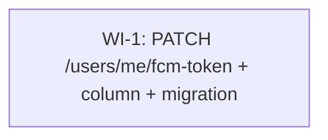

# UC-305 — FCM Token Update — Work Items

Single PATCH endpoint that lets the mobile app post the current FCM device token on every app open. Adds one nullable column to the existing `User` entity and reuses the existing `UsersFeatureConfiguration` slice.

## Assumptions

- **Single WI, not split.** UC-305 introduces a column add (not a new entity) plus one endpoint, validator, and a small migration. Splitting "entity + migration" from "endpoint + validator + tests" would force a strict serial dependency with no parallelism gain, and the entity-tweak alone is well under 20 LOC. Per the Step 5 merge rule ("if a WI is <20 LOC, merge it into its dependent"), one WI of size **S** is the right shape.
- **No new feature configuration.** The slice lives under the existing `Features/Users/` and reuses `UsersFeatureConfiguration`. The endpoint instantiates `private readonly UsersFeatureConfiguration _featureConfiguration = new();` exactly like `ToggleOpenTodayEndpoint` and `UpdateMeEndpoint`.
- **Closest mirror is `ToggleOpenTodayEndpoint`** for the `Endpoint<TRequest>` (no response generic) shape, single-column write, and 204 success. Mirror **`SendInviteEndpoint`** for the `DontThrowIfValidationFails()` + `if (ValidationFailed)` + `Send.ErrorsAsync(400, ct)` pattern that surfaces structured error codes alongside `DontCatchExceptions()`.
- **Tracked write, not `ExecuteUpdateAsync`.** Unlike `ToggleOpenTodayEndpoint`, this endpoint must distinguish "no user row" from "row updated", and per the spec it must AddError(`User.NotRegistered`) on 404 — `UpdateMeEndpoint` is the model. Load tracked caller, set both `FcmToken` and `LastActiveAt`, single `SaveChangesAsync`.
- **No trim, no normalisation.** Spec is explicit: FCM tokens are well-formed and trimming would silently mutate them. The endpoint writes `req.Token` verbatim.
- **No index on `FcmToken`.** It is never used as a filter or sort key. Push delivery (UC-307) joins by `User.Id`, then reads the column.
- **No log line referencing `FcmToken`.** The token is per-device secret material. Endpoint logs (if any) reference `User.Id` only.
- **Migration is safe.** Single nullable `VARCHAR(512)` column add on `users` table — no rewrite, no lock issue. Generated SQL must be reviewed before commit; expected: `ALTER TABLE users ADD COLUMN fcm_token VARCHAR(512) NULL`.
- **Test IP allocation:** distinct `10.80.x.y` per test method to avoid rate-limit cross-talk in the shared `WebApplicationFactory`.
- **Out of MVP, not addressed here:** clearing the token (DELETE), multi-device, validating against Firebase, push delivery itself.

## Dependency Graph

## WI-1: Add PATCH /api/v1/users/me/fcm-token endpoint with column add and migration

**Complexity:** S — single endpoint, single nullable-column add, ~80–120 LOC across production + tests.

### Required Reads

- `docs/specs/todo/08_UC_305_fcm-token.md` — the full spec
- `src/WanderMeet.Api/Features/Users/ToggleOpenToday/ToggleOpenTodayEndpoint.cs` — closest endpoint shape (`Endpoint<TRequest>`, 204 success, single-field PATCH on caller)
- `src/WanderMeet.Api/Features/Users/UpdateMe/UpdateMeEndpoint.cs` — tracked-caller load + `LastActiveAt` bump + `AddError(ErrorCodes.User.NotRegistered, ...)` 404 pattern
- `src/WanderMeet.Api/Features/Users/UpdateMe/UpdateMeValidator.cs` — `Validator<TRequest>` (FastEndpoints) shape with `.WithErrorCode(...)`
- `src/WanderMeet.Api/Features/Invites/SendInvite/SendInviteEndpoint.cs` — `DontThrowIfValidationFails()` + `if (ValidationFailed) await Send.ErrorsAsync(400, ct)` pattern
- `src/WanderMeet.Api/Features/Users/UsersFeatureConfiguration.cs` — feature configuration to reuse
- `src/WanderMeet.Api/Database/Entities/User.cs` — add the new property here
- `src/WanderMeet.Api/Infrastructure/EntityFramework/Configurations/UserConfiguration.cs` — add the `HasMaxLength` line here
- `src/WanderMeet.Shared/ValidationConstants.cs` — add `FcmTokenMaxLength = 512`
- `src/WanderMeet.Shared/ErrorCodes.cs` — add `Validation.FcmTokenRequired` and `Validation.FcmTokenTooLong`
- `tests/WanderMeet.Api.IntegrationTests/Features/Users/ToggleOpenToday/ToggleOpenTodayEndpointTests.cs` — integration test pattern (collection, fixture, `X-Forwarded-For`, DB-state assertion)
- `tests/WanderMeet.Api.UnitTests/Features/Users/UpdateMe/UpdateMeValidatorTests.cs` — validator unit-test pattern

### Deliverables

**Production code**

- `src/WanderMeet.Api/Features/Users/UpdateFcmToken/UpdateFcmTokenRequest.cs` — `public record UpdateFcmTokenRequest` with one `string Token { get; init; }` property and XML `
`.
- `src/WanderMeet.Api/Features/Users/UpdateFcmToken/UpdateFcmTokenValidator.cs` — `internal sealed class UpdateFcmTokenValidator : Validator<UpdateFcmTokenRequest>`, two rules:
  - `RuleFor(x => x.Token).NotEmpty().WithErrorCode(ErrorCodes.Validation.FcmTokenRequired);`
  - `RuleFor(x => x.Token).MaximumLength(ValidationConstants.FcmTokenMaxLength).WithErrorCode(ErrorCodes.Validation.FcmTokenTooLong);`
- `src/WanderMeet.Api/Features/Users/UpdateFcmToken/UpdateFcmTokenEndpoint.cs` — `internal sealed class UpdateFcmTokenEndpoint(WanderMeetDbContext dbContext, TimeProvider timeProvider) : Endpoint<UpdateFcmTokenRequest>`. `Configure()` declares `Patch("users/me/fcm-token")`, `DontCatchExceptions()`, `DontThrowIfValidationFails()`, `Policies(nameof(AuthorizationPolicies.UsersOnly))`, `.RequireRateLimiting(RateLimitPolicies.GeneralApi)` inside `Description(...)`, `.WithName(nameof(UpdateFcmTokenEndpoint))`, `.WithTags(_featureConfiguration.Info.Name)`. `Summary` lists 204/400/401/404/429. `HandleAsync`:
  1. `if (ValidationFailed) await Send.ErrorsAsync(400, ct); return;`
  2. resolve `sub` from `ClaimTypes.NameIdentifier`; if null/empty → `Send.UnauthorizedAsync`.
  3. `var caller = await dbContext.Users.FirstOrDefaultAsync(u => u.AzureAdB2CId == sub && u.DeletedAt == null, ct);` (tracked, no `AsNoTracking`)
  4. if null → `AddError(ErrorCodes.User.NotRegistered, "No user profile found for this identity.")` + `Send.ErrorsAsync(404, ct)` + `return;`.
  5. `var now = timeProvider.GetUtcNow();`
  6. `caller.FcmToken = req.Token;` `caller.LastActiveAt = now;`
  7. `await dbContext.SaveChangesAsync(ct);`
  8. `await Send.NoContentAsync(ct);`

**Entity / EF**

- `src/WanderMeet.Api/Database/Entities/User.cs` — add `public string? FcmToken { get; set; }` with XML `
` (per `rules/csharp-style.md#xml-documentation`).
- `src/WanderMeet.Api/Infrastructure/EntityFramework/Configurations/UserConfiguration.cs` — add `builder.Property(x => x.FcmToken).HasMaxLength(ValidationConstants.FcmTokenMaxLength);` (no `IsRequired`, no `HasIndex`).

**Migration**

- Create via `dotnet ef migrations add AddFcmTokenToUser --project src/WanderMeet.Api --startup-project src/WanderMeet.Api`.
- Review the generated `*.cs` and confirm SQL is purely `ALTER TABLE users ADD COLUMN fcm_token VARCHAR(512) NULL` (no destructive ops, no rewrite). Commit migration `.cs`, `.Designer.cs`, and the updated `WanderMeetDbContextModelSnapshot.cs`.

**Shared constants**

- `src/WanderMeet.Shared/ValidationConstants.cs` — add `public const int FcmTokenMaxLength = 512;` with XML `
`.
- `src/WanderMeet.Shared/ErrorCodes.cs` — add inside the existing `Validation` nested class:
  - `public const string FcmTokenRequired = "Validation.FcmTokenRequired";`
  - `public const string FcmTokenTooLong = "Validation.FcmTokenTooLong";`
  - Both with XML `
` docs.

**Tests**

- `tests/WanderMeet.Api.UnitTests/Features/Users/UpdateFcmToken/UpdateFcmTokenValidatorTests.cs` — covers null / empty / whitespace / 512-char (passes) / 513-char (fails). Use `TestValidate(...)` + `ShouldHaveValidationErrorFor(...).WithErrorCode(...)` per `rules/validation.md#testing-validators`.
- `tests/WanderMeet.Api.IntegrationTests/Features/Users/UpdateFcmToken/UpdateFcmTokenEndpointTests.cs` — `[Collection(TestConstants.Collections.PipelineTest)]` (or whichever the `Users` slice currently uses), inherits `IntegrationTestBase`. Each test gets a distinct `X-Forwarded-For` in the `10.80.x.y` range. Assertions use FluentAssertions + DB readback via a fresh scope (`AsNoTracking`).

### Error Paths

| Status | Code | Trigger |
|--------|------|---------|
| 204 | — | Token persisted; `LastActiveAt` advanced |
| 400 | `Validation.FcmTokenRequired` | `req.Token` is null, empty, or whitespace-only (FluentValidation `NotEmpty`) |
| 400 | `Validation.FcmTokenTooLong` | `req.Token.Length > 512` |
| 401 | — | Bearer token missing or has no `sub` claim |
| 404 | `User.NotRegistered` | No `User` row with `AzureAdB2CId == sub && DeletedAt == null` |
| 429 | — | `GeneralApi` rate limit exceeded |

All 4xx error codes are surfaced via `AddError(code, message)` + `Send.ErrorsAsync(status, ct)` (per `rules/error-handling.md#send-for-expected-errors`). Validation 400s arrive through `if (ValidationFailed)` because the validator already populated `ValidationFailures` with the right error codes.

### Tests

**Integration** (`UpdateFcmTokenEndpointTests`)

- `HandleAsync_ValidRequest_Returns204AndSetsFcmToken` — seed user, PATCH with token, assert 204, re-read row, assert `FcmToken == request.Token` and `LastActiveAt == App.FakeTimeProvider.GetUtcNow()`. IP `10.80.0.1`.
- `HandleAsync_ResendSameToken_Returns204AndAdvancesLastActiveAt` — seed user with `FcmToken = T`, advance `FakeTimeProvider`, PATCH again with the same `T`, assert 204 and `LastActiveAt` updated. IP `10.80.0.2`.
- `HandleAsync_DifferentToken_OverwritesPreviousToken` — seed user with `FcmToken = T1`, PATCH with `T2`, assert DB has `T2`. IP `10.80.0.3`.
- `HandleAsync_NoBearerToken_Returns401` — anonymous client, expect 401. IP `10.80.0.4`.
- `HandleAsync_CallerNotRegistered_Returns404WithUserNotRegistered` — authenticated client with sub that has no User row, expect 404 with body code `User.NotRegistered`. IP `10.80.0.5`.
- `HandleAsync_EmptyToken_Returns400WithFcmTokenRequired` — body `{ token: "" }`, expect 400 with `Validation.FcmTokenRequired`. IP `10.80.0.6`.
- `HandleAsync_WhitespaceOnlyToken_Returns400WithFcmTokenRequired` — body `{ token: "   " }`, expect 400 with `Validation.FcmTokenRequired`. IP `10.80.0.7`.
- `HandleAsync_TokenLongerThanMax_Returns400WithFcmTokenTooLong` — 513-char token, expect 400 with `Validation.FcmTokenTooLong`. IP `10.80.0.8`.

**Unit** (`UpdateFcmTokenValidatorTests`)

- `Validate_NullToken_FailsWithFcmTokenRequired`
- `Validate_EmptyToken_FailsWithFcmTokenRequired`
- `Validate_WhitespaceOnlyToken_FailsWithFcmTokenRequired`
- `Validate_TokenAt512Chars_Passes`
- `Validate_TokenAt513Chars_FailsWithFcmTokenTooLong`

### Verification

`{ "tool": "dotnet-test", "filter": "UpdateFcmToken" }` → `dotnet test --filter "FullyQualifiedName~UpdateFcmToken"`.
