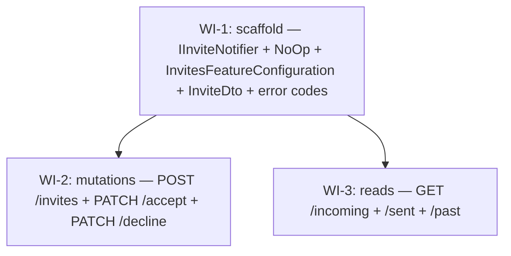

# UC-301 — Invites: work items

Source spec: [`04_UC_301_invites.md`](./04_UC_301_invites.md)

## Assumptions

The following design judgements are baked into the work items below. Each one is a defensible-either-way call; deviating means re-running design.

1. **`IInviteNotifier` lives in `Features/Invites/Shared/` (feature-local), not `WanderMeet.Infrastructure/Notifications/`.** The Phase 3a default `NoOpInviteNotifier` is registered via `InvitesFeatureConfiguration.AddFeatureDependencies`. **Rationale:** zero existing notification infra, no SignalR/FCM packages yet in `WanderMeet.Infrastructure`, and the spec explicitly says Phase 3b will replace. Keeping the interface feature-local now avoids cross-project churn; when Phase 3b lands, the interface moves to `WanderMeet.Infrastructure/Notifications/` and the feature config switches the registration. The move is a five-line refactor (interface namespace + one DI line) — far cheaper than adding a project reference and an empty folder today. **Trade-off:** when UC-302 grows a sibling `IReviewNotifier`, both will sit in their own slices until Phase 3b consolidates — that mirrors the vertical-slice principle and is fine.
2. **Same-city invariant is enforced on POST: `place.CityId == receiver.CityId`** with error code `Invite.PlaceCityMismatch` (400). **Rationale:** UC-301 is "right now meetups", not "future trips"; a place outside the receiver's current city is nonsense the receiver cannot honour today. The travel-history slice already records cities, so a "I'm flying in tomorrow" use case has a clear future home (UC-302's arriving feature). Frictionless edge cases are hypothetical; nonsense-invite spam is real. **Trade-off:** If a receiver is travelling on a sub-day basis we will need to relax this — easy to delete one guard later.
3. **List endpoints cap at `Take(50)` — no cursor pagination.** **Rationale:** invite lists are inherently small (Pending capped by the 20/h send rate; Accepted+Declined per receiver bounded by the same partner's actions). A power user accumulates ~200 past invites a year — trivially within 50. Cursor pagination is dead weight here vs. Discovery's potentially unlimited city-wide feed. **Trade-off:** A 2-year-old account with 500+ past invites loses the tail; defer to a future "load more" UC if real users complain. The cap MUST be documented in the Summary block of each list endpoint so the frontend team is not surprised.
4. **PATCH on a foreign invite returns 404, not 403.** Spec leans this way. **Rationale:** matches existing `UpdateCityEndpoint`'s "row not found or not owned" 404 pattern; closes a low-value side channel where senders could probe receiver behaviour by polling `/accept`. Cost is zero — 403 tells senders nothing useful given they already know they sent it.
5. **No decline-cooldown.** Only **Pending** invites in either direction block a new send. Declined / Expired / Accepted prior invites do NOT block. **Rationale:** spec is silent and a cooldown adds state nobody asked for. The 20/hour per-sender rate limit already throttles harassment. A blocked user's correct fix is the future block/mute slice (out of scope), not a 24h cooldown that legitimate users will hit when "decline by accident" UX is normal. **Trade-off:** A determined harasser can re-send hourly within their 20/h budget; mitigation is the future block feature.
6. **`Invite.AlreadyResolved` is the single 409 code for "not Pending OR past `ExpiresAt`".** Spec offered `Invite.AlreadyResolved` or `Invite.Expired` separately and asked the designer to pick. Keeping a single 409 code keeps the frontend's localisation table small; the timestamp on the persisted row already tells the client which sub-case it was. The background expiry job (UC-304) will set `Status = Expired`, so by the time the client typically retries, the synchronous 409 will round-trip back as "already-Expired" anyway.
7. **PATCH endpoints rate-limit under `RateLimitPolicies.GeneralApi`** (POST under `InviteSend`). The 20/h budget is for *sending*, not for accepting/declining one's own incoming invites — receivers should not be throttled for honest responses.
8. **One `SaveChangesAsync` per accept.** Both the Invite mutation and the new Meetup row save in a single round-trip; EF Core wraps them in an implicit transaction, so the invariant "Accepted invite ↔ Meetup exists" holds atomically. The unique index on `Meetup.InviteId` (already in `MeetupConfiguration`) is the safety net against double-accept races.
9. **Notifier failures are swallowed** (try/catch + `LogWarning`) per spec non-functional `Notifier failures (Phase 3b) MUST NOT bubble past the endpoint`. Persisted state is the source of truth; a missed push is a degraded UX, not a 500.
10. **No new EF entities, no migration.** Phase 2 already shipped `Invite` + `Meetup` + the index on `Meetup.InviteId`. WI-2 reads/writes them only.

## Dependency Graph



WI-2 and WI-3 are independent of each other and may run in parallel after WI-1 lands.

## WI-1: Invites feature scaffold (IInviteNotifier + DTOs + error codes)

### Required reads

- `docs/specs/in-progress/04_UC_301_invites.md`
- `src/WanderMeet.Api/Features/Discovery/DiscoveryFeatureConfiguration.cs` — minimal feature-config shape (no DI extras).
- `src/WanderMeet.Api/Features/Auth/AuthFeatureConfiguration.cs` — feature-config that registers DI services.
- `src/WanderMeet.Api/Common/IFeatureConfiguration.cs` and `Common/FeatureConfigurationExtensions.cs` — auto-discovery rules; the new feature is invisible in Swagger if the configuration class is missing.
- `src/WanderMeet.Api/Database/Entities/Invite.cs`, `Meetup.cs`, `User.cs`, `Place.cs`, `HangoutTag.cs`, `UserPhoto.cs` — entity shapes the DTO will project.
- `src/WanderMeet.Api/Features/Users/Shared/PublicUserDto.cs`, `Features/Places/Shared/PlaceDto.cs` — existing DTO records to mirror style.
- `src/WanderMeet.Shared/ErrorCodes.cs`, `Enums/InviteStatus.cs`, `Enums/PlaceCategory.cs`.

### Deliverables

- **`src/WanderMeet.Api/Features/Invites/InvitesFeatureConfiguration.cs`** — `internal sealed`, parameterless ctor, `FeatureInfo("Invites", "Send / accept / decline / list invites between users")`, `AddFeatureDependencies` registers `IInviteNotifier → NoOpInviteNotifier` as a singleton.
- **`Features/Invites/Shared/IInviteNotifier.cs`** — `public` interface with two minimal methods:
  - `Task InviteSentAsync(Invite invite, CancellationToken ct)`
  - `Task InviteAcceptedAsync(Invite invite, Guid meetupId, CancellationToken ct)`
  - Interface XML doc states the Phase 3b replacement plan AND that callers MUST handle implementation failures locally per the spec non-functional requirement.
- **`Features/Invites/Shared/NoOpInviteNotifier.cs`** — `internal sealed class NoOpInviteNotifier(ILogger<NoOpInviteNotifier> logger) : IInviteNotifier`. Each method emits one `Debug`-level log line including the invite id and returns `Task.CompletedTask`.
- **DTOs** (`record`s, `public`) in `Features/Invites/Shared/`:
  - `InviteUserMiniDto(Guid Id, string FirstName, string? PhotoUrl)`
  - `InvitePlaceMiniDto(Guid Id, string Name, PlaceCategory Category)`
  - `InviteDto(Guid Id, string Status, bool SenderIsThere, DateTimeOffset SentAt, DateTimeOffset? RespondedAt, DateTimeOffset ExpiresAt, string HangoutTagSlug, InviteUserMiniDto Sender, InviteUserMiniDto Receiver, InvitePlaceMiniDto Place)` — MUST NOT leak `AzureAdB2CId`, location, trust score, or any other sensitive identity field (spec NF7).
- **`ErrorCodes.cs`** appends a new nested `Invite` static class:
  - `ReceiverNotFound`, `HangoutTagNotFound`, `PlaceNotFound`, `SelfInviteForbidden`, `PlaceCityMismatch` (400-tier).
  - `AlreadyPending` (409).
  - `NotFound` (404 on PATCH).
  - `AlreadyResolved` (409 on PATCH).
  - Stable string values matching `Invite.{ErrorName}`.
  - Each constant has an XML doc summary.
- **`ErrorCodes.Validation`** gains: `ReceiverIdRequired`, `HangoutTagIdRequired`, `PlaceIdRequired`.

### Error paths

WI-1 only adds scaffolding; no endpoints land here. Codes are consumed by WI-2.

### Tests

| Test | Type |
|------|------|
| `Discover_FeatureConfiguration_RegistersIInviteNotifierAsNoOp` | Integration — resolves `IInviteNotifier` from `App.Services` and asserts concrete type is `NoOpInviteNotifier`. |
| `NoOpInviteNotifier_InviteSentAsync_LogsAtDebugAndReturnsCompletedTask` | Unit — fakes `ILogger<NoOpInviteNotifier>`, asserts a single `LogDebug` call with the invite id and that the returned task is completed. |
| `NoOpInviteNotifier_InviteAcceptedAsync_LogsAtDebugAndReturnsCompletedTask` | Unit — same, with the meetup id present in the log scope/state. |

### Verification

`dotnet test --filter "FullyQualifiedName~Invites"` (or `dotnet build -warnaserror` to confirm scaffolding compiles before running tests).

## WI-2: Invite mutations (POST + PATCH accept + PATCH decline)

### Required reads

- `docs/specs/in-progress/04_UC_301_invites.md`
- `src/WanderMeet.Api/Features/Auth/Register/RegisterEndpoint.cs` — auth-lookup → guard → mutate → save → respond.
- `src/WanderMeet.Api/Features/Users/AddCity/AddCityEndpoint.cs` — auth-lookup → entity-existence guard → mutate → 201.
- `src/WanderMeet.Api/Features/Users/UpdateCity/UpdateCityEndpoint.cs` — PATCH on a tracked entity scoped to the caller.
- `src/WanderMeet.Api/Features/Auth/Register/RegisterValidator.cs` — FluentValidation `Validator<T>` with `WithErrorCode(...)` (NEVER `AbstractValidator<T>`).
- `src/WanderMeet.Api/Database/Entities/Invite.cs`, `Meetup.cs`, `User.cs`, `Place.cs`, `HangoutTag.cs`, `UserPhoto.cs`, `AuditableEntity.cs`.
- `src/WanderMeet.Api/Infrastructure/EntityFramework/WanderMeetDbContext.cs`, `Configurations/InviteConfiguration.cs`, `Configurations/MeetupConfiguration.cs`.
- `src/WanderMeet.Api/Common/RateLimitPolicies.cs`, `Authorization/AuthorizationPolicies.cs`.
- All WI-1 deliverables (`InvitesFeatureConfiguration`, `InviteDto`, `IInviteNotifier`, error codes).
- `src/WanderMeet.Shared/ValidationConstants.cs` — `InviteExpiryWindow = 48h`.
- `src/WanderMeet.Shared/Enums/InviteStatus.cs`.
- `tests/WanderMeet.Api.IntegrationTests/Features/Discovery/Feed/DiscoverFeedEndpointTests.cs` — pattern for distinct `X-Forwarded-For`, seeding via `App.Services` scope, `[Collection]`.
- `tests/WanderMeet.Api.UnitTests/Features/Auth/Register/RegisterValidatorTests.cs` — `TestValidate` + `ShouldHaveValidationErrorFor(...).WithErrorCode(...)`.

### Deliverables

**Files:**

```
src/WanderMeet.Api/Features/Invites/SendInvite/{SendInviteEndpoint, SendInviteRequest, SendInviteValidator}.cs
src/WanderMeet.Api/Features/Invites/AcceptInvite/{AcceptInviteEndpoint, AcceptInviteRequest, AcceptInviteResponse}.cs
src/WanderMeet.Api/Features/Invites/DeclineInvite/{DeclineInviteEndpoint, DeclineInviteRequest}.cs
```

**`SendInviteEndpoint`** — `internal sealed`, primary ctor `(WanderMeetDbContext dbContext, TimeProvider timeProvider, IInviteNotifier inviteNotifier, ILogger<SendInviteEndpoint> logger)`. `Post("invites")`. Description chains `RequireRateLimiting(RateLimitPolicies.InviteSend)`. `DontCatchExceptions()` mandatory. `Policies(nameof(AuthorizationPolicies.UsersOnly))`.

Handle order:
1. JWT sub → 401 if missing.
2. Load caller `User` (tracked, for `LastActiveAt` update) where `AzureAdB2CId == sub && DeletedAt == null`. 404 + `User.NotRegistered` if missing.
3. Project receiver `(Id, CityId, DeletedAt)` from `Users.AsNoTracking()`. 400 + `Invite.ReceiverNotFound` if missing OR soft-deleted.
4. Project place `(Id, CityId)` from `Places.AsNoTracking()`. 400 + `Invite.PlaceNotFound` if missing.
5. `HangoutTags.AsNoTracking().AnyAsync(h => h.Id == req.HangoutTagId)`. 400 + `Invite.HangoutTagNotFound` if missing.
6. Guard `receiver.Id != caller.Id` → 400 + `Invite.SelfInviteForbidden`.
7. Guard `place.CityId == receiver.CityId` → 400 + `Invite.PlaceCityMismatch`.
8. Single `AnyAsync` over `Invites` checking pending in either direction:
   ```
   Invites.Any(i => i.Status == InviteStatus.Pending &&
       ((i.SenderId == caller.Id && i.ReceiverId == receiver.Id) ||
        (i.SenderId == receiver.Id && i.ReceiverId == caller.Id)))
   ```
   → 409 + `Invite.AlreadyPending`.
9. Build `Invite` row: `Id = NewGuid`, `Status = Pending`, `SentAt = now`, `ExpiresAt = now + ValidationConstants.InviteExpiryWindow`, `RespondedAt = null`, `CreatedAt = now`. Add to context.
10. Update `caller.LastActiveAt = now`.
11. `SaveChangesAsync(ct)` — single round-trip.
12. Try-catch around `inviteNotifier.InviteSentAsync(invite, ct)`; on exception `LogWarning` + continue (state already persisted).
13. Build `InviteDto` (use a private `MapToDto` helper that takes the persisted invite + the loaded receiver/place/hangout-tag projections + caller's first photo URL). Return 201.

**`AcceptInviteEndpoint`** — `Patch("invites/{id:guid}/accept")`. `RequireRateLimiting(RateLimitPolicies.GeneralApi)`. Handle:
1. JWT sub → 401.
2. Resolve caller User (tracked or projected; tracked is simpler since we update `LastActiveAt`). 404 + `User.NotRegistered` if missing.
3. Load invite TRACKED with `Include(i => i.Sender).ThenInclude(s => s!.Photos)`, `Include(i => i.Receiver).ThenInclude(r => r!.Photos)`, `Include(i => i.Place)`, `Include(i => i.HangoutTag)` where `i.Id == req.Id && i.ReceiverId == caller.Id`. 404 + `Invite.NotFound` if missing (covers both "doesn't exist" and "caller is the sender").
4. If `invite.Status != InviteStatus.Pending` OR `invite.ExpiresAt <= now` → 409 + `Invite.AlreadyResolved`.
5. Set `invite.Status = Accepted`, `invite.RespondedAt = now`, `invite.UpdatedAt = now`.
6. Create `Meetup { Id = NewGuid, InviteId = invite.Id, UserAId = invite.SenderId, UserBId = invite.ReceiverId, PlaceId = invite.PlaceId, MetAt = now, PromptSent = false, CreatedAt = now }`. Add to context.
7. Update `caller.LastActiveAt = now`.
8. ONE `SaveChangesAsync(ct)` — both rows persisted atomically.
9. Try-catch around `inviteNotifier.InviteAcceptedAsync(invite, meetup.Id, ct)`; on exception `LogWarning` + continue.
10. Build `InviteDto` from the loaded includes. Return 200 with `AcceptInviteResponse(InviteDto Invite, Guid MeetupId)`.

**`DeclineInviteEndpoint`** — same scoping/preconditions as Accept (same 404, same 409). Sets `Status = Declined`, `RespondedAt = now`, `UpdatedAt = now`. NO Meetup row. NO notifier call (silent decline is intentional per spec). 200 with `InviteDto`.

**`SendInviteValidator`** — `internal sealed class : Validator<SendInviteRequest>`. Three `RuleFor(x => x.<Field>).NotEmpty().WithErrorCode(ErrorCodes.Validation.<Field>Required)` calls. `SenderIsThere` is a `bool`, no validator rule needed.

**Routes:**
- `POST  /api/v1/invites`
- `PATCH /api/v1/invites/{id:guid}/accept`
- `PATCH /api/v1/invites/{id:guid}/decline`

(Global `/api/v1` prefix is configured project-wide; endpoints declare only the relative route.)

### Error paths

| Code | Status | Trigger |
| --- | --- | --- |
| (n/a) | 401 | Bearer token missing/invalid (any of 3 endpoints) |
| `Validation.ReceiverIdRequired` | 400 | POST: empty receiverId |
| `Validation.HangoutTagIdRequired` | 400 | POST: empty hangoutTagId |
| `Validation.PlaceIdRequired` | 400 | POST: empty placeId |
| `User.NotRegistered` | 404 | Caller has JWT but no User row (any of 3 endpoints) |
| `Invite.ReceiverNotFound` | 400 | POST: receiverId unknown OR soft-deleted |
| `Invite.HangoutTagNotFound` | 400 | POST: hangoutTagId unknown |
| `Invite.PlaceNotFound` | 400 | POST: placeId unknown |
| `Invite.SelfInviteForbidden` | 400 | POST: receiverId == callerId |
| `Invite.PlaceCityMismatch` | 400 | POST: place.CityId != receiver.CityId |
| `Invite.AlreadyPending` | 409 | POST: a Pending invite already exists in either direction |
| (n/a) | 429 | POST: > 20/h (Retry-After present) |
| `Invite.NotFound` | 404 | PATCH: id unknown OR caller is not the receiver |
| `Invite.AlreadyResolved` | 409 | PATCH: Status != Pending OR ExpiresAt past |

### Tests

Integration (`tests/WanderMeet.Api.IntegrationTests/Features/Invites/`):
- `SendInvite/SendInviteEndpointTests.cs` — covers happy path, 401, 404 not-registered, every 400 code, 409 already-pending in BOTH directions, 409 vs. previously-Declined invite (must succeed — see Assumption 5), 429 rate-limit (build client ONCE, fire 21 sends), trust-score-unchanged check, persisted Status string is `'Pending'`, no Meetup row created, notifier-throws-but-201.
- `AcceptInvite/AcceptInviteEndpointTests.cs` — happy path returns 200 with both `InviteDto` and `meetupId`, persisted Status `'Accepted'`, Meetup row exists with correct FKs and `MetAt = TimeProvider now` and `PromptSent == false`, 404 for foreign invite, 404 for non-existent, 409 for already-Accepted/Declined/Expired/PendingButPastExpiresAt, notifier `InviteAcceptedAsync` called with the right `meetupId`, trust-score-unchanged.
- `DeclineInvite/DeclineInviteEndpointTests.cs` — happy path, 404 foreign, 409 already-resolved, NO Meetup row, NO notifier call (use a recording fake to assert zero invocations).

Unit (`tests/WanderMeet.Api.UnitTests/Features/Invites/`):
- `SendInvite/SendInviteValidatorTests.cs` — three failure cases (empty Guids) and one happy case.
- `SendInvite/SendInviteEndpointNotifierTests.cs` — fake notifier whose `InviteSentAsync` throws; assert endpoint does NOT propagate (this can be a unit test if `HandleAsync` is invoke-able with a `FakeItEasy` `WanderMeetDbContext` substitute, otherwise fold into the integration suite as a "notifier-throws-but-201" scenario).

Distinct `X-Forwarded-For` per test; the rate-limit test creates the client ONCE outside its loop (CLAUDE.md: rate-limit-test trap).

### Verification

`dotnet test --filter "FullyQualifiedName~Invites"`

## WI-3: Invite read endpoints (incoming, sent, past)

### Required reads

- `docs/specs/in-progress/04_UC_301_invites.md`
- `src/WanderMeet.Api/Features/Discovery/Feed/DiscoverFeedEndpoint.cs` — multi-filter LINQ + projection + AsNoTracking pattern.
- `src/WanderMeet.Api/Features/Users/AddCity/AddCityEndpoint.cs` — auth-lookup pattern.
- `src/WanderMeet.Api/Database/Entities/Invite.cs`, `User.cs`, `Place.cs`, `HangoutTag.cs`, `UserPhoto.cs`.
- `src/WanderMeet.Api/Infrastructure/EntityFramework/WanderMeetDbContext.cs`, `Configurations/InviteConfiguration.cs` — confirm composite indexes `(SenderId, Status)` and `(ReceiverId, Status)` are already in place (they are — see Phase 2 commit).
- `src/WanderMeet.Api/Common/RateLimitPolicies.cs`, `Authorization/AuthorizationPolicies.cs`.
- WI-1 deliverables — `InvitesFeatureConfiguration`, `InviteDto`, `InviteUserMiniDto`, `InvitePlaceMiniDto`.
- `src/WanderMeet.Shared/ErrorCodes.cs`, `Enums/InviteStatus.cs`.
- `tests/WanderMeet.Api.IntegrationTests/Features/Discovery/Feed/DiscoverFeedEndpointTests.cs`, `Infrastructure/IntegrationTestBase.cs`.

### Deliverables

**Files:**

```
src/WanderMeet.Api/Features/Invites/ListIncoming/ListIncomingInvitesEndpoint.cs
src/WanderMeet.Api/Features/Invites/ListSent/ListSentInvitesEndpoint.cs
src/WanderMeet.Api/Features/Invites/ListPast/ListPastInvitesEndpoint.cs
src/WanderMeet.Api/Features/Invites/Shared/ListInvitesResponse.cs
```

**`ListInvitesResponse`** — `public record ListInvitesResponse(IReadOnlyList<InviteDto> Items)`. NO `NextCursor` field (Assumption 3 — pagination deferred).

**Endpoints** — each `internal sealed`, inherits `EndpointWithoutRequest<ListInvitesResponse>`. `DontCatchExceptions()`, `Policies(nameof(AuthorizationPolicies.UsersOnly))`, `RequireRateLimiting(RateLimitPolicies.GeneralApi)` chained inside `Description(...)`. `Summary(...)` documents 200, 401, 404, 429 and the **`Take(50)` cap**.

Routes:
- `GET /api/v1/invites/incoming`
- `GET /api/v1/invites/sent`
- `GET /api/v1/invites/past`

Handler shape (each endpoint):
1. JWT sub → 401.
2. Project caller id from `Users.AsNoTracking().Where(AzureAdB2CId == sub && DeletedAt == null).Select(u => (Guid?)u.Id).FirstOrDefaultAsync(ct)`. 404 + `User.NotRegistered` if `null` (per spec alternate flow — list endpoints return 404, NOT 200 with `[]`).
3. Build `dbContext.Invites.AsNoTracking()` query with the WHERE+ORDER for the slice (see below).
4. `.Take(50)`. `.Select(...)` building `InviteDto` directly (no `Include`, pure projection so EF only loads the needed columns). For Sender/Receiver photo: `i.Sender!.Photos.OrderBy(p => p.Order).Select(p => p.BlobUrl).FirstOrDefault()`. For HangoutTag slug: `i.HangoutTag!.Slug.ToString()`.
5. `await Send.OkAsync(new ListInvitesResponse(items), ct)`.

Per-slice WHERE/ORDER:

| Slice | WHERE | ORDER BY |
| --- | --- | --- |
| Incoming | `i.ReceiverId == callerId && i.Status == InviteStatus.Pending && i.Sender!.DeletedAt == null` | `SentAt DESC` |
| Sent | `i.SenderId == callerId` (all statuses) | `SentAt DESC` |
| Past | `(i.SenderId == callerId \|\| i.ReceiverId == callerId) && i.Status != InviteStatus.Pending` | `RespondedAt DESC NULLS LAST, SentAt DESC` |

The Past ordering needs a deterministic SQL translation. Recommend `OrderBy(i => i.RespondedAt == null).ThenByDescending(i => i.RespondedAt).ThenByDescending(i => i.SentAt)` — EF Core/Npgsql translates `i.RespondedAt == null` to a boolean-as-int sort key that pushes NULLs to the end. Add a single `// NULLS LAST: ...` comment above the OrderBy explaining the intent. Avoid `i.RespondedAt ?? DateTimeOffset.MinValue` — Npgsql translates `??` to `COALESCE`, but the `MinValue` constant produces an awkward `timestamptz` literal that the planner sometimes fails to use the index on; the `== null` boolean trick is more index-friendly.

### Error paths

| Code | Status | Trigger |
| --- | --- | --- |
| (n/a) | 401 | Bearer token missing/invalid |
| `User.NotRegistered` | 404 | Caller has JWT but no User row — list endpoints return 404 per spec (NOT 200 `[]`) |
| (n/a) | 429 | GeneralApi rate-limit exceeded |

### Tests

All integration (no unit-level surface beyond what the integration suite already covers — these are pure projections, no validator).

`tests/WanderMeet.Api.IntegrationTests/Features/Invites/ListIncoming/ListIncomingInvitesEndpointTests.cs`:
- 401 / 404-not-registered.
- Pending receiver-side invite is included; Accepted receiver-side is excluded; Pending sender-side is excluded.
- Soft-deleted sender's invite is excluded.
- Ordered by `SentAt DESC`.
- The implicit `Take(50)` cap is documented but a 50-row test is not required.

`ListSent/ListSentInvitesEndpointTests.cs`:
- 401 / 404-not-registered.
- All statuses (Pending, Accepted, Declined, Expired) returned.
- Receiver-side invite is excluded.
- Ordered by `SentAt DESC`.

`ListPast/ListPastInvitesEndpointTests.cs`:
- 401 / 404-not-registered.
- Pending invites are excluded.
- Accepted/Declined/Expired where caller is sender OR receiver are returned.
- Ordering test: invites with `RespondedAt = null` (Expired, since the background job sets Status without populating RespondedAt — verify Phase 2 entity allows this) appear AFTER invites with `RespondedAt` populated. Two responded invites are sorted by `RespondedAt DESC`.
- Other users' invites are not leaked.

Distinct `X-Forwarded-For` per test. `[Collection(TestConstants.Collections.PipelineTest)]`. Seed via `App.Services` scope.

### Verification

`dotnet test --filter "FullyQualifiedName~Invites"`
