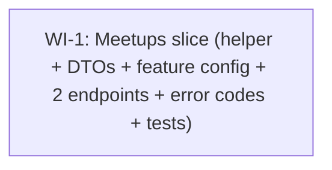

# UC-302 Meetups & Reviews — Work Items

Source spec: [`05_UC_302_meetups-reviews.md`](./05_UC_302_meetups-reviews.md)

## Assumptions

These judgment calls were made by the designer. Conductor / user can override before developer dispatch — otherwise the developer treats them as binding.

1. **Trust-score recompute placement: option (a), post-`SaveChangesAsync` GROUP BY.**
   The endpoint saves the new `MeetupReview` first, then runs a single GROUP BY against `MeetupReviews` filtered by `RevieweeId`, then sets `User.TrustScore` / `User.MeetupCount` and saves a second time. Two round-trips on the write path; clean, easy to reason about, the recompute reflects the full DB state. Concurrent reviewers landing in the same window each see their own row plus all earlier rows — no in-memory diff needed. Option (b), pre-load aggregates and combine in memory, was rejected: the LINQ projection couples math with EF, and concurrency reasoning gets hard.

2. **Trust-score formula extracted to a static helper.**
   `Features/Meetups/Shared/TrustScoreCalculator.cs` — one static method `Compute(int didMeetCount, int feltSafeCount, int goodConvoCount, int wouldMeetAgainCount) -> (int trustScore, int meetupCount)`. Pure, unit-testable, named per the roadmap "Algorithm" framing. Endpoint stays orchestration-only.

3. **`User.MeetupCount` semantics: count of did-meet reviews about the reviewee.**
   Spec already chose this. Recomputing on Meetup-row creation would mean editing UC-301 AcceptInvite — out of scope. The chosen semantic also reflects "meetups confirmed to have happened" rather than "meetups scheduled" — more honest as a trust signal.

4. **Pending-review item shape → `MeetupSummaryDto` (reusable).**
   The shape `(meetupId, otherUser, place, metAt)` is exactly what a future "my meetup history" endpoint would project. Lives at `Features/Meetups/Shared/MeetupSummaryDto.cs`. Two sibling mini-DTOs, `MeetupUserMiniDto` and `MeetupPlaceMiniDto`, also in `Features/Meetups/Shared/` — duplicates the structure of `Invites/Shared/InviteUserMiniDto` rather than referencing it (architecture rule: no cross-feature references).

5. **Reviewee mini-summary in POST response → fully-typed `RevieweeStatsDto` record.**
   Convention is fully-typed records, never anonymous-ish in HTTP responses. Lives at `Features/Meetups/Shared/RevieweeStatsDto.cs` so a future `GET /users/{id}/reviews` slice can reuse it.

6. **Single WI for both endpoints + helper + scaffolding.**
   The two endpoints share `MeetupsFeatureConfiguration`, the participant-resolution logic, the `MeetupSummaryDto` projection, and the tests collection wiring. Splitting POST vs GET would force scaffolding to land twice with no parallelism gain. WI-1 ships everything together.

7. **Idempotency race**: the `(MeetupId, ReviewerId)` unique index is the ultimate guard. The pre-check 409 is the clean path. If two concurrent POSTs race past the pre-check, the second `SaveChangesAsync` raises `DbUpdateException` → bubbles to the global handler (500). Acceptable, mirrors UC-201 Register.

8. **Validation flow**: mirror `SendInviteEndpoint` — declare `DontThrowIfValidationFails()`, then guard `if (ValidationFailed) { await Send.ErrorsAsync(400, ct); return; }` early in `HandleAsync`. Avoids the FastEndpoints default exception path.

9. **Test IP allocation**: `10.50.x.y` per test (mirrors `10.40.x.y` allocation in `AcceptInviteEndpointTests`). Each test gets a distinct trailing octet.

## Dependency Graph



Single-WI workflow — no inter-WI dependencies.

---

## WI-1: Meetups slice — TrustScoreCalculator, MeetupsFeatureConfiguration, shared DTOs, error codes, GET /meetups/pending-review and POST /meetups/{id}/review with trust-score recalc

**Estimated complexity:** M
**Verification:** `dotnet test --filter "FullyQualifiedName~Meetups"`

### Required Reads

- `docs/specs/in-progress/05_UC_302_meetups-reviews.md` — the UC spec.
- `docs/specs/in-progress/meetups-reviews-work-items.md` — this document (the assumptions).
- `src/WanderMeet.Api/Features/Invites/InvitesFeatureConfiguration.cs` — reference for `IFeatureConfiguration`.
- `src/WanderMeet.Api/Features/Invites/AcceptInvite/AcceptInviteEndpoint.cs` — closest mutation pattern: tracked load → mutate → `SaveChangesAsync` → fresh `AsNoTracking` projection → `Send.OkAsync`. Mirror this shape for POST /review.
- `src/WanderMeet.Api/Features/Invites/SendInvite/SendInviteEndpoint.cs` — `DontThrowIfValidationFails()` + `if (ValidationFailed)` pattern; `AddError` + `Send.ErrorsAsync(409, ct)` for the 409 conflict path.
- `src/WanderMeet.Api/Features/Invites/SendInvite/SendInviteValidator.cs` — the `Validator<TRequest>` shape. Mirror exactly.
- `src/WanderMeet.Api/Features/Invites/ListIncoming/ListIncomingInvitesEndpoint.cs` — list-with-projection pattern; mirror for GET pending-review.
- `src/WanderMeet.Api/Features/Invites/Shared/InviteUserMiniDto.cs`, `InvitePlaceMiniDto.cs` — DTO shape to mirror for `MeetupUserMiniDto` / `MeetupPlaceMiniDto`.
- `src/WanderMeet.Api/Features/Discovery/Feed/DiscoverFeedEndpoint.cs` — NOT EXISTS subquery pattern via `!dbContext.Invites.Any(...)`; use the same idiom for the pending-review filter.
- `src/WanderMeet.Api/Database/Entities/{Meetup,MeetupReview,User,Place,UserPhoto}.cs` — entity shapes.
- `src/WanderMeet.Api/Infrastructure/EntityFramework/WanderMeetDbContext.cs` — `Meetups`, `MeetupReviews`, `Places`, `Users`, `UserPhotos` already registered; no DbSet changes.
- `src/WanderMeet.Api/Infrastructure/EntityFramework/Configurations/MeetupReviewConfiguration.cs` — confirms unique `(MeetupId, ReviewerId)` index, `Text` max 120, FK indexes on `RevieweeId`.
- `src/WanderMeet.Api/Common/{IFeatureConfiguration,FeatureInfo,RateLimitPolicies}.cs` — DI auto-discovery contract; rate-limit policy names.
- `src/WanderMeet.Shared/{ErrorCodes,ValidationConstants}.cs` — add new error codes here; `TrustScoreMin/Max` and `ReviewTextMaxLength` already present.
- `tests/WanderMeet.Api.IntegrationTests/Infrastructure/{IntegrationTestBase,IntegrationTestFixture,WanderMeetApiFactory}.cs` — fixture, `ResetDatabaseAsync`, `App.CreateAuthenticatedClient(sub)`, `App.FakeTimeProvider`.
- `tests/WanderMeet.Api.IntegrationTests/Features/Invites/AcceptInvite/AcceptInviteEndpointTests.cs` — seed/assert pattern to mirror for POST /review tests.
- `tests/WanderMeet.Api.IntegrationTests/Features/Invites/InvitesFeatureConfigurationTests.cs` — feature-config discovery test pattern.

### Deliverables

**Production code:**

- `src/WanderMeet.Api/Features/Meetups/MeetupsFeatureConfiguration.cs` — `internal sealed`, parameterless ctor, `FeatureInfo("Meetups", "Pending-review list and post-meetup review submission")`, `AddFeatureDependencies` returns services unchanged (no DI in this slice).
- `src/WanderMeet.Api/Features/Meetups/Shared/TrustScoreCalculator.cs` — static class with `public static (int TrustScore, int MeetupCount) Compute(int didMeetCount, int feltSafeCount, int goodConvoCount, int wouldMeetAgainCount)`. Formula: `base = didMeet*6 + feltSafe*4 + wouldMeetAgain*3 + goodConvo*2`; `TrustScore = Math.Clamp(base, ValidationConstants.TrustScoreMin, ValidationConstants.TrustScoreMax)`; `MeetupCount = didMeetCount`. XML doc on the method explaining the weights.
- `src/WanderMeet.Api/Features/Meetups/Shared/MeetupUserMiniDto.cs` — `public record MeetupUserMiniDto(Guid Id, string FirstName, string? PhotoUrl);`.
- `src/WanderMeet.Api/Features/Meetups/Shared/MeetupPlaceMiniDto.cs` — `public record MeetupPlaceMiniDto(Guid Id, string Name, PlaceCategory Category);`.
- `src/WanderMeet.Api/Features/Meetups/Shared/MeetupSummaryDto.cs` — `public record MeetupSummaryDto(Guid MeetupId, MeetupUserMiniDto OtherUser, MeetupPlaceMiniDto Place, DateTimeOffset MetAt);`.
- `src/WanderMeet.Api/Features/Meetups/Shared/RevieweeStatsDto.cs` — `public record RevieweeStatsDto(Guid Id, int TrustScore, int MeetupCount);`.
- `src/WanderMeet.Api/Features/Meetups/PendingReview/PendingReviewEndpoint.cs` — `EndpointWithoutRequest<ListPendingReviewsResponse>`. Route `Get("meetups/pending-review")`. Resolves caller, runs the single SQL query (Meetups where caller in (UserAId, UserBId) AND `!dbContext.MeetupReviews.Any(r => r.MeetupId == m.Id && r.ReviewerId == callerId)`), `OrderByDescending(m => m.MetAt)`, `Take(50)`, projects `MeetupSummaryDto` selecting `OtherUser` via a `m.UserAId == callerId ? m.UserB! : m.UserA!` ternary inside `.Select`. PhotoUrl projection: `OtherUser.Photos.Where(p => p.DeletedAt == null).OrderBy(p => p.Order).Select(p => p.BlobUrl).FirstOrDefault()`.
- `src/WanderMeet.Api/Features/Meetups/PendingReview/ListPendingReviewsResponse.cs` — `public record ListPendingReviewsResponse(IReadOnlyList<MeetupSummaryDto> Items);`.
- `src/WanderMeet.Api/Features/Meetups/SubmitReview/SubmitReviewRequest.cs` — `public record SubmitReviewRequest { public Guid Id { get; init; } public bool DidMeet { get; init; } public bool FeltSafe { get; init; } public bool GoodConvo { get; init; } public bool WouldMeetAgain { get; init; } public string? Text { get; init; } }`. `Id` is bound from the route.
- `src/WanderMeet.Api/Features/Meetups/SubmitReview/SubmitReviewValidator.cs` — `internal sealed class SubmitReviewValidator : Validator<SubmitReviewRequest>` with rule `RuleFor(x => x.Text).MaximumLength(ValidationConstants.ReviewTextMaxLength).When(x => !string.IsNullOrEmpty(x.Text)).WithErrorCode(ErrorCodes.Validation.ReviewTextTooLong);`.
- `src/WanderMeet.Api/Features/Meetups/SubmitReview/ReviewDto.cs` — `public record ReviewDto(Guid Id, Guid MeetupId, Guid ReviewerId, Guid RevieweeId, bool DidMeet, bool FeltSafe, bool GoodConvo, bool WouldMeetAgain, string? Text, DateTimeOffset CreatedAt);`.
- `src/WanderMeet.Api/Features/Meetups/SubmitReview/SubmitReviewResponse.cs` — `public record SubmitReviewResponse(ReviewDto Review, RevieweeStatsDto Reviewee);`.
- `src/WanderMeet.Api/Features/Meetups/SubmitReview/SubmitReviewEndpoint.cs` — `Endpoint<SubmitReviewRequest, SubmitReviewResponse>`. Route `Post("meetups/{id:guid}/review")`. Configure block matches `SendInviteEndpoint` (DontThrowIfValidationFails + DontCatchExceptions + Policies + RequireRateLimiting(GeneralApi) + Summary). HandleAsync flow:
  1. `if (ValidationFailed) { Send.ErrorsAsync(400, ct); return; }`.
  2. Resolve sub claim → 401 if missing.
  3. Load tracked caller `Where(u => u.AzureAdB2CId == sub && u.DeletedAt == null)` → 404 + `User.NotRegistered` if null.
  4. Load tracked Meetup `Where(m => m.Id == req.Id && (m.UserAId == caller.Id || m.UserBId == caller.Id))` → `Send.NotFoundAsync` if null. (Foreign meetups → 404, never 403.)
  5. Compute `revieweeId = (caller.Id == meetup.UserAId) ? meetup.UserBId : meetup.UserAId`.
  6. `bool already = await dbContext.MeetupReviews.AnyAsync(r => r.MeetupId == meetup.Id && r.ReviewerId == caller.Id, ct);` → if true, AddError + `Send.ErrorsAsync(409, ct)`.
  7. Build new `MeetupReview` with all fields populated, `Add` to context.
  8. First `SaveChangesAsync`.
  9. Recompute query: `await dbContext.MeetupReviews.AsNoTracking().Where(r => r.RevieweeId == revieweeId).GroupBy(_ => 1).Select(g => new { DidMeet = g.Count(r => r.DidMeet), FeltSafe = g.Count(r => r.FeltSafe), GoodConvo = g.Count(r => r.GoodConvo), WouldMeetAgain = g.Count(r => r.WouldMeetAgain) }).FirstOrDefaultAsync(ct);` (treat null as all-zero — defensive).
  10. `var (trustScore, meetupCount) = TrustScoreCalculator.Compute(...)`.
  11. Load tracked reviewee `Users.FirstOrDefaultAsync(u => u.Id == revieweeId, ct)`. (If null → log and bail, but acceptance criteria assume reviewee exists; soft-deleted reviewees are still updated per spec.)
  12. `reviewee.TrustScore = trustScore; reviewee.MeetupCount = meetupCount;`.
  13. If `req.DidMeet`, load tracked Place (`m.PlaceId`) and `place.WanderMeetupCount += 1`.
  14. `caller.LastActiveAt = now;`.
  15. Second `SaveChangesAsync`.
  16. Build `ReviewDto` from the persisted entity, `RevieweeStatsDto` from the updated reviewee, `Send.OkAsync(new SubmitReviewResponse(...), ct)`.

**Shared error codes** in `src/WanderMeet.Shared/ErrorCodes.cs`:

```text
+ public static class Meetup
+ {
+     public const string NotFound = "Meetup.NotFound";
+     public const string AlreadyReviewed = "Meetup.AlreadyReviewed";
+ }
```

Plus inside the existing `Validation` nested class:

```text
+ public const string ReviewTextTooLong = "Validation.ReviewTextTooLong";
```

XML `<summary>` on each constant.

**Test code:**

- `tests/WanderMeet.Api.UnitTests/Features/Meetups/Shared/TrustScoreCalculatorTests.cs` — pure unit tests (no DI). Cover: zero reviews, one all-positive did-meet review (= 15, 1), did-meet=false review (meetupCount stays at 0), 50 saturating reviews (trust score clamps at 100), only-feltSafe-true did-meet review.
- `tests/WanderMeet.Api.UnitTests/Features/Meetups/SubmitReview/SubmitReviewValidatorTests.cs` — `TestValidate` boundary tests at 120 / 121 chars, null text, empty text.
- `tests/WanderMeet.Api.IntegrationTests/Features/Meetups/MeetupsFeatureConfigurationTests.cs` — `[Collection(TestConstants.Collections.PipelineTest)]`; assert the feature is auto-discovered (resolve `IEnumerable<IFeatureConfiguration>` from `App.Services` and assert one is `MeetupsFeatureConfiguration`).
- `tests/WanderMeet.Api.IntegrationTests/Features/Meetups/PendingReview/PendingReviewEndpointTests.cs` — full coverage of the GET path (see Tests below).
- `tests/WanderMeet.Api.IntegrationTests/Features/Meetups/SubmitReview/SubmitReviewEndpointTests.cs` — full coverage of the POST path including the trust-score-recalc assertion and the place-count delta.

### Error Paths

| HTTP | Code | Trigger | Where |
|------|------|---------|-------|
| 401 | (none) | Bearer token missing / sub claim empty | both endpoints — `Send.UnauthorizedAsync(ct)` |
| 404 | `User.NotRegistered` | JWT sub has no User row | both endpoints — `AddError(...) + Send.ErrorsAsync(404, ct)` |
| 404 | (none) | POST: meetup id unknown OR caller is not UserA/UserB | POST — plain `Send.NotFoundAsync(ct)`; mirrors `AcceptInviteEndpoint` foreign-invite handling |
| 409 | `Meetup.AlreadyReviewed` | POST: caller already submitted a review for this meetup | POST — `AddError(...) + Send.ErrorsAsync(409, ct)` |
| 400 | `Validation.ReviewTextTooLong` | POST: `Text.Length > 120` | validator emits, `if (ValidationFailed)` guard returns `Send.ErrorsAsync(400, ct)` |
| 429 | (none) | Rate-limit `GeneralApi` exceeded | both endpoints — middleware |
| 500 | (none) | DB error / unique-index race on `(MeetupId, ReviewerId)` | both endpoints — propagates to global handler |

### Tests

**Unit — `TrustScoreCalculatorTests`:**

- `Compute_NoReviews_ReturnsZeroAndZero` — `(0,0,0,0) -> (0, 0)`.
- `Compute_OneAllPositiveDidMeetReview_Returns15AndMeetupCount1` — `(1,1,1,1) -> (15, 1)`.
- `Compute_DidMeetFalseReview_DoesNotIncrementMeetupCount` — `(0,1,1,1) -> (9, 0)` (= `0*6 + 1*4 + 1*3 + 1*2`).
- `Compute_FiftyAllPositiveDidMeetReviews_ClampsAt100` — `(50,50,50,50) -> (100, 50)`.
- `Compute_OnlyFeltSafeTrue_ReturnsExpectedFormula` — `(1,1,0,0) -> (10, 1)` (= `1*6 + 1*4`).

**Unit — `SubmitReviewValidatorTests`:**

- `Validate_TextAt120Chars_Passes`.
- `Validate_TextAt121Chars_FailsWithReviewTextTooLong`.
- `Validate_TextNull_Passes`.
- `Validate_TextEmpty_Passes`.

**Integration — `MeetupsFeatureConfigurationTests`:**

- `Discover_FeatureConfiguration_RegistersMeetupsTagInSwagger` — verify `MeetupsFeatureConfiguration` is auto-discovered.

**Integration — `PendingReviewEndpointTests`:**

- `HandleAsync_NoBearerToken_Returns401`.
- `HandleAsync_JwtSubHasNoUserRow_Returns404WithUserNotRegistered`.
- `HandleAsync_HappyPath_ReturnsOnlyMeetupsCallerHasNotReviewedOrderedByMetAtDesc` — seed 2 meetups (caller as UserB in both), 1 with an existing review by caller; expect only the unreviewed one.
- `HandleAsync_CallerIsUserA_OtherUserIsUserB`.
- `HandleAsync_CallerIsUserB_OtherUserIsUserA`.
- `HandleAsync_CallerHasAlreadyReviewed_ExcludesThatMeetup`.
- `HandleAsync_CapsAt50Items` — seed 51, assert `Items.Count == 50`.

**Integration — `SubmitReviewEndpointTests`:**

- `HandleAsync_NoBearerToken_Returns401`.
- `HandleAsync_JwtSubHasNoUserRow_Returns404WithUserNotRegistered`.
- `HandleAsync_UnknownMeetupId_Returns404WithMeetupNotFound`.
- `HandleAsync_CallerIsNotParticipant_Returns404WithMeetupNotFound` — third-party caller; expect 404 (NOT 403).
- `HandleAsync_CallerAlreadyReviewedThisMeetup_Returns409WithMeetupAlreadyReviewed`.
- `HandleAsync_TextOver120Chars_Returns400WithReviewTextTooLong`.
- `HandleAsync_HappyPathDidMeetTrue_PersistsReviewAndRecomputesTrustScoreAndMeetupCount` — seed reviewee with no prior reviews; submit `(true, true, true, true)`; assert reviewee.TrustScore == 15, reviewee.MeetupCount == 1, response body matches.
- `HandleAsync_HappyPathDidMeetTrue_IncrementsPlaceWanderMeetupCountByOne` — assert before/after delta on Place.WanderMeetupCount.
- `HandleAsync_DidMeetFalse_DoesNotIncrementPlaceWanderMeetupCount`.
- `HandleAsync_TrustScoreClampedAt100_WhenSumExceedsCeiling` — seed reviewee with 50 prior all-positive did-meet reviews; submit one more all-positive; assert reviewee.TrustScore == 100.
- `HandleAsync_NullText_PersistsReviewWithNullText`.
- `HandleAsync_HappyPath_UpdatesCallerLastActiveAt` — assert caller's LastActiveAt == FakeTimeProvider.GetUtcNow() after the call.
- `HandleAsync_HappyPath_ReturnsRevieweeMiniWithRecomputedTrustScoreAndMeetupCount` — explicitly asserts the response body's `reviewee` object matches the recomputed values.

Every async call passes `TestContext.Current.CancellationToken`. Each test sets a distinct `X-Forwarded-For` header in the `10.50.x.y` range.

### Verification

```bash
dotnet test --filter "FullyQualifiedName~Meetups"
```

Followed by a full-suite run before PR:

```bash
dotnet test
```
