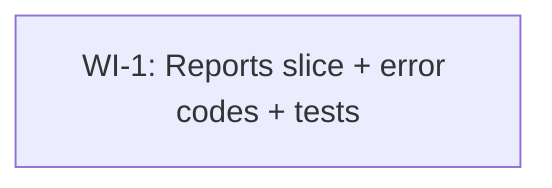

# UC-303 Reports — Work Items

Spec: `docs/specs/todo/06_UC_303_reports.md` (UC marked `complexity_tag: routine`; spec deliberately stays in `todo/` per the user's standing approval for autonomous execution on routine slices.)

Single-WI decomposition. The contradiction-guard signal from the prompt fires only if more than one WI shows up here; one WI is the expected output for a routine intake-only slice with no schema work.

## Assumptions

- The `Report` entity, `ReportConfiguration`, and `DbSet<Report> Reports` are already on `WanderMeetDbContext`. Confirmed: `src/WanderMeet.Api/Database/Entities/Report.cs` defines `ReporterId`, `ReportedId`, `Reason`, `ReviewedAt` on top of `AuditableEntity`. No migration in this WI.
- `ValidationConstants.ReportReasonMaxLength = 300` already exists in `src/WanderMeet.Shared`. The validator reads from it; tests use `ReportReasonMaxLength` and `ReportReasonMaxLength + 1` rather than hard-coded 300/301.
- `RateLimitPolicies.Reports` is already declared and wired in `Program.cs` (5/day per authenticated user, partitioned by JWT sub). Endpoint only needs `.RequireRateLimiting(RateLimitPolicies.Reports)`; no `Program.cs` change.
- `AuthorizationPolicies.UsersOnly` is the standard policy used by every other authenticated write endpoint (`SendInviteEndpoint` etc.) — same policy applies here.
- Success contract is **204 NoContent with empty body** — endpoint inherits `Endpoint<SubmitReportRequest>` (no response generic, no response DTO). Mobile only needs the status code.
- Closest reference patterns to mirror, named explicitly so the developer reads exactly these:
  - `src/WanderMeet.Api/Features/Invites/SendInvite/SendInviteEndpoint.cs` — `DontThrowIfValidationFails` + `if (ValidationFailed)` guard, JWT-sub resolve, `User.NotRegistered` 404 path, `AddError` + `Send.ErrorsAsync(...)` shape, caller `LastActiveAt` update + single `SaveChangesAsync`.
  - `src/WanderMeet.Api/Features/Invites/SendInvite/SendInviteValidator.cs` — `Validator<TRequest>` (FastEndpoints, NOT `AbstractValidator<T>`) with `.WithErrorCode(...)` per rule.
  - `src/WanderMeet.Api/Features/Meetups/MeetupsFeatureConfiguration.cs` + `tests/.../Features/Meetups/MeetupsFeatureConfigurationTests.cs` — feature-config shape + the auto-discovery integration test.
- Naming on the wire (per design review M1/M2): every new endpoint-guard error code lives under a new nested `Report` class — constant name and wire-string suffix match exactly, mirroring every other entry in `ErrorCodes.cs`. The two new domain codes are:
  - `ErrorCodes.Report.UserNotFound = "Report.UserNotFound"` — the reported target user does not exist or is soft-deleted (named `UserNotFound` rather than `NotFound` to disambiguate from `User.NotRegistered`, which means *the caller's own* profile is missing).
  - `ErrorCodes.Report.SelfReportForbidden = "Report.SelfReportForbidden"` — caller targeted themselves. Lives under `Report.*` (not `Validation.*`) because it is an endpoint guard, not a FluentValidation rule. Mirrors `Invite.SelfInviteForbidden`.
- Reason text is trimmed before persistence. The validator's reason rules check **trimmed** length and trimmed non-empty — so a payload of `"   "` fails with `Validation.ReportReasonRequired` and a 305-char string that trims to 299 passes. AC wording follows the validator: "trimmed reason length > `ValidationConstants.ReportReasonMaxLength`".
- Test IP allocation: prior slices used 10.40.x.y (Invites), 10.50.x.y (Meetups). This UC reserves **10.60.x.y**. Each test gets a distinct address. The 429 test gets a dedicated `sub` so its quota cannot be polluted by earlier tests in the collection that share a sub by accident.

## Dependency Graph



---

## WI-1: Reports vertical slice — POST /api/v1/reports (intake-only)

**Estimated complexity:** S (one new feature folder, three new error codes + one new nested class on `ErrorCodes`, one endpoint, one validator, one feature config, three test files; no entity, no migration, no DI).

### Required Reads

Read these in order; do not read anything else from the repo unless cross-referenced from one of these files.

- `docs/specs/todo/06_UC_303_reports.md` — full UC, every acceptance criterion.
- `src/WanderMeet.Api/Features/Invites/SendInvite/SendInviteEndpoint.cs` — copy the `DontCatchExceptions` + `DontThrowIfValidationFails` pair, the `if (ValidationFailed)` guard, the JWT-sub resolve and tracked-caller load, the `AddError` + `Send.ErrorsAsync(404, ct)` 404 path, the `caller.LastActiveAt = now;` + single `SaveChangesAsync` finish.
- `src/WanderMeet.Api/Features/Invites/SendInvite/SendInviteValidator.cs` — exact `Validator<TRequest>` shape and `.WithErrorCode(...)` placement. Validator uses `FastEndpoints.Validator<T>`, not FluentValidation's `AbstractValidator<T>`.
- `src/WanderMeet.Api/Features/Invites/SendInvite/SendInviteRequest.cs` — request DTO style (record vs. class with `init`).
- `src/WanderMeet.Api/Features/Meetups/MeetupsFeatureConfiguration.cs` — drop-in template for `ReportsFeatureConfiguration`. `Info => new("Reports", "<short tag description>")`. `AddFeatureDependencies` returns `services` unchanged.
- `tests/WanderMeet.Api.IntegrationTests/Features/Meetups/MeetupsFeatureConfigurationTests.cs` — drop-in template for the discovery test.
- `tests/WanderMeet.Api.IntegrationTests/Features/Invites/SendInvite/SendInviteEndpointTests.cs` — pattern for the integration tests: `[Collection(TestConstants.Collections.PipelineTest)]`, `App.CreateAuthenticatedClient(sub)` / `App.CreateAnonymousClient()`, `X-Forwarded-For` per test, DB seeding via `App.Services.GetRequiredService<WanderMeetDbContext>()`.
- `src/WanderMeet.Shared/ErrorCodes.cs` — append the new constants here, do not create a new file. Five new entries: four under the existing `Validation` nested class, one new nested `Report` class with a single `NotFound` const.
- `src/WanderMeet.Shared/ValidationConstants.cs` — confirm `ReportReasonMaxLength` is exposed; consume it in the validator and in the boundary tests.
- `src/WanderMeet.Api/Database/Entities/Report.cs` — confirms entity shape; nothing to change.
- `src/WanderMeet.Api/Infrastructure/EntityFramework/Configurations/ReportConfiguration.cs` — confirms FK indexes already cover the lookup paths; nothing to change.
- `src/WanderMeet.Api/Common/RateLimitPolicies.cs` — confirm `Reports` policy name; reference via `RateLimitPolicies.Reports` inside `Description(...)`.
- `src/WanderMeet.Api/Authorization/AuthorizationPolicies.cs` — confirm `UsersOnly` exists; reference via `nameof(AuthorizationPolicies.UsersOnly)`.
- `src/WanderMeet.Api/Common/IFeatureConfiguration.cs` — interface contract for the new feature config.

### Deliverables

Files created or edited (paths relative to repo root):

1. **NEW** `src/WanderMeet.Api/Features/Reports/ReportsFeatureConfiguration.cs` — `internal sealed`, parameterless ctor, `Info => new("Reports", "User-to-user report intake (5/day per reporter)")`, `AddFeatureDependencies` returns `services` unchanged.
2. **NEW** `src/WanderMeet.Api/Features/Reports/SubmitReport/SubmitReportRequest.cs` — match whichever style the codebase uses for `SendInviteRequest` (record vs. class with `init`).
3. **NEW** `src/WanderMeet.Api/Features/Reports/SubmitReport/SubmitReportValidator.cs` — `internal sealed class SubmitReportValidator : Validator<SubmitReportRequest>` with three rules. XML `<summary>` on the class.
   - `RuleFor(x => x.ReportedUserId).NotEmpty().WithErrorCode(ErrorCodes.Validation.ReportedUserIdRequired);`
   - `RuleFor(x => x.Reason).Must(r => !string.IsNullOrWhiteSpace(r)).WithErrorCode(ErrorCodes.Validation.ReportReasonRequired);`
   - `RuleFor(x => x.Reason).Must(r => r is null || r.Trim().Length <= ValidationConstants.ReportReasonMaxLength).WithErrorCode(ErrorCodes.Validation.ReportReasonTooLong);`
4. **NEW** `src/WanderMeet.Api/Features/Reports/SubmitReport/SubmitReportEndpoint.cs` — `internal sealed`, primary ctor `(WanderMeetDbContext dbContext, TimeProvider timeProvider)`, inherits `Endpoint<SubmitReportRequest>` (no second generic — success is 204 NoContent; the codebase already uses single-generic endpoints, e.g. `ToggleOpenTodayEndpoint`), `private readonly ReportsFeatureConfiguration _featureConfiguration = new();`. XML `<summary>` on the class. `Configure()` uses bare `Post("reports")` plus the global `api/v1` prefix (mirror `SendInviteEndpoint` exactly), `Description(b => b.WithName(nameof(SubmitReportEndpoint)).WithTags(_featureConfiguration.Info.Name).RequireRateLimiting(RateLimitPolicies.Reports))`, `DontCatchExceptions()`, `DontThrowIfValidationFails()`, `Policies(nameof(AuthorizationPolicies.UsersOnly))`, full `Summary` block listing 204/400/401/404/429. `HandleAsync`:
   1. `if (ValidationFailed) { await Send.ErrorsAsync(400, ct); return; }`
   2. Resolve `sub` via `User.FindFirstValue(ClaimTypes.NameIdentifier)`, 401 if missing.
   3. Load tracked caller filtered by `AzureAdB2CId == sub && DeletedAt == null`; if null → `AddError(ErrorCodes.User.NotRegistered, "...")` + `Send.ErrorsAsync(404, ct); return;`.
   4. Self-report guard: `if (req.ReportedUserId == caller.Id) { AddError(ErrorCodes.Report.SelfReportForbidden, "..."); await Send.ErrorsAsync(400, ct); return; }`
   5. `var targetExists = await dbContext.Users.AsNoTracking().AnyAsync(u => u.Id == req.ReportedUserId && u.DeletedAt == null, ct);` if false → `AddError(ErrorCodes.Report.UserNotFound, "...")` + `Send.ErrorsAsync(404, ct); return;`.
   6. `var now = timeProvider.GetUtcNow();` create `Report { Id = Guid.NewGuid(), ReporterId = caller.Id, ReportedId = req.ReportedUserId, Reason = req.Reason.Trim(), ReviewedAt = null, CreatedAt = now }`; `dbContext.Reports.Add(report); caller.LastActiveAt = now; await dbContext.SaveChangesAsync(ct);`
   7. `await Send.NoContentAsync(ct);`
5. **EDIT** `src/WanderMeet.Shared/ErrorCodes.cs` — add three constants under the existing `Validation` nested class (`ReportedUserIdRequired = "Validation.ReportedUserIdRequired"`, `ReportReasonRequired = "Validation.ReportReasonRequired"`, `ReportReasonTooLong = "Validation.ReportReasonTooLong"`) and a brand-new nested `Report` class with two constants: `UserNotFound = "Report.UserNotFound"` and `SelfReportForbidden = "Report.SelfReportForbidden"`. Each gets a one-line `<summary>` XML doc, matching the file's existing style. The `Validation` nested class stays purely for FluentValidation-rule outputs; endpoint-guard codes go on the domain class.
6. **NEW** `tests/WanderMeet.Api.IntegrationTests/Features/Reports/ReportsFeatureConfigurationTests.cs` — copy `MeetupsFeatureConfigurationTests` verbatim, swap `Meetups`→`Reports`.
7. **NEW** `tests/WanderMeet.Api.IntegrationTests/Features/Reports/SubmitReport/SubmitReportEndpointTests.cs` — covers every integration case below.
8. **NEW** `tests/WanderMeet.Api.UnitTests/Features/Reports/SubmitReport/SubmitReportValidatorTests.cs` — validator boundaries via `TestValidate`.

No DI registration in `Program.cs`. Feature config is auto-discovered by reflection. Reports endpoint is auto-discovered by FastEndpoints' assembly scan.

### Error Paths

| Status | Code (wire string) | Trigger | Where |
|---|---|---|---|
| 400 | `Validation.ReportedUserIdRequired` | `reportedUserId == Guid.Empty` | validator (`NotEmpty`) |
| 400 | `Validation.ReportReasonRequired` | reason is null / empty / whitespace-only | validator (`Must !IsNullOrWhiteSpace`) |
| 400 | `Validation.ReportReasonTooLong` | trimmed reason length > `ValidationConstants.ReportReasonMaxLength` | validator (`Must … Length <=`) |
| 400 | `Report.SelfReportForbidden` | `req.ReportedUserId == caller.Id` | endpoint guard, no DB lookup |
| 401 | (none) | bearer token missing or has no `sub` claim | `Send.UnauthorizedAsync(ct)` |
| 404 | `User.NotRegistered` | no User row matches JWT sub (or row is soft-deleted) | endpoint, `AddError` + `Send.ErrorsAsync(404, ct)` |
| 404 | `Report.UserNotFound` | reported user does not exist or `DeletedAt != null` | endpoint, `AddError` + `Send.ErrorsAsync(404, ct)` |
| 429 | (none) | 6th report in 24h per authenticated user | `RateLimitPolicies.Reports` middleware; **no endpoint code** |

### Tests

**Unit (`SubmitReportValidatorTests.cs`)** — `TestValidate` shape:

- `Validate_EmptyReportedUserId_FailsWithReportedUserIdRequired` — pass `Guid.Empty`, assert `ShouldHaveValidationErrorFor(x => x.ReportedUserId).WithErrorCode(ErrorCodes.Validation.ReportedUserIdRequired)`.
- `Validate_NullReason_FailsWithReportReasonRequired`, `Validate_EmptyReason_FailsWithReportReasonRequired`, `Validate_WhitespaceOnlyReason_FailsWithReportReasonRequired` — three separate `[Fact]`s (or one `[Theory]` with three rows) all assert `ReportReasonRequired`.
- `Validate_ReasonAt300Chars_Passes` — `new string('a', ValidationConstants.ReportReasonMaxLength)`, assert no errors on `Reason`.
- `Validate_ReasonAt301Chars_FailsWithReportReasonTooLong` — `new string('a', ValidationConstants.ReportReasonMaxLength + 1)`, assert `ReportReasonTooLong`.

**Integration discovery (`ReportsFeatureConfigurationTests.cs`)**:

- `Discover_FeatureConfiguration_RegistersReportsTagInSwagger` — same shape as the Meetups version.

**Integration endpoint (`SubmitReportEndpointTests.cs`)** — every test sets `X-Forwarded-For` from the **10.60.x.y** range and uses a unique `sub` per test (and per iteration where the test loops). Reseed with `ResetDatabaseAsync()` first line of `SetupAsync()`. Every async call passes `TestContext.Current.CancellationToken`.

- `HandleAsync_ValidRequest_Returns204AndPersistsReport` — happy path. Seed reporter + target, POST with a 100-char reason. Assert `204 NoContent`, response body is empty. Re-query DB: exactly one `Report` row with `ReporterId = caller.Id`, `ReportedId = target.Id`, `Reason` equal to trimmed input, `CreatedAt = App.FakeTimeProvider.GetUtcNow()`, `ReviewedAt = null`. Re-load caller and assert `LastActiveAt == App.FakeTimeProvider.GetUtcNow()`.
- `HandleAsync_NoBearerToken_Returns401` — anonymous client.
- `HandleAsync_JwtSubHasNoUserRow_Returns404WithUserNotRegistered` — authenticated client with a sub that has no DB row. Assert body contains `ErrorCodes.User.NotRegistered`.
- `HandleAsync_ReportedUserNotFound_Returns404WithReportUserNotFound` — seed only the reporter, POST with random `ReportedUserId`. Body contains `"Report.UserNotFound"`.
- `HandleAsync_ReportedUserSoftDeleted_Returns404WithReportUserNotFound` — seed reporter + soft-deleted target (`DeletedAt = now`).
- `HandleAsync_SelfReport_Returns400WithSelfReportForbidden` — POST with `ReportedUserId = caller.Id`. Body contains `"Report.SelfReportForbidden"`.
- `HandleAsync_ReasonTooLong_Returns400WithReportReasonTooLong` — POST with `new string('x', ValidationConstants.ReportReasonMaxLength + 1)`. Use a body-substring assertion, same as `SendInviteEndpointTests`. (See `CLAUDE.md → FastEndpoints AddError error-code placement` and `CLAUDE.md → FastEndpoints 8.1 ThrowIfValidationFails default is true`.)
- `HandleAsync_ReasonEmpty_Returns400WithReportReasonRequired` — POST with `Reason = "   "`.
- `HandleAsync_DuplicateReportSameTarget_BothPersist` — seed reporter + target, POST twice back-to-back. Both 204. Assert `dbContext.Reports.Where(r => r.ReporterId == caller.Id && r.ReportedId == target.Id).CountAsync(ct)` returns 2.
- `HandleAsync_ExceedsDailyQuota_Returns429WithRetryAfter` — single sub, single dedicated IP (e.g. `10.60.99.1`), seed reporter + 6 distinct targets. Loop 6 POSTs back-to-back. Assert first 5 → `204`, sixth → `429`, sixth response has `Retry-After` header. **Reuse one client instance for all 6 calls** (per `CLAUDE.md → Rate-limit test isolation` note about `WithWebHostBuilder`).

### Verification

```bash
dotnet test --filter "FullyQualifiedName~Reports"
```
