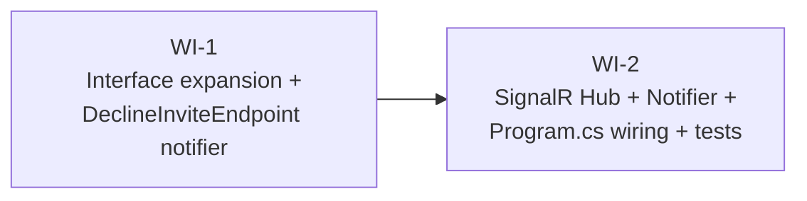

# UC-306 — SignalR invites: work-items breakdown

## Assumptions

- **Spec location**: the spec lives at `docs/specs/todo/09_UC_306_signalr-invites.md` (autonomous-execution policy is in effect — Gate A is implicit, the path is treated as authoritative regardless of the `todo/` vs `in-progress/` folder).
- **2-WI split chosen over 1 WI**. WI-1 is a small, risk-free interface expansion + one-line endpoint change that ships green against the existing `NoOpInviteNotifier`. WI-2 lands the SignalR transport against a stable interface. Trade-off: two PRs instead of one. Net win: WI-1 cannot break anything (the new methods only get called from the new SignalR notifier, not from any endpoint other than `DeclineInviteEndpoint` for `Declined`); landing it first means WI-2's diff is pure additive infra with no risk to the existing endpoint suite.
- **Azure SignalR Service is OUT OF SCOPE** per the spec. The in-process `AddSignalR()` is sufficient for MVP; switching to Azure SignalR is a single-line `.AddAzureSignalR(connectionString)` chained on `AddSignalR()` at deployment time and does not change the Hub or Notifier code.
- **Test transport: LongPolling, not WebSockets.** `Microsoft.AspNetCore.TestServer` (the in-memory server backing `WebApplicationFactory`) does not support raw WebSockets — `HubConnection` will fall back to LongPolling automatically when given a server handler from `Server.CreateHandler()`, but pinning `opts.Transports = HttpTransportType.LongPolling` makes intent explicit and keeps the negotiation deterministic.
- **DI lifetime change is intentional**. `NoOpInviteNotifier` was registered as Singleton because it had no scoped dependencies. `SignalRInviteNotifier` injects `WanderMeetDbContext` (Scoped) for the receiver-photo projection in `InviteSentAsync`, so its registration must become Scoped. `IHubContext<InviteHub>` is Singleton-safe to inject into a Scoped service.
- **`InviteExpiredAsync` has no production caller in this UC** — UC-308's Hangfire expiry job will be the first caller. Tests verify the SignalR-side behaviour by resolving `IInviteNotifier` from `App.Services` and invoking the method directly. Conductor accepted this in the prompt.
- **`DeclineInviteEndpoint` semantics shift slightly**. The existing summary calls decline "silent — no notification sent". After WI-1, a sender-side notifier event DOES fire; the UI is still silent (no toast on either side) but the sender's pending-list updates in real-time. Wording in the XML doc + `Summary(s => …)` block must be updated to match.
- **PII discipline reaffirmed**. Hub DTOs reuse the existing `InviteUserMiniDto` / `InvitePlaceMiniDto` shapes, which already exclude `Email`, `AzureAdB2CId`, `FcmToken`, and `Bio`. Reviewers should reject any Hub DTO that adds fields outside this surface.
- **Test IP allocation 10.90.x.y** is reserved for `InviteHubTests` to avoid rate-limit cross-talk with the rest of the integration suite.
- **`Microsoft.AspNetCore.SignalR.Client` package version**: pinned to 10.0.7 to match the EF Core / aspnetcore versions already pinned in the integration-tests csproj (avoids the same `ReflectionTypeLoadException` class of trap noted for EF Core 10.0.4 vs 10.0.7).

## Dependency graph

## WI-1: Expand `IInviteNotifier`; wire `DeclineInviteEndpoint` to `InviteDeclinedAsync`

### Required reads

- `docs/specs/todo/09_UC_306_signalr-invites.md`
- `src/WanderMeet.Api/Features/Invites/Shared/IInviteNotifier.cs`
- `src/WanderMeet.Api/Features/Invites/Shared/NoOpInviteNotifier.cs`
- `src/WanderMeet.Api/Features/Invites/SendInvite/SendInviteEndpoint.cs` (try/catch + LogWarning template)
- `src/WanderMeet.Api/Features/Invites/AcceptInvite/AcceptInviteEndpoint.cs` (try/catch + LogWarning template)
- `src/WanderMeet.Api/Features/Invites/DeclineInvite/DeclineInviteEndpoint.cs`
- `src/WanderMeet.Api/Features/Invites/InvitesFeatureConfiguration.cs`
- `tests/WanderMeet.Api.IntegrationTests/Infrastructure/RecordingInviteNotifier.cs`
- `tests/WanderMeet.Api.IntegrationTests/Features/Invites/DeclineInvite/DeclineInviteEndpointTests.cs`
- `tests/WanderMeet.Api.IntegrationTests/Features/Invites/AcceptInvite/AcceptInviteEndpointTests.cs` (template for `_FiresNotifier_` and `_NotifierThrows_` test variants)

### Deliverables

- `IInviteNotifier` gains two new methods with full XML docs:
  - `Task InviteDeclinedAsync(Invite invite, CancellationToken ct)`
  - `Task InviteExpiredAsync(Invite invite, CancellationToken ct)`
- `NoOpInviteNotifier` implements both (Task.CompletedTask + LogDebug, mirroring the existing methods).
- `RecordingInviteNotifier` (test infra) records `Declined` and `Expired` events into `IReadOnlyList<Invite>` collections plus optional `Exception? ThrowOnDeclined` / `ThrowOnExpired` symmetric to existing throw hooks.
- `DeclineInviteEndpoint` adds `IInviteNotifier inviteNotifier` + `ILogger<DeclineInviteEndpoint> logger` to its primary ctor; after `await dbContext.SaveChangesAsync(ct)` it invokes `await inviteNotifier.InviteDeclinedAsync(invite, ct)` inside the same try/catch + LogWarning shape used in `SendInviteEndpoint` / `AcceptInviteEndpoint`.
- The endpoint's class XML summary and `Summary(s => …)` block are updated — drop "silent — no notification sent"; replace with wording that reflects the sender-side notifier event while keeping UI-silent semantics.

### Error paths

| Scenario | Behavior |
|---|---|
| `InviteDeclinedAsync` throws (downstream blip, future SignalR transport error, etc.) | Endpoint's try/catch + LogWarning absorbs the exception. PATCH still returns 200; invite remains persisted as `Declined`. |
| `InvitesFeatureConfiguration` registration | Unchanged in this WI (still `NoOpInviteNotifier`). Swap to `SignalRInviteNotifier` happens in WI-2. |

### Tests

- `DeclineInviteEndpointTests.HandleAsync_HappyPath_FiresInviteDeclinedAsyncOnInviteNotifier` — RecordingInviteNotifier captures one Declined event with the persisted invite id; Sent and Accepted lists empty.
- `DeclineInviteEndpointTests.HandleAsync_NotifierThrows_StillReturns200AndPersists` — `ThrowOnDeclined = new InvalidOperationException("simulated")`; PATCH still 200, DB still has `Status=Declined` + `RespondedAt`.
- All existing `Send*`, `Accept*`, `Decline*`, `ListIncoming*`, `ListSent*`, `ListPast*` integration tests stay green.

### Verification

`dotnet test --filter "FullyQualifiedName~DeclineInviteEndpointTests"`

---

## WI-2: SignalR Hub + UserIdProvider + Notifier; Program.cs wiring; SignalR client tests

### Required reads

- `docs/specs/todo/09_UC_306_signalr-invites.md`
- `src/WanderMeet.Api/Program.cs`
- `src/WanderMeet.Api/Features/Invites/Shared/IInviteNotifier.cs` (post WI-1)
- `src/WanderMeet.Api/Features/Invites/Shared/InviteDto.cs`
- `src/WanderMeet.Api/Features/Invites/Shared/InviteUserMiniDto.cs`
- `src/WanderMeet.Api/Features/Invites/Shared/InvitePlaceMiniDto.cs`
- `src/WanderMeet.Api/Features/Invites/SendInvite/SendInviteEndpoint.cs` (sender-photo projection idiom — replicate in `SignalRInviteNotifier.InviteSentAsync`)
- `src/WanderMeet.Api/Features/Invites/InvitesFeatureConfiguration.cs`
- `src/WanderMeet.Api/Authorization/AuthorizationPolicies.cs`
- `src/WanderMeet.Api/Database/Entities/User.cs`
- `src/WanderMeet.Api/Database/Entities/Invite.cs`
- `src/WanderMeet.Api/Infrastructure/EntityFramework/WanderMeetDbContext.cs`
- `tests/WanderMeet.Api.IntegrationTests/Infrastructure/WanderMeetApiFactory.cs`
- `tests/WanderMeet.Api.IntegrationTests/Infrastructure/IntegrationTestFixture.cs`
- `tests/WanderMeet.Api.IntegrationTests/Infrastructure/TestJwtTokenFactory.cs`
- `tests/WanderMeet.Api.IntegrationTests/Infrastructure/RecordingInviteNotifier.cs` (post WI-1)
- `tests/WanderMeet.Api.IntegrationTests/WanderMeet.Api.IntegrationTests.csproj`

### Deliverables

#### Production code (`src/WanderMeet.Api/Infrastructure/SignalR/`)

- `InviteHub.cs` — `internal sealed class InviteHub : Microsoft.AspNetCore.SignalR.Hub`, decorated `[Authorize(Policy = nameof(AuthorizationPolicies.UsersOnly))]`. No client-callable methods. `OnConnectedAsync` / `OnDisconnectedAsync` overrides log at Debug (include `Context.UserIdentifier` for correlation). XML `
` on the class explaining server-push-only.
- `JwtSubUserIdProvider.cs` — `internal sealed class JwtSubUserIdProvider(IServiceScopeFactory scopeFactory) : IUserIdProvider`. `GetUserId(HubConnectionContext)` reads `ClaimTypes.NameIdentifier`, opens a scope, queries `WanderMeetDbContext.Users.AsNoTracking()` for `AzureAdB2CId == sub && DeletedAt == null`, returns `User.Id.ToString()` or `null`. Registered as Singleton (matches the lifetime expected by SignalR's framework).
- `SignalRInviteNotifier.cs` — `internal sealed class SignalRInviteNotifier(IHubContext<InviteHub> hubContext, WanderMeetDbContext dbContext, ILogger<SignalRInviteNotifier> logger) : IInviteNotifier`. Implements all four interface methods.
- `Shared/InviteHubReceivedDto.cs` — `public record` (init properties): `Id`, `Sender` (reuses `InviteUserMiniDto`), `HangoutTagId`, `HangoutTagSlug`, `Place` (reuses `InvitePlaceMiniDto`), `SenderIsThere`, `SentAt`, `ExpiresAt`. Strict subset of `InviteDto` shape.
- `Shared/InviteHubAcceptedDto.cs` — `public record (Guid InviteId, Guid MeetupId, DateTimeOffset AcceptedAt)`.
- `Shared/InviteHubDeclinedDto.cs` — `public record (Guid InviteId)`.
- `Shared/InviteHubExpiredDto.cs` — `public record (Guid InviteId)`.

#### Wiring (`Program.cs`)

- `builder.Services.AddSignalR()` and `builder.Services.AddSingleton<IUserIdProvider, JwtSubUserIdProvider>()` before `AddVerticalSliceFeatures`.
- Inside the existing `.AddJwtBearer(options => …)` block, set `options.Events = new JwtBearerEvents { OnMessageReceived = ctx => { var path = ctx.HttpContext.Request.Path; var token = ctx.Request.Query["access_token"]; if (!string.IsNullOrEmpty(token) && path.StartsWithSegments("/hubs", StringComparison.OrdinalIgnoreCase)) { ctx.Token = token; } return Task.CompletedTask; } }`. The path-prefix gate prevents the query-string token bypass on regular HTTP endpoints.
- `app.MapHub<InviteHub>("/hubs/invites")` after `app.UseAuthorization()` and before `app.UseFastEndpoints(...)`.

#### DI swap (`InvitesFeatureConfiguration`)

- Replace `services.AddSingleton<IInviteNotifier, NoOpInviteNotifier>()` with `services.AddScoped<IInviteNotifier, SignalRInviteNotifier>()`. Lifetime is Scoped because the notifier consumes `WanderMeetDbContext` (Scoped). `IHubContext<InviteHub>` is Singleton-resolvable into a Scoped service, no problem. Keep `NoOpInviteNotifier` source file.

#### Test infra (`WanderMeetApiFactory.cs`)

- Public helper `HubConnection CreateAuthenticatedSignalRConnection(string azureAdB2CId, string hubPath = "/hubs/invites")` that builds a `HubConnection` via `new HubConnectionBuilder().WithUrl(new Uri(Server.BaseAddress!, hubPath), opts => { opts.HttpMessageHandlerFactory = _ => Server.CreateHandler(); opts.AccessTokenProvider = () => Task.FromResult<string?>(_jwtFactory.CreateToken(azureAdB2CId)); opts.Transports = HttpTransportType.LongPolling; }).Build()`. Sibling helpers if needed for the query-string-token test variant.

#### Tests (`tests/WanderMeet.Api.IntegrationTests/Features/Invites/Realtime/InviteHubTests.cs`)

- `[Collection(TestConstants.Collections.PipelineTest)]`, inherits `IntegrationTestBase`. Each test allocates a fresh `X-Forwarded-For` IP from the 10.90.x.y range. Each test creates one or two `HubConnection` instances, registers `On<TDto>("EventName", dto => tcs.SetResult(dto))` per expected event, calls `await connection.StartAsync(ct)`, then drives the HTTP endpoint or invokes `IInviteNotifier` directly. Assertions wait on the TCS with a 5-second timeout via `tcs.Task.WaitAsync(TimeSpan.FromSeconds(5), ct)`.

#### Package (`WanderMeet.Api.IntegrationTests.csproj`)

- Add `<PackageReference Include="Microsoft.AspNetCore.SignalR.Client" Version="10.0.7" />`.

### Error paths

| Scenario | Behavior |
|---|---|
| Receiver offline | `Clients.User(...).SendAsync` is a no-op; HTTP 201 still returned; nothing thrown. |
| Multi-device receiver | `Clients.User(userId)` fans out to all connections automatically — default SignalR behavior; no code change. |
| Notifier projection throws | Exception propagates out of the Notifier; the calling endpoint's existing try/catch + LogWarning absorbs it; HTTP response still succeeds. |
| JWT expires mid-session | Connection drops at next negotiation; client refresh + reconnect (mobile responsibility). |
| Unauthenticated connection | `[Authorize]` on `InviteHub` rejects negotiation with 401. |
| JWT sub maps to soft-deleted user | `JwtSubUserIdProvider.GetUserId` returns `null`; SignalR refuses to bind the connection to a user-id; `Clients.User(...)` calls for that sub-id fan out to nobody. |

### Tests

- `OnConnectAsync_NoBearerToken_NegotiationFails401` — `HubConnection.StartAsync()` without bearer throws `HttpRequestException` with 401 status.
- `InviteSent_PushesInviteReceivedToReceiverOnly` — sender posts `/api/v1/invites`; receiver hub gets `InviteReceived` with the new invite id; sender's parallel hub does NOT receive `InviteReceived`.
- `InviteAccepted_PushesInviteAcceptedToSenderOnly` — receiver PATCH-accepts; sender hub gets `InviteAccepted` with `{ inviteId, meetupId, acceptedAt }`; receiver hub does NOT receive `InviteAccepted`.
- `InviteDeclined_PushesInviteDeclinedToSenderOnly` — receiver PATCH-declines; sender hub gets `InviteDeclined` with `{ inviteId }`; receiver hub does NOT.
- `InviteExpired_PushesInviteExpiredToBothParticipants` — resolve `IInviteNotifier` from `App.Services` inside a test scope, invoke `await notifier.InviteExpiredAsync(invite, ct)`; both sender and receiver hubs receive `InviteExpired` with `{ inviteId }`.
- `QueryStringAccessToken_AllowsConnection` — connection built with `?access_token=<jwt>` (no `AccessTokenProvider`) negotiates successfully — verifies the `OnMessageReceived` query-string fallback for `/hubs/*` paths.
- `SoftDeletedUser_CannotConnect` — soft-deleted receiver does NOT receive an `InviteReceived` push for an invite addressed to them; an un-deleted parallel receiver in the same test still does (asserts `JwtSubUserIdProvider` returns null for soft-deleted users without breaking the test setup).

### Verification

`dotnet test --filter "FullyQualifiedName~InviteHub"`

> **Library research note** — the `HubConnectionBuilder` + `WebApplicationFactory.Server.CreateHandler()` integration pattern is non-trivial and not yet exercised in this codebase. WI-2 is flagged `needs_library_research: true`; the developer dispatches the Haiku research subagent for an API cheat-sheet covering: (a) the correct `HttpMessageHandlerFactory` shape, (b) how `AccessTokenProvider` interacts with the bearer middleware, (c) why LongPolling (and not WebSockets) is required when targeting `TestServer`, (d) the right way to await a server-pushed event in an xUnit v3 async test (TaskCompletionSource + WaitAsync + cancellation token).
