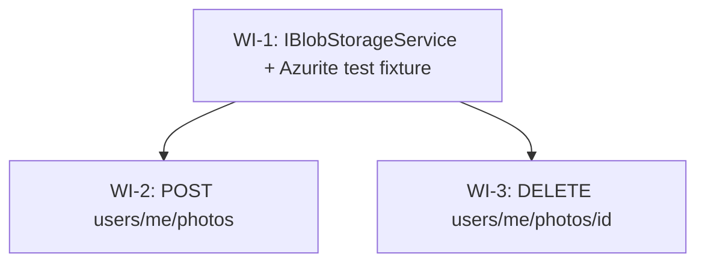

# UC-204 — User photos: work items

Source spec: [`02_UC_204_user-photos.md`](./02_UC_204_user-photos.md)

## Assumptions

The following design judgements are baked into the work items below. Each one is a defensible-either-way call; deviating means re-running design.

1. **Container creation is lazy, on first SAS issuance** — not during `AddFeatureDependencies`, not via an `IHostedService`. The Azure SDK call lives inside `AzureBlobStorageService.GenerateWriteSasAsync` and is gated by an `Interlocked.CompareExchange` one-shot flag so subsequent uploads pay zero cost. **Rationale:** zero startup network dependency; matches the lifecycle of the Azurite container (which is also up before the first request); no hosted-service plumbing for a single boolean. **Trade-off:** the first POST after a cold start pays one extra `CreateIfNotExistsAsync` round-trip.
2. **`UserPhoto` row is pre-created before SAS issuance** — `UserPhoto.Add` + `SaveChangesAsync` happen *before* `GenerateWriteSasAsync` returns. **Rationale:** the existing unique index on `(UserId, Order)` is already the source of truth for slot uniqueness; pre-creating and saving lets EF/Postgres atomically reject duplicate-slot races without a separate read-then-write transaction. **Trade-off:** clients that never PUT to the SAS URL leave orphan rows. Mitigation lives in spec `out_of_scope` — Phase-3 background cleanup will reconcile rows whose target blob never materialised.
3. **Azurite is shared per fixture, not per test** — `IntegrationTestFixture` owns one Azurite container and one PostgreSQL container with identical lifecycles. Tests namespace their blobs by `userId` (a fresh `Guid.NewGuid()` per test) so collision risk is zero. **Rationale:** mirrors the existing Postgres pattern; container churn would dominate runtime. **Trade-off:** tests that need a "broken" storage account use `Microsoft.Extensions.Options.Options.Create(new BlobStorageOptions { ConnectionString = "" })` against a locally-built service instance (covered by unit tests for the 503 path).
4. **No per-feature `Errors.cs`.** New error codes are appended to the existing `WanderMeet.Shared/ErrorCodes.cs` nested classes (`Validation`, plus a new `Storage` and `UserPhoto` group). The previous slice's impl-reviewer flagged delegating wrappers; keep `ErrorCodes` the single source of truth.
5. **No `IBlobStorageOptionsValidator`.** Configuration validity is surfaced via `IBlobStorageService.IsConfigured` (true ⇔ non-empty connection string). Endpoints check it inline and emit `Send.ErrorsAsync(503, ct)` with code `Storage.NotConfigured`. Avoids a startup failure mode that would block local dev when the operator forgets the connection string.
6. **`Testcontainers.Azurite` package** is added to the integration-test project only. Production code uses the real Azure Storage account; locally the developer talks to the docker-compose Azurite via `BlobStorage:ConnectionString` in `appsettings.Development.json` (out of scope for this UC — operator config).
7. **Cross-blob SAS scoping**: `BlobClient.GenerateSasUri` (per-blob, not container-level) is the chosen API — its `BlobSasBuilder.Resource = "b"` constraint means the resulting URI is bound to one blob path. Verified by an integration test that attempts `PUT` to a sibling blob in the same container with the same SAS and asserts 403.

## Dependency Graph

WI-2 and WI-3 are independent of each other and may run in parallel after WI-1 lands.

## WI-1: `IBlobStorageService` abstraction + Azurite test fixture

### Required reads

- `docs/specs/in-progress/02_UC_204_user-photos.md`
- `src/WanderMeet.Infrastructure/WanderMeet.Infrastructure.csproj` — confirm `Azure.Storage.Blobs 12.27.0` and `Azure.Identity 1.21.0` are already wired
- `src/WanderMeet.Api/Features/Auth/AuthFeatureConfiguration.cs` — pattern for `AddOptions<T>().Bind(...)` inside `AddFeatureDependencies`
- `src/WanderMeet.Api/Features/Auth/AzureAdB2COptions.cs` — pattern for an options record
- `src/WanderMeet.Api/Features/Users/UsersFeatureConfiguration.cs` — currently a no-op; this WI extends it
- `tests/WanderMeet.Api.IntegrationTests/Infrastructure/IntegrationTestFixture.cs` — Postgres `IAsyncLifetime` pattern to mirror for Azurite
- `tests/WanderMeet.Api.IntegrationTests/Infrastructure/WanderMeetApiFactory.cs` — `UseSetting(...)` propagation pattern
- `tests/WanderMeet.Api.IntegrationTests/WanderMeet.Api.IntegrationTests.csproj` — package list to extend with `Testcontainers.Azurite`
- `src/WanderMeet.Shared/ErrorCodes.cs`

### Deliverables

- **`IBlobStorageService`** (public, in `WanderMeet.Infrastructure`):
  - `Task<BlobUploadSasResult> GenerateWriteSasAsync(string blobPath, TimeSpan ttl, CancellationToken ct)` — returns SAS URI scoped to that single blob path with `Create | Write` permissions only.
  - `Task<bool> DeleteBlobAsync(string blobPath, CancellationToken ct)` — returns `false` if the blob did not exist; never throws on 404.
  - `Task EnsureContainerExistsAsync(CancellationToken ct)` — idempotent.
  - `bool IsConfigured` — `false` when `BlobStorageOptions.ConnectionString` is null/empty.
  - XML doc on the interface MUST state: "Implementations MUST NOT log the connection string or any returned SAS URI at any log level."
- **`BlobUploadSasResult`** record `(Uri SasUrl, DateTimeOffset ExpiresAt, string BlobUrl)`.
- **`BlobStorageOptions`** record `(string? ConnectionString, string ContainerName)` with `ContainerName` defaulting to `"user-photos"`.
- **`AzureBlobStorageService`** (`internal sealed`, in `WanderMeet.Infrastructure`):
  - Primary ctor takes `IOptions<BlobStorageOptions>`, `TimeProvider`, `ILogger<AzureBlobStorageService>`.
  - Constructs `BlobServiceClient` lazily once (cached field) when `IsConfigured == true`. When `IsConfigured == false`, all methods throw `InvalidOperationException` if called — endpoints are responsible for the `IsConfigured` short-circuit so callers never reach a misconfigured invocation.
  - `EnsureContainerExistsAsync` is gated by `Interlocked.CompareExchange(ref _initialized, 1, 0) == 0` and calls `BlobContainerClient.CreateIfNotExistsAsync(PublicAccessType.None, ct)`.
  - `GenerateWriteSasAsync` calls `EnsureContainerExistsAsync` first, then `BlobClient.GenerateSasUri(new BlobSasBuilder { ... Resource = "b", BlobContainerName = …, BlobName = blobPath, ExpiresOn = timeProvider.GetUtcNow() + ttl } { Permissions = BlobSasPermissions.Create | BlobSasPermissions.Write })`. Forwards `ct` to every async call.
  - `DeleteBlobAsync` uses `BlobClient.DeleteIfExistsAsync(DeleteSnapshotsOption.IncludeSnapshots, conditions: null, ct)` and returns `response.Value`.
- **`UsersFeatureConfiguration.AddFeatureDependencies`** binds `BlobStorageOptions` from configuration section `"BlobStorage"` and registers `IBlobStorageService → AzureBlobStorageService` as a singleton.
- **`ErrorCodes.cs`** appends:
  - New nested class `Storage` with `public const string NotConfigured = "Storage.NotConfigured";`.
  - To `Validation`: `PhotoOrderOutOfRange = "Validation.PhotoOrderOutOfRange"`, `PhotoLimitReached = "Validation.PhotoLimitReached"`, `PhotoOrderTaken = "Validation.PhotoOrderTaken"`.
  - New nested class `UserPhoto` with `public const string NotFound = "UserPhoto.NotFound";` (forward-looking; not used until WI-3 if at all).
- **Test fixture extension**:
  - `tests/WanderMeet.Api.IntegrationTests/WanderMeet.Api.IntegrationTests.csproj` adds `<PackageReference Include="Testcontainers.Azurite" Version="…" />` (latest 4.x; verify compatibility with `Testcontainers.PostgreSql 4.11.0`).
  - `IntegrationTestFixture` adds `private readonly AzuriteContainer _azurite = new AzuriteBuilder().Build();`. `InitializeAsync` starts both containers in parallel; `DisposeAsync` disposes both. Pass the connection string to `WanderMeetApiFactory` via constructor.
  - `WanderMeetApiFactory` adds `_blobConnectionString` ctor param and propagates `builder.UseSetting("BlobStorage:ConnectionString", _blobConnectionString)` and `builder.UseSetting("BlobStorage:ContainerName", "user-photos-tests")`.
  - `AzureBlobStorageServiceTests` (integration) covers the 6 test cases listed in the handoff. The "blocks different blob in same container" test is the security-critical one — assert HTTP 403 from `BlobClient(differentSasUri).UploadAsync(...)`.

### Error paths

| Code | Status | Trigger |
| ---- | ------ | ------- |
| `Storage.NotConfigured` | 503 | `BlobStorageOptions.ConnectionString` missing/empty when WI-2/WI-3 endpoints check `IBlobStorageService.IsConfigured` |

### Tests

See `test_cases` in the handoff. Naming follows `rules/naming.md#test-naming`.

### Verification

`dotnet test --filter "FullyQualifiedName~AzureBlobStorageService"` (matches both unit and integration test classes if both are added).

## WI-2: `POST users/me/photos`

### Required reads

- `docs/specs/in-progress/02_UC_204_user-photos.md` — main flow steps 1–7, acceptance criteria 1–9
- `src/WanderMeet.Api/Database/Entities/UserPhoto.cs` — entity shape; note `BlobUrl` is `required string`
- `src/WanderMeet.Api/Infrastructure/EntityFramework/Configurations/UserPhotoConfiguration.cs` — confirm the `(UserId, Order)` unique index is in place
- `src/WanderMeet.Api/Features/Users/AddCity/AddCityEndpoint.cs` — closest pattern: sub-claim guard → user lookup → 404 NotRegistered → business → `Send.ResponseAsync(dto, 201, ct)`
- `src/WanderMeet.Api/Features/Users/AddCity/AddCityRequest.cs`, `AddCityValidator.cs` — request/validator shape
- `src/WanderMeet.Api/Features/Users/UsersFeatureConfiguration.cs` — Swagger tag name `"Users"`
- `src/WanderMeet.Api/Authorization/AuthorizationPolicies.cs`, `Common/RateLimitPolicies.cs`
- `src/WanderMeet.Shared/ErrorCodes.cs`, `ValidationConstants.cs` (`MaxPhotosPerUser = 4`)
- `tests/WanderMeet.Api.IntegrationTests/Features/Users/AddCity/AddCityEndpointTests.cs` — test pattern, `X-Forwarded-For` per test
- `tests/WanderMeet.Api.UnitTests/Features/Users/AddCity/AddCityValidatorTests.cs` — validator test pattern

### Deliverables

- **`Features/Users/UploadPhoto/UploadPhotoRequest.cs`** — `public record UploadPhotoRequest(int Order);`
- **`Features/Users/UploadPhoto/UploadPhotoResponse.cs`** — `public record UploadPhotoResponse(Guid PhotoId, string BlobUrl, string SasUrl, DateTimeOffset SasExpiresAt);`
- **`Features/Users/UploadPhoto/UploadPhotoValidator.cs`** — `internal sealed class UploadPhotoValidator : Validator<UploadPhotoRequest>` with one rule: `RuleFor(x => x.Order).InclusiveBetween(0, ValidationConstants.MaxPhotosPerUser - 1).WithErrorCode(ErrorCodes.Validation.PhotoOrderOutOfRange);`. (Use FastEndpoints `Validator<T>` — NOT `AbstractValidator<T>`.)
- **`Features/Users/UploadPhoto/UploadPhotoEndpoint.cs`** — `internal sealed`, primary ctor `(WanderMeetDbContext dbContext, TimeProvider timeProvider, IBlobStorageService blobStorage, IOptions<BlobStorageOptions> options)`. Field-on-class-body `private readonly UsersFeatureConfiguration _featureConfiguration = new();`. Route `Post("users/me/photos")`. Policy `nameof(AuthorizationPolicies.UsersOnly)`. Rate limit `RateLimitPolicies.GeneralApi`. `DontCatchExceptions()`.
- **`HandleAsync` flow** (numbered to match acceptance):
  1. Read `sub` from `User.FindFirstValue(ClaimTypes.NameIdentifier)`. Empty → `Send.UnauthorizedAsync(ct); return;`.
  2. `dbContext.Users.FirstOrDefaultAsync(u => u.AzureAdB2CId == sub && u.DeletedAt == null, ct)` (tracked — we mutate `LastActiveAt`). Null → `AddError(ErrorCodes.User.NotRegistered, "..."); await Send.ErrorsAsync(404, ct); return;`.
  3. `if (!blobStorage.IsConfigured) { AddError(ErrorCodes.Storage.NotConfigured, "..."); await Send.ErrorsAsync(503, ct); return; }`.
  4. `var existing = await dbContext.UserPhotos.AsNoTracking().Where(p => p.UserId == user.Id && p.DeletedAt == null).Select(p => p.Order).ToListAsync(ct);` — fetch active orders in one round trip. If `existing.Count >= MaxPhotosPerUser` → 400 `Validation.PhotoLimitReached`. If `existing.Contains(req.Order)` → 400 `Validation.PhotoOrderTaken`.
  5. `var photoId = Guid.NewGuid(); var blobPath = $"{user.Id}/photos/{photoId}.jpg";`
  6. Add `UserPhoto { Id = photoId, UserId = user.Id, Order = req.Order, BlobUrl = $"{baseUrl}/{containerName}/{blobPath}", CreatedAt = now }` (compute `baseUrl` from the SAS result's `BlobUrl` after step 7, OR derive from `BlobServiceClient.Uri` exposed on the service — easiest: have `GenerateWriteSasAsync` return the canonical `BlobUrl` and use that).
  7. `var sas = await blobStorage.GenerateWriteSasAsync(blobPath, TimeSpan.FromMinutes(10), ct);`. Set `userPhoto.BlobUrl = sas.BlobUrl;` before save.
  8. `user.LastActiveAt = now; await dbContext.SaveChangesAsync(ct);`.
  9. `await Send.ResponseAsync(new UploadPhotoResponse(photoId, sas.BlobUrl, sas.SasUrl.ToString(), sas.ExpiresAt), StatusCodes.Status201Created, ct);`.
- **Summary** documents 201, 400, 401, 404, 429, 503.

### Error paths

| Code | Status | Trigger |
| ---- | ------ | ------- |
| `Validation.PhotoOrderOutOfRange` | 400 | `Order < 0` or `Order > 3` (validator) |
| `Validation.PhotoLimitReached` | 400 | active photo count ≥ 4 |
| `Validation.PhotoOrderTaken` | 400 | active photo already in that slot |
| `User.NotRegistered` | 404 | JWT `sub` maps to no `User` row |
| `Storage.NotConfigured` | 503 | `IBlobStorageService.IsConfigured == false` |
| (none) | 401 | no/invalid Bearer token |
| (none) | 429 | rate limit exceeded |

### Tests

- **Integration** (`tests/WanderMeet.Api.IntegrationTests/Features/Users/UploadPhoto/UploadPhotoEndpointTests.cs`):
  - Happy path returns 201 with the four fields populated; DB row matches expected shape; SAS URL allows PUT to the target blob via Azure SDK `BlobClient`.
  - SAS scope: building a `BlobClient` for a sibling path (`{userA}/photos/{otherId}.jpg`) using the same SAS query string returns 403 on PUT.
  - Limit reached: seed 4 active photos → 400 `Validation.PhotoLimitReached`.
  - Slot reuse after soft-delete: seed photo with `Order=2, DeletedAt=now`, post Order=2 → 201.
  - 401 anonymous; 404 `User.NotRegistered`; 400 `Validation.PhotoOrderTaken` when seeded with an active row.
  - All async calls pass `TestContext.Current.CancellationToken`. Each test uses a distinct `X-Forwarded-For`.
- **Unit** (`tests/WanderMeet.Api.UnitTests/Features/Users/UploadPhoto/UploadPhotoValidatorTests.cs`): `Order` = -1, 4 fail with `PhotoOrderOutOfRange`; 0 and 3 pass.
- **Unit** (`tests/WanderMeet.Api.UnitTests/Features/Users/UploadPhoto/UploadPhotoEndpointStorageNotConfiguredTests.cs`): construct the endpoint with a stub `IBlobStorageService` whose `IsConfigured == false` (use FakeItEasy or a small hand-rolled stub) and assert it returns 503 with `Storage.NotConfigured`. Note: build options via `Microsoft.Extensions.Options.Options.Create(new BlobStorageOptions { ConnectionString = "" })` — FakeItEasy cannot proxy `IOptions<InternalSealedClass>` (per `CLAUDE.md → Project-specific facts`).

### Verification

`dotnet test --filter "FullyQualifiedName~UploadPhoto"`.

## WI-3: `DELETE users/me/photos/{id}`

### Required reads

- `docs/specs/in-progress/02_UC_204_user-photos.md` — main flow steps 8–11
- `src/WanderMeet.Api/Features/Users/UpdateCity/UpdateCityEndpoint.cs` — closest pattern for an authenticated mutating endpoint with route-bound `{id:guid}` and ownership check
- `src/WanderMeet.Api/Database/Entities/UserPhoto.cs`, `Database/Entities/AuditableEntity.cs` (`DeletedAt` field)
- `src/WanderMeet.Api/Features/Users/UsersFeatureConfiguration.cs`
- `src/WanderMeet.Api/Authorization/AuthorizationPolicies.cs`, `Common/RateLimitPolicies.cs`
- `src/WanderMeet.Shared/ErrorCodes.cs`

### Deliverables

- **`Features/Users/DeletePhoto/DeletePhotoRequest.cs`** — `public record DeletePhotoRequest(Guid Id);` (route-bound; `{id:guid}` covers shape).
- **`Features/Users/DeletePhoto/DeletePhotoEndpoint.cs`** — `internal sealed`, primary ctor `(WanderMeetDbContext dbContext, TimeProvider timeProvider, IBlobStorageService blobStorage, ILogger<DeletePhotoEndpoint> logger)`. Inherits `Endpoint<DeletePhotoRequest>` (no response body). Route `Delete("users/me/photos/{id:guid}")`. Policy `UsersOnly`, rate limit `GeneralApi`. `DontCatchExceptions()`.
- **`HandleAsync` flow**:
  1. Sub claim guard → 401.
  2. User lookup → 404 `User.NotRegistered` if missing. Mutating user (we update `LastActiveAt`), so tracked.
  3. `if (!blobStorage.IsConfigured) → 503 Storage.NotConfigured;`.
  4. `var photo = await dbContext.UserPhotos.FirstOrDefaultAsync(p => p.Id == req.Id && p.UserId == user.Id && p.DeletedAt == null, ct);` (tracked). Null → `await Send.NotFoundAsync(ct); return;` — bare 404 covers all three cases (unknown id, owned by another, already soft-deleted) per spec.
  5. `var now = timeProvider.GetUtcNow(); photo.DeletedAt = now; user.LastActiveAt = now; await dbContext.SaveChangesAsync(ct);`.
  6. Best-effort blob removal: `var blobPath = $"{user.Id}/photos/{photo.Id}.jpg"; try { await blobStorage.DeleteBlobAsync(blobPath, ct); } catch (Exception ex) when (ex is not OperationCanceledException) { logger.LogWarning(ex, "Best-effort blob delete failed for {PhotoId}", photo.Id); }`. Do NOT log the connection string or any URL.
  7. `await Send.NoContentAsync(ct);`.
- **Summary** documents 204, 401, 404, 429, 503.

### Error paths

| Code | Status | Trigger |
| ---- | ------ | ------- |
| (none) | 404 | photo unknown OR owned by another user OR already soft-deleted |
| `User.NotRegistered` | 404 | JWT `sub` maps to no `User` row |
| `Storage.NotConfigured` | 503 | `IBlobStorageService.IsConfigured == false` |
| (none) | 401 | no/invalid Bearer token |
| (none) | 429 | rate limit exceeded |

### Tests

- **Integration** (`tests/WanderMeet.Api.IntegrationTests/Features/Users/DeletePhoto/DeletePhotoEndpointTests.cs`):
  - Happy path: seed active photo + matching blob in Azurite → 204 → `DeletedAt` is set and the blob is gone.
  - Best-effort: the storage failure path is exercised by either (a) deleting the blob out-of-band before the endpoint runs (so `DeleteIfExistsAsync` returns false but still no exception) — covers the "missing blob" case but NOT the "throws" case. The "throws" case is unit-tested with a fake `IBlobStorageService`.
  - Not owned: seed photo for user A, call as user B → 404.
  - Already soft-deleted → 404.
  - Anonymous → 401.
  - All async calls pass `TestContext.Current.CancellationToken`. Distinct `X-Forwarded-For` per test.
- **Unit** (`tests/WanderMeet.Api.UnitTests/Features/Users/DeletePhoto/DeletePhotoEndpointTests.cs`):
  - `BlobDeleteThrows_StillReturns204AndSoftDeletesRow_LogsWarning` — fake `IBlobStorageService.DeleteBlobAsync` throws; assert endpoint returns 204, row's `DeletedAt` is set, and the logger received a `Warning` entry. Use `FakeItEasy` with a hand-rolled wrapper instead of `IOptions<…>` proxying.
  - `StorageNotConfigured_Returns503` — same `Options.Create` shortcut as WI-2.

### Verification

`dotnet test --filter "FullyQualifiedName~DeletePhoto"`.
