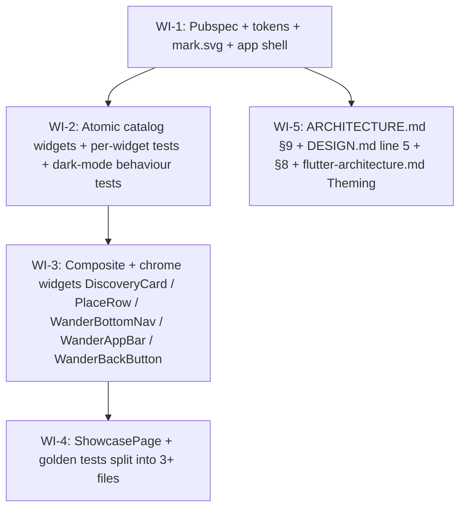

# UC-400 Design System Bootstrap — Work Items

This document is the human-readable companion to `.claude/state/handoff-designer.json`. The JSON drives the pipeline; this file makes it reviewable.

UC-400 is the new head of Phase 4. It ships the entire Wander design system (tokens, theme, catalog widgets, and a debug showcase route) before any feature slice exists. Once it lands every later UC composes its screens from `lib/core/widgets/` — no further token work allowed downstream.

Five WIs, mostly linear (`WI-1 → WI-2 → WI-3 → WI-4`), with the doc-update WI-5 hanging off WI-1 so it can run in parallel with the catalog work.

**Round-2 revision notes (applied after `fl-design-reviewer` findings):**
- WI-2 splits `form_primitives.dart` into three single-type files (`wander_text_field.dart`, `wander_toggle.dart`, `wander_check_pill.dart`) per `flutter-naming.md#files-and-types`. Total atomic widget files: 11 (up from 9). WI-2 remains L complexity — file count grew but the work per file is unchanged.
- WI-3 splits `wander_app_bar.dart` into `wander_app_bar.dart` (WanderAppBar) + `wander_back_button.dart` (WanderBackButton). Renames mock-model files to match primary type: `discovery_card_models.dart` → `user_summary_mock.dart`, `place_row_models.dart` → `place_mock.dart`.
- WI-1 switches `WanderMeetApp` from `ConsumerWidget` to `StatelessWidget` (no provider read at app level; an inline source-comment notes promotion in UC-401).
- Phantom test cases (reviewer greps masquerading as flutter tests) are moved out of `test_cases` into a new "Reviewer checks (not in flutter test)" section per WI.
- WI-2 adds explicit dark-mode behaviour tests for StatusDot, Avatar, HangoutTag — the redundant-cue contract must hold in both themes, and goldens are too slow/fragile to be the only gate.
- WI-4 drops `release_build_path_swaps_to_text_placeholder_not_ShowcasePage` (not implementable under `flutter test` because `kDebugMode == true` there). The release-build linkage gate falls to `flutter analyze` + `dart compile` plus a one-line acceptance criterion under WI-1 noting tree-shaking is verified manually during dev.
- WI-3 acceptance changes `AppColors.white.withOpacity(0.88)` → `AppColors.white.withValues(alpha: 0.88)` (the `withOpacity` API is deprecated; `flutter analyze` would surface the lint).
- WI-5 also patches `frontend/docs/DESIGN.md` — line 5 (`wandermeet_frontend` → `wandermeet_app`) and §8 (`MaterialApp.router` → `MaterialApp ... themeMode: ThemeMode.system`) — to eliminate cross-doc drift before the next designer pass on UC-401.

---

## Assumptions

These call out judgements made during decomposition. If any are wrong, raise it before the developer starts.

1. **`MaterialApp`, not `MaterialApp.router`.** UC-400 wires `home: ShowcaseGate()`. Real GoRouter wiring lands in UC-401. The spec is explicit; we follow it. WI-5 also patches `DESIGN.md §8` so the bridge doc stops pointing at `MaterialApp.router` for UC-400.
2. **No new core/ infrastructure other than `tokens/` and `widgets/`.** No `core/network/`, no `core/auth/`, no `core/realtime/`, no `core/errors/`, no `core/storage/`, no `core/clock/`, no `core/logging/`, no `core/copy/`. Those land with the UCs that need them (per the spec's `out_of_scope`).
3. **Token files are copied verbatim.** Every header comment and import path stays as the handoff ships them. The handoff source uses `import 'app_colors.dart';` (not `package:wandermeet_app/core/tokens/app_colors.dart`); we preserve that to keep the md5 equality property. Both styles compile under Dart's part/library semantics — the relative imports are fine inside `lib/core/tokens/`.
4. **`pubspec.yaml` `name: wandermeet_app` stays.** The handoff sample uses `name: wander`; we do NOT rename the package in this UC. The decision was made in `frontend/docs/DESIGN.md` ("frontend project directory stays `frontend/` for now; the Dart `pubspec.yaml` `name:` is still `wandermeet_app` and need not be renamed until launch"). WI-5 patches `DESIGN.md` line 5 where the bridge doc currently misstates the pubspec name as `wandermeet_frontend`.
5. **`flutter_riverpod 3.2.1` pin holds.** The handoff's `pubspec_snippet.yaml` shows `flutter_riverpod: ^2.5.1` — that's a sample, not authoritative. We keep the project's exact 3.2.1 pin (set together with `riverpod_annotation 4.0.2` / `riverpod_generator 4.0.3` / `riverpod_lint 3.1.3` per `frontend/docs/ARCHITECTURE.md §1`).
6. **`google_fonts` runtime fetching is allowed in app code, disabled in tests.** The spec's `alternate_flows` accepts platform-font fallback on first cold launch. In test environments we set `GoogleFonts.config.allowRuntimeFetching = false` to keep goldens deterministic.
7. **Mock `UserSummary` and `Place` live in single-type files matching the type name.** Real DTOs land with UC-405 (users) and UC-507 (places). Mock files are `user_summary_mock.dart` and `place_mock.dart` (not `discovery_card_models.dart` / `place_row_models.dart`) — the file name matches the primary type AND makes the TODO(UC-405) / TODO(UC-507) tombstone grep-obvious by file name alone. Each carries a `// TODO(UC-405)` / `// TODO(UC-507)` header naming the replacing UC explicitly — `/fl-review` will use this as a tombstone when those UCs ship.
8. **`WanderMeetApp` is a `const StatelessWidget`, not a `ConsumerWidget`.** UC-400 reads no provider at the app level; `ConsumerWidget` would bring an unused `WidgetRef`. WI-1's source file carries an inline comment ("Promote to ConsumerWidget when UC-401 wires goRouterProvider and the body reads from it.") so the next designer pass on UC-401 has a tombstone to find.
9. **`ShowcaseGate` always imports `ShowcasePage` at file scope.** A conditional `if (kDebugMode) ShowcasePage() else Text(...)` keeps the import graph valid in release builds; tree-shaking drops the showcase code path because the `kDebugMode` constant evaluates to `false` at compile time. **Verification is manual during dev**, not in `flutter test` — `kDebugMode` is always `true` under `flutter test`, so the release-swap is not directly testable. `flutter analyze` + `dart compile` cover the linkage.
10. **Golden files start empty.** The developer runs `flutter test --update-goldens` once locally to seed the baseline. Reviewer asserts the baseline is committed and consistent across light + dark.
11. **No `aad_oauth` / `dio` / `signalr_netcore` / `flutter_secure_storage` / `hive` / `firebase_messaging` / `image_picker` / `image_cropper` deps.** These belong to UC-401 / UC-402 / UC-404 / UC-501 / UC-504 / UC-505. The spec is explicit; the WIs are constrained accordingly.

---

## Dependency Graph

WI-5 runs in parallel with WI-2/3/4 once WI-1 has shipped the token files (the doc update describes contracts that exist after WI-1).

---

## WI-1: Pubspec deps + token files (verbatim copy) + mark.svg + app shell + ShowcaseGate placeholder

Foundational. Everything else in the UC depends on this. The file contract is small but exact — token files must be byte-for-byte equal to the handoff source.

### Required reads

- `frontend/docs/specs/in-progress/00_UC_400_design_system_bootstrap.md` — the UC itself
- `frontend/pubspec.yaml` — current dep list
- `frontend/lib/main.dart` — current counter sample (rewritten in this WI)
- `.claude/state/design_handoff_wander_ui/flutter_tokens/{app_colors,app_typography,app_radius,app_theme}.dart` — token source files (md5 equality required)
- `.claude/state/design_handoff_wander_ui/flutter_tokens/pubspec_snippet.yaml` — dep version reference (informational; project's existing pins win)
- `.claude/state/design_handoff_wander_ui/COMPONENT_SPECS.md` §1 — `WanderMark` SVG geometry spec
- `frontend/docs/DESIGN.md` — integration bridge (informational)

### Deliverables

- `frontend/pubspec.yaml` adds: `google_fonts ^6.2.1`, `flutter_svg ^2.0.10`, `country_flags ^3.0.0`, `cached_network_image ^3.3.1`, `intl ^0.19.0`. Commits `pubspec.lock`.
- `frontend/lib/core/tokens/app_colors.dart` — copied verbatim from handoff (md5 must match)
- `frontend/lib/core/tokens/app_typography.dart` — copied verbatim
- `frontend/lib/core/tokens/app_radius.dart` — copied verbatim (exports `AppRadius`, `AppSpace`, `AppShadow`)
- `frontend/lib/core/tokens/app_theme.dart` — copied verbatim
- `frontend/assets/mark.svg` — < 3 KB, geometry per `COMPONENT_SPECS.md §1`
- `frontend/lib/main.dart` — rewritten to `WidgetsFlutterBinding.ensureInitialized(); runApp(const ProviderScope(child: WanderMeetApp()));`
- `frontend/lib/app/wandermeet_app.dart` — **const `StatelessWidget`** (NOT `ConsumerWidget` — UC-400 reads no provider at the app level) returning `MaterialApp(theme: AppTheme.light, darkTheme: AppTheme.dark, themeMode: ThemeMode.system, home: ShowcaseGate())`. Inline source comment: `// Promote to ConsumerWidget when UC-401 wires goRouterProvider and the body reads from it.`
- `frontend/lib/app/showcase_gate.dart` — const StatelessWidget that branches on `kDebugMode`; references `ShowcasePage` at file scope so release builds link cleanly (tree-shaking under `--release` is verified manually during dev, not in CI)
- `frontend/lib/debug/showcase_page.dart` — empty stub `Scaffold(body: SizedBox.shrink())` (real implementation in WI-4)

### Error paths

- **Token files diverge from handoff** → md5 check fails → reviewer rejects. Re-copy verbatim, do NOT rewrite imports.
- **Mark SVG fails to parse** → `WanderMark` shows the 24×24 ember placeholder square (WI-2's `placeholderBuilder` handles this; in WI-1 we ship the asset only).
- **`pubspec.lock` regeneration changes other pins** → if `flutter pub get` upgrades a transitive that wasn't requested, pin the dep explicitly in `dependency_overrides` to keep the diff scoped.

### Tests

- `app_boots_and_renders_showcase_gate_placeholder_in_release` — smoke widget test pumping `WanderMeetApp` and asserting the placeholder Text is reachable (or the empty stub `Scaffold` in debug mode).
- `token_files_md5_equal_handoff_source` — a Dart test (or a shell hook) that hashes the four `lib/core/tokens/*.dart` files and compares against the handoff source. Run by reviewer; can be a CI step.

### Reviewer checks (not in flutter test)

- `WanderMeetApp` is `StatelessWidget`, not `ConsumerWidget` — grep `wandermeet_app.dart` for `extends ConsumerWidget`, expect 0 matches.
- Inline source comment in `wandermeet_app.dart` mentions UC-401 promotion path.
- ShowcaseGate references `ShowcasePage` at file scope (the import line exists and is not behind `dart.library.io` or any conditional import).

### Verification

`flutter analyze` clean. (`flutter analyze` covers the bulk of the contract; the md5 equality is a reviewer check, not a `flutter test` filter.)

---

## WI-2: Atomic catalog widgets

The 11 single-purpose widgets, each in its own file (one public type per file per `flutter-naming.md#files-and-types`). Each gets a behaviour test that locks the visible contract from `COMPONENT_SPECS.md`. The five hangout icons are `CustomPainter` subclasses under `widgets/icons/`. Dark-mode behaviour tests cover the widgets where the redundant-cue contract must hold in both themes.

### Required reads

- `frontend/docs/specs/in-progress/00_UC_400_design_system_bootstrap.md`
- `.claude/state/design_handoff_wander_ui/COMPONENT_SPECS.md` §§ 1-7, 12-13
- `.claude/state/design_handoff_wander_ui/README.md` (visual fidelity bar, accessibility floor)
- `frontend/lib/core/tokens/{app_colors,app_typography,app_radius}.dart` (already shipped in WI-1)

### Deliverables

| File | Type | Notes |
|---|---|---|
| `core/widgets/wander_mark.dart` | `WanderMark` | flutter_svg, `placeholderBuilder` shows ember square on parse failure; seed dropped below 32 px |
| `core/widgets/avatar.dart` | `Avatar` + `AvatarHue` enum | 7 hues, ink text for sand/stone, `cached_network_image` when `imageUrl != null` |
| `core/widgets/status_dot.dart` | `StatusDot` + `ActivityStatus` enum | online filled green + halo, recent **hollow** yellow ring (transparent fill + non-zero border), hidden → `SizedBox.shrink()` |
| `core/widgets/open_today_pill.dart` | `OpenTodayPill` | Teal bg, "Open today" label literal, 5 px white dot |
| `core/widgets/hangout_tag.dart` | `HangoutTag` + `Hangout` enum | emberTint bg, emberDeep text, 12 px hangout icon |
| `core/widgets/icons/icon_{coffee,walk,food,explore,cowork}.dart` | 5 `CustomPainter`s | 24-grid, 1.75 px stroke, 2 px corner radius |
| `core/widgets/trust_badge.dart` | `TrustBadge` + `TrustBadgeKind` enum | trusted requires `score`, idVerified label "ID Verified" |
| `core/widgets/sponsored_pill.dart` | `SponsoredPill` | Literal "Sponsored" uppercase, 9/700, letterspacing 0.10em |
| `core/widgets/ember_cta.dart` | `EmberCTA` | Wraps ElevatedButton, optional trailing arrow, pressed-scale 0.98 over 100 ms via `AnimatedScale` |
| `core/widgets/wander_text_field.dart` | `WanderTextField` | One public type per file; focus border 1.5 px ember |
| `core/widgets/wander_toggle.dart` | `WanderToggle` | One public type per file; track 38×22, thumb 18×18, teal on / line off |
| `core/widgets/wander_check_pill.dart` | `WanderCheckPill` | One public type per file; active uses emberTint bg + ember border + emberDeep text |

### Error paths

- **`WanderMark` SVG parse failure** → `placeholderBuilder` renders a 24×24 ember square so the failure is visible at design-review time, not hidden as an empty box.
- **`Avatar` with `imageUrl` set but network failure** → `cached_network_image`'s `errorWidget` falls back to the initial-letter rendering. (Not strictly UC-400 territory but the contract is "image when present else initial".)
- **`HangoutTag` for an unrecognised `Hangout` value** → exhaustive `switch` over the sealed enum; if Dart's exhaustiveness checker passes, this path doesn't exist at compile time. No runtime guard needed.
- **`TrustBadge.trusted` without `score`** → assert at construction (compile-time signal via `assert(score != null)` in const ctor); `TrustBadge.idVerified` does not take a `score`.
- **`EmberCTA` with `null` `onPressed`** → disabled state (`ElevatedButton` greys out per theme); pressed-scale animation is gated on `onPressed != null`.

### Tests

One `*_test.dart` file per widget under `frontend/test/core/widgets/`. Each asserts:

- The const constructor compiles (the file imports the const literal in a `test('const ctor')` block).
- Visible labels/icons are reachable via `find.text(...)` / `find.byType(...)`.
- Widget-specific contract bullets:
  - `StatusDot` for `ActivityStatus.recent` has a non-zero border + transparent fill (pump the widget, find the `Container`, assert `decoration.border.top.width > 0` and `decoration.color == null || decoration.color == Colors.transparent`).
  - `StatusDot` for `ActivityStatus.hidden` returns `SizedBox.shrink()` (assert via `find.byType(SizedBox)` and `tester.getSize(...)` equals `Size.zero`).
  - `WanderMark` at `size: 24` does NOT include the seed (assert via paint inspection or a child-count check).
  - `EmberCTA` triggers the scale animation on tap (pump → tap → pump duration < 100 ms → expect `Transform.scale.scale ≈ 0.98`).
  - `OpenTodayPill` label is literally `"Open today"` (not "Open Today", not "Today").
  - `SponsoredPill` label is literally `"Sponsored"` (not "AD", not "PROMOTED").
- Interactive widgets (`EmberCTA`, `WanderToggle`, `WanderCheckPill`) have non-empty `Semantics.label`.

**Dark-mode behaviour tests** (added in round-2 revision — the redundant-cue contract must hold under both `Brightness.light` and `Brightness.dark`; goldens are too slow/fragile to be the only gate):

- `StatusDot_RendersRecentRingInDarkMode` — pump `StatusDot` with `ActivityStatus.recent` under a `MediaQuery(data: MediaQueryData(platformBrightness: Brightness.dark))` wrapper; assert the border is still non-zero and the fill is still transparent so the hollow-ring contract holds.
- `Avatar_RendersInitialContrastInDarkMode` — pump `Avatar` for each `AvatarHue` under dark mode; assert the initial-letter text colour resolves to the expected ink / paper variant (sand and stone still use ink, the rest use paper/white).
- `HangoutTag_RendersCoffeeChipInDarkMode` — pump `HangoutTag(hangout: Hangout.coffee)` under dark mode; assert the emberTint background is still visible (non-transparent) and the icon + label colour reads as emberDeep.

### Reviewer checks (not in flutter test)

These are reviewer greps over the source AST / file contents, NOT `flutter test` cases — moved out of `test_cases` per round-2 revision to keep the test-count gate honest:

- Zero raw `Color(0x...)` / `EdgeInsets.all(<num>)` / `TextStyle(fontSize: <num>)` / `BorderRadius.circular(<num>)` in any `core/widgets/*.dart` file outside the icon CustomPainters where stroke widths and grid sizes are intentional numeric constants.
- One public type per file (grep each `*.dart` for top-level `class ` declarations not prefixed with `_`; expect 1 per atomic widget file, plus optionally the accompanying enum which is the carve-out).

### Verification

`flutter test --plain-name "StatusDot"` (the `StatusDot` test is the load-bearing one for the redundant-cue contract). Full `flutter analyze` clean.

---

## WI-3: Composite + chrome widgets

DiscoveryCard and PlaceRow compose the atomic widgets from WI-2. WanderBottomNav and WanderAppBar are app-shell chrome that screens will consume in UC-401+. The `WanderBackButton` lives in its own file per the one-public-type-per-file rule.

### Required reads

- `.claude/state/design_handoff_wander_ui/COMPONENT_SPECS.md` §§ 8-11
- `.claude/state/design_handoff_wander_ui/SCREEN_SPECS.md` §§ 1, 5 (for visual context — Discovery card on Today, PlaceRow on Places tab)
- `frontend/docs/DESIGN.md` §2 (component catalog table)
- WI-2's atomic widget files (composition targets)

### Deliverables

| File | Type | Notes |
|---|---|---|
| `core/widgets/discovery_card.dart` | `DiscoveryCard` | Composes Avatar + StatusDot + TrustBadge + HangoutTag + EmberCTA; takes a mock `UserSummary` |
| `core/widgets/user_summary_mock.dart` | mock `UserSummary` record | File name matches primary type; `// TODO(UC-405): replace with real UserSummary from features/users/domain/` header |
| `core/widgets/place_row.dart` | `PlaceRow` | Composes SponsoredPill conditionally; takes a mock `Place` |
| `core/widgets/place_mock.dart` | mock `Place` record | File name matches primary type; `// TODO(UC-507): replace with real Place from features/places/domain/` header |
| `core/widgets/wander_bottom_nav.dart` | `WanderBottomNav` | Custom `Container` + `BackdropFilter`; NOT `BottomNavigationBar`; uses `Color.withValues(alpha:)` (NOT the deprecated `withOpacity`) |
| `core/widgets/wander_app_bar.dart` | `WanderAppBar` | `PreferredSizeWidget`, paper bg, 0 elevation — **one public type per file** |
| `core/widgets/wander_back_button.dart` | `WanderBackButton` | Split out of `wander_app_bar.dart` per `flutter-naming.md#files-and-types` |

### Error paths

- **`DiscoveryCard` for `user.activity == ActivityStatus.recent`** → swap filled `EmberCTA` to `OutlinedButton` with ember border and 0.85 opacity. Compile-time switch on the enum.
- **`PlaceRow` selected without `onTap`** → still renders the check chip but the row is non-tappable (visually consistent with the invite-composer preview state).
- **`PlaceRow` sponsored** → background `AppColors.sunTint` on the 48×48 thumb, `SponsoredPill` rendered inline with the name.
- **`WanderBottomNav` invalid `index`** (< 0 or > 3) → assert at construction; no runtime fallback.
- **`WanderAppBar.trailing == null`** → trailing slot renders nothing (not an empty `SizedBox` taking layout space).

### Tests

- `discovery_card_test.dart` — composition (Avatar/StatusDot/TrustBadge/HangoutTag/EmberCTA all present), recent → outlined CTA, idVerified renders only when true, bio max-2-lines + ellipsis.
- `place_row_test.dart` — selected → trailing check chip, sponsored → SponsoredPill + sunTint thumb, amenity pills wrap.
- `wander_bottom_nav_test.dart` — active item uses ember, tap dispatches `onChange(index)`, `BackdropFilter` present with sigma 20.
- `wander_app_bar_test.dart` — `preferredSize.height == kToolbarHeight`, back-chevron label uses Newsreader italic 300, trailing slot renders when provided.
- `wander_back_button_test.dart` — taps pop the navigator (pumped inside a `Navigator` with a known route).

### Reviewer checks (not in flutter test)

These are reviewer greps over source files, NOT `flutter test` cases — moved out of `test_cases` per round-2 revision:

- `user_summary_mock.dart` carries `TODO(UC-405)` in the file header; `place_mock.dart` carries `TODO(UC-507)`. Reviewer greps each file's first 5 lines for the exact tombstone string.
- No `Color.withOpacity(...)` calls anywhere in `frontend/lib/core/widgets/*.dart`; all alpha adjustments use `Color.withValues(alpha:)` to avoid the deprecation lint.
- `wander_app_bar.dart` declares only one public type (`WanderAppBar`); `wander_back_button.dart` declares only `WanderBackButton`. Grep each file for `^class [A-Z]` not prefixed with `_`; expect exactly one per file.
- Zero raw `Color / EdgeInsets / TextStyle / BorderRadius` literals — every visual constant comes from `AppColors / AppText / AppSpace / AppRadius / AppShadow`.

### Verification

`flutter test --plain-name "DiscoveryCard"`. `flutter analyze` clean.

---

## WI-4: ShowcasePage + golden tests

The proving ground for the entire design system. `ShowcasePage` renders every token + every catalog widget. Goldens lock the visual contract and become the regression target for `/fl-review`.

### Required reads

- `frontend/docs/specs/in-progress/00_UC_400_design_system_bootstrap.md` (acceptance criteria for the showcase contents)
- `.claude/state/design_handoff_wander_ui/COMPONENT_SPECS.md` (every widget's primary state)
- `frontend/lib/core/tokens/*.dart` (every token to swatch)
- WI-2 + WI-3 widget files (every widget to render)

### Deliverables

- `frontend/lib/debug/showcase_page.dart` — rewritten from stub:
  - Section 1: **Colours** — labelled swatch grid (≥ 24 swatches: every `AppColors` static const), plus dark-mode swatch row alongside.
  - Section 2: **Typography** — every `AppText` role on its own labelled row.
  - Section 3: **Components** — every catalog widget in primary state (Avatar in all 7 hues, StatusDot in all 3 states, TrustBadge in both kinds, HangoutTag for all 5 hangouts, SponsoredPill, OpenTodayPill, DiscoveryCard with mock UserSummary, PlaceRow organic + sponsored, WanderBottomNav, WanderAppBar with WanderBackButton, EmberCTA filled + arrow).
  - Section 4: **Radii + shadows** — sample container per `AppRadius` value, sample card per `AppShadow` value.
- `frontend/test/debug/showcase_colors_golden_test.dart` — light + dark goldens for Section 1.
- `frontend/test/debug/showcase_typography_golden_test.dart` — light + dark goldens for Section 2.
- `frontend/test/debug/showcase_components_golden_test.dart` — light + dark goldens for Section 3 (may need sub-files if Section 3's height exceeds 10 000 logical px — split into `showcase_components_atomic_golden_test.dart` + `showcase_components_composite_golden_test.dart`).
- `frontend/test/debug/goldens/` — committed PNG baselines.

### Error paths

- **Single golden > 10 000 logical px** → split that section into sub-goldens. The spec's `alternate_flows` already names this branch ("splitting into sections is acceptable").
- **`google_fonts` runtime fetch fails in CI** → set `GoogleFonts.config.allowRuntimeFetching = false` in test `setUpAll`; this forces the platform default and keeps goldens deterministic. The widget still renders, the golden still locks the layout (text geometry is the part that matters; exact font rasterisation is OS-dependent anyway).
- **Dark-mode golden differs across platforms** → run goldens on a fixed `Brightness.dark` `MediaQuery` wrapper, not by toggling the system theme. Reviewer asserts the golden file headers are committed under `goldens/`.

### Tests

The goldens ARE the tests. Each `testWidgets(...)` block:

1. Sets `GoogleFonts.config.allowRuntimeFetching = false`.
2. Pumps `MaterialApp(theme: AppTheme.light, home: const ShowcasePage())` (and again with `AppTheme.dark`).
3. Scrolls to the target section, awaits font / image settling.
4. Calls `await expectLater(find.byType(ShowcasePage), matchesGoldenFile('goldens/showcase_<section>_<brightness>.png'))`.

### Reviewer checks (not in flutter test)

- Release-build tree-shaking of the `ShowcasePage` code path: verified manually during dev — `kDebugMode` is always `true` under `flutter test`, so there is no `flutter test` case for the release-swap. The gate falls to `flutter analyze` clean + `dart compile` linkage success. Round-2 revision dropped the phantom `release_build_path_swaps_to_text_placeholder_not_ShowcasePage` test case since it can't actually execute under `flutter test`.
- Golden baselines committed under `frontend/test/debug/goldens/` for both `Brightness.light` and `Brightness.dark`.

### Verification

`flutter test --plain-name "showcase"`. `flutter analyze` clean.

---

## WI-5: Doc + rule updates

The token contract from WI-1 + the non-negotiables from WI-2/3 are now authoritative. Three docs that previously described the old `#534AB7` / `AppSpacing.s4` / `AppRadii.r4` placeholder must be updated in lock-step so future skills (`/fl-feature`, `/fl-tdd`, `/fl-review`) cite the right names. Round-2 adds `frontend/docs/DESIGN.md` to the patch list — line 5 contradicts the actual pubspec, and §8 still mentions `MaterialApp.router` for UC-400 even though UC-400's spec and WIs (correctly) defer routing to UC-401.

This WI depends only on WI-1 (the token files exist) and can run in parallel with WI-2/3/4.

### Required reads

- `frontend/docs/ARCHITECTURE.md` (current §9)
- `frontend/docs/DESIGN.md` (current line 5 + §8)
- `.claude/rules/flutter-architecture.md` (current Theming — design tokens section)
- `frontend/docs/DESIGN.md` §1 (the replacement copy)
- `.claude/state/design_handoff_wander_ui/README.md` (the 11 non-negotiables)
- `frontend/lib/core/tokens/{app_colors,app_typography,app_radius}.dart` (verify the names being documented are real)

### Deliverables

- `frontend/docs/ARCHITECTURE.md §9` rewritten:
  - Brand: `AppColors.ember` (`#DC4F2C`), not `AppColors.brand` (`#534AB7`).
  - Token file names: `app_colors.dart` / `app_typography.dart` / `app_radius.dart` (exports `AppSpace` + `AppShadow`) / `app_theme.dart`.
  - Spacing scale: `AppSpace.xxs..xxxl` (4 / 6 / 8 / 12 / 16 / 20 / 24 / 32).
  - Radii scale: `AppRadius.xs..pill` (8 / 10 / 12 / 14 / 16 / 18 / 9999).
  - Typography: three families (Newsreader serif, Manrope sans, JetBrains Mono) via `google_fonts ^6.2.1`; role styles displayLarge / displayMedium / displaySmall / displayItalic / headline / cardName / title / titleSmall / body / bodySmall / caption / pill / monoLabel / monoTiny.
  - Banned-inline-literals list explicitly names `AppColors / AppText / AppSpace / AppRadius / AppShadow` as the canonical replacements and removes references to `AppSpacing.s*` / `AppRadii.r*` / `AppColors.brand`.
  - 2-line link to `frontend/docs/DESIGN.md §1` for the full table.

- `frontend/docs/DESIGN.md` patched in two places:
  - **Line 5** — the phrase `the Dart pubspec.yaml name: is still wandermeet_frontend` is replaced with `the Dart pubspec.yaml name: is still wandermeet_app` to match the actual pubspec.
  - **§8** ("UC-400 — new prerequisite UC") — the bullet `Wire MaterialApp.router(theme: AppTheme.light, darkTheme: AppTheme.dark)` is replaced with `Wire MaterialApp(theme: AppTheme.light, darkTheme: AppTheme.dark, themeMode: ThemeMode.system) — MaterialApp.router lands in UC-401.`

- `.claude/rules/flutter-architecture.md` Theming — design tokens section rewritten in lock-step:
  - Brand `#DC4F2C` ember.
  - Token class names `AppColors / AppText / AppSpace / AppRadius / AppShadow` (NOT `AppSpacing / AppRadii / AppTextStyles`).
  - Three-family typography requirement (`google_fonts` dep) called out.
  - Explicit "Non-negotiables (product constants — `/fl-review` enforces)" block listing the 11 items from `DESIGN.md §6` (no swipe, no red badges, no match scores, no precise last-seen, no profile-view counts, no streaks-or-guilt, `is_open_to_romance` is settings-level, Sponsored is slot-3 invite-only, declined invites are silent, first names only, iris+teal+sun colour reservations).
  - Banned-list explicitly rejects `Color(0x...)`, `EdgeInsets.all(<num>)`, `EdgeInsets.symmetric(<num>)`, `TextStyle(fontSize: <num>)`, `BorderRadius.circular(<num>)` anywhere in `lib/` outside `lib/core/tokens/` — and notes that `/fl-review` uses this as a blocking rejection criterion.

### Error paths

- **The Theming section's anchor changes** (`#theming-design-tokens`) → other WIs' `rule_citations` reference this anchor. Keep the existing anchor exactly (markdown lower-cases header text + dashes). No rename.
- **Banned-list expands too far** → only forbid raw `Color / EdgeInsets / TextStyle / BorderRadius` literals. Do NOT forbid theme-derived `Theme.of(context).colorScheme.primary` reads.
- **Cross-references to the retired token names** → grep for `AppColors.brand`, `AppSpacing.s`, `AppRadii.r`, `AppTextStyles.` in both files; replace at every site or remove the bullet entirely.
- **`DESIGN.md` §8 anchor / TOC drift** → §8 is referenced from other parts of `DESIGN.md` and from this work-items doc; preserve the §8 numbering and the existing heading text, edit only the bullet body.

### Tests

This WI ships no production code. Verification is reviewer grep:

- `architecture.md` §9 no longer contains the strings `534AB7`, `AppSpacing.s4`, `AppRadii.r4`, `AppColors.brand`.
- `flutter-architecture.md` Theming section now contains the strings `DC4F2C`, `AppSpace`, `AppRadius`, `AppShadow`, `AppText`, `google_fonts`.
- `DESIGN.md` line 5 contains the string `wandermeet_app` and does NOT contain `wandermeet_frontend`.
- `DESIGN.md` §8 no longer contains the string `MaterialApp.router` in the UC-400 bullet (it does contain it in a `MaterialApp.router lands in UC-401` reference, which is the intended new copy).
- A "Non-negotiables" block exists in the rule file and lists the 11 items.

### Reviewer checks (not in flutter test)

All of WI-5 is reviewer-driven — this WI ships no code. The five greps above ARE the contract.

### Verification

`flutter analyze` clean (the build doesn't touch production code, but we still gate the doc change behind a green analyze to prevent accidental code churn).

---

## Risk register

| Risk | Likelihood | Mitigation |
|---|---|---|
| Token files diverge from handoff during a future edit | Med | md5-equality test in CI; document in WI-1 acceptance |
| Goldens flake across platforms / fonts | Med | Pin `GoogleFonts.config.allowRuntimeFetching = false` in test setup; commit goldens only after local + CI agreement; WI-2 dark-mode behaviour tests provide an early-warning gate before goldens fire |
| `flutter_riverpod 3.2.1` pin breaks with new transitive | Low | Already pinned exactly in pubspec.yaml; CI catches via `flutter pub get` |
| `country_flags` ships unused code into release builds | Low | Unused import would surface in `flutter analyze`; we accept the small binary cost for UC-405's benefit (per spec `alternate_flows`) |
| `cached_network_image` Hive cache directory needs init | Med | Default behaviour creates the dir lazily; no explicit init needed for UC-400; if `flutter test` complains, add `setUpAll` stub |
| Showcase page's import of `ShowcasePage` is tree-shaken incorrectly | Low | `kDebugMode` is a compile-time constant; release builds drop the path; verification is manual during dev (not `flutter test`) plus `flutter analyze` + `dart compile` linkage |
| `Color.withOpacity` deprecation lint surfaces in `flutter analyze` | Low | WI-3 acceptance pins `Color.withValues(alpha:)` everywhere — reviewer grep enforces |

---

## What this UC does NOT do (re-stated)

These are in the spec's `out_of_scope` and the WIs are constrained accordingly. Do not be tempted to add them.

- No GoRouter wiring. `MaterialApp`, not `MaterialApp.router`. (DESIGN.md §8 patched in WI-5 to match.)
- No HTTP client, Dio, interceptors, token storage, auth-session state. (UC-401)
- No feature slice. (UC-401 introduces the first.)
- No `flutter_localizations`. Copy stays as `const` strings under `core/copy/` in the UC that needs it.
- No animation polish beyond the `EmberCTA` pressed-scale. StatusDot pulse, banner slide-in, trust-bar animation land with the UC that uses them.
- No image-picker / image-cropper. (UC-404)
- No real `UserSummary` / `Place` types. Mocks for the showcase only — deleted in UC-405 / UC-507.
- No `WanderMeetApp` as `ConsumerWidget`. Promotion happens in UC-401 when `goRouterProvider` is wired.

---

## Done when

- All five WIs ship with green `flutter analyze`, `flutter test`, and `dart run build_runner build --delete-conflicting-outputs && git diff --exit-code`.
- `frontend/docs/ARCHITECTURE.md §9`, `frontend/docs/DESIGN.md` line 5 + §8, and `.claude/rules/flutter-architecture.md` Theming section describe the ember-led token contract authoritatively and consistently with the actual pubspec / app shell.
- The 13 catalog widgets compose every later UC's screens — no later UC redefines them.
- The `/_debug/showcase` page (in debug builds, via `ShowcaseGate`) renders every token and every catalog widget; the goldens lock the visual baseline.
- `/fl-review` rejects any raw `Color / EdgeInsets / TextStyle / BorderRadius` literal in `lib/` outside `lib/core/tokens/`, and rejects any `Color.withOpacity(...)` call (use `Color.withValues(alpha:)`).
