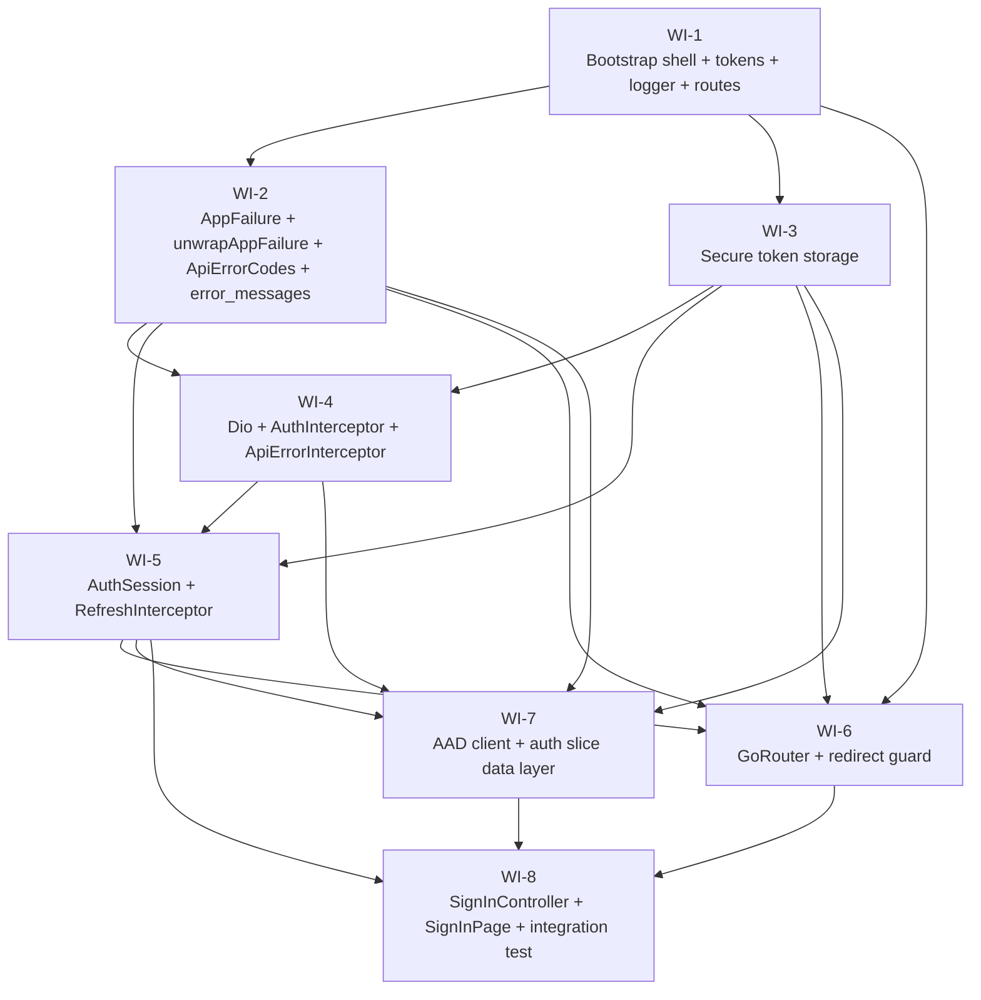

# UC-401 — Sign-in and Token Lifecycle: Work Items

Spec: [`01_UC_401_signin.md`](./01_UC_401_signin.md)
Slug: `signin-and-token-lifecycle`
Stack: Flutter (frontend/)
Designer output: `.claude/state/handoff-designer.json`

---

## Revision history

- **2026-05-10 — Round 1 review revisions.** Design-review round 1 produced 9 findings (2 CRITICAL + 2 HIGH + 3 MEDIUM + 2 LOW), `blocks_merge=true`. All 9 findings addressed below; topology unchanged (still 8 WIs). Architecture rule patches consumed: AuthInterceptor skip-list reduced to `/auth/refresh` only; freezed wire format pinned to camelCase (no `FieldRename.pascal`). Finding-by-finding resolution map appears in the conductor return summary; the changes themselves live in the WI sections below and the Assumptions section.

---

## Assumptions

These judgements were made during decomposition and revision and should be confirmed before WI-1 starts. Surface to the user via `AskUserQuestion` if any are wrong.

1. **`Auth.InvalidToken` error code does not exist on the backend yet.** The spec acknowledges this in AC #9: "if defined backend-side; otherwise add backend constant in the same UC". The decomposition keeps the backend untouched and adds `authInvalidToken = 'Auth.InvalidToken'` on the Dart side only (WI-2). Rationale: a 401 from `/auth/register` returns no body code today (`Send.UnauthorizedAsync(ct)` only), so the Dart constant is just a stable label the UI/tests use locally. If the user prefers, we can add the constant to `src/WanderMeet.Shared/ErrorCodes.cs` in a small backend follow-up after UC-401.

2. **Wire format is camelCase per FastEndpoints default.** Verified by reading `src/WanderMeet.Api/Program.cs:276` — only `c.Endpoints.RoutePrefix = "api/v1"` is set; no `JsonSerializerOptions.PropertyNamingPolicy` override exists anywhere in `src/`. FastEndpoints' built-in default response serialization is `JsonNamingPolicy.CamelCase`. The `freezed` DTOs (WI-7) use the **default casing** — do **not** apply `FieldRename.pascal` and do **not** add per-field `@JsonKey(name: 'PascalCase')` overrides. The integration test (WI-8) hits a `shelf` server with a canned camelCase payload — drift would surface there. *(CRITICAL #1 fix from review.)*

3. **`/auth/register` is an authenticated endpoint and DOES receive `Authorization: Bearer <jwt>`.** Backend `RegisterEndpoint` declares `Policies(nameof(AuthorizationPolicies.UsersOnly))` (line 28) and reads `User.FindFirstValue(ClaimTypes.NameIdentifier)` (line 45) to extract the AAD `sub` claim. The AuthInterceptor skip-list therefore contains exactly one entry: `/api/v1/auth/refresh` (the refresh endpoint legitimately omits the bearer because the access token is by definition expired and the refresh token travels in the body). WI-4's unit tests assert this directly (`AuthInterceptor_RegisterPath_InjectsBearerHeader`, `AuthInterceptor_PublicPathSetContainsOnlyRefresh`); WI-8's integration test (`UC401_Integration_RealInterceptorsRan_RegisterReceivedBearerEqualToFixedAccessToken`) is now consistent with WI-4. The architecture rule `flutter-architecture.md#networking-dio-interceptor-order` was patched in the same revision pass to match. *(CRITICAL #2 fix from review.)*

4. **`/users/me` lookup is deferred to UC-405.** UC-401's spec explicitly stubs this. WI-7's `AuthApiRepository.completeSignIn` returns a *synthetic* `AuthIdentity` for the 409-returning-user path, with `userId` parsed from the JWT `sub` claim (tiny inline base64 helper) and `firstName` from input. Marked with `/// TODO(UC-405)` at the call site.

5. **Resilience for the "stored tokens but `/users/me` returns 404" cold-start scenario is deferred.** Spec alternate flow notes this: "this resilience may be deferred to UC-402; UC-401 ships the simpler behaviour: 404 → sign out → /sign-in." Since UC-401 doesn't call `/users/me` at all (point 4), this is moot — UC-402 will wire the resilience together with the real `/users/me` call.

6. **`AuthIdentity` lives in `core/auth/auth_session.dart`, not in `features/auth/data/models/`.** Compile-isolation choice: WI-5 (AuthSession) ships before WI-7 (data layer), so `AuthIdentity` cannot depend on `UserDto`. Rather than an awkward forward-reference, the chosen path is to make `AuthIdentity` the canonical session-state type owned by `core/auth/`. WI-7's `AuthApiRepository.completeSignIn` returns `Future<AuthIdentity>` (NOT `Future<UserDto>`), constructing it internally from the in-memory `UserDto`-shape. `UserDto` never escapes the data layer. This diverges intentionally from spec AC #13 which reads `markSignedIn({required UserDto user})`; the divergence is contained to a private signature-detail and will reconcile when UC-405 wires the real `/users/me` call (the right time to revisit whether `AuthSession` should consume the canonical user entity directly). *(MEDIUM #1 resolution from review.)*

7. **`go_router 16.x`** — pinned in WI-1 with a caret on the major. The architecture rule cites "latest 16.x"; the actual lock will pin to whatever the resolver picks at install time.

8. **Logger redaction regex matches a JWT three-segment pattern (`eyJ<base64url>.<base64url>.<base64url>`).** Tokens that look different (e.g. opaque refresh tokens issued by B2C) will not be redacted by the regex alone — the WI-3 rule "tokens never reach the logger" is the primary defence; the regex is belt-and-suspenders.

9. **`firstName` extraction order is `given_name` → `name` → `'Wanderer'`.** Matches spec main-flow step 5 and the architecture's auth flow. UC-402 will prompt to correct it during onboarding.

10. **`ApiErrorCodes` mirror is hand-maintained.** Backend `src/WanderMeet.Shared/ErrorCodes.cs` has 60+ codes today (counting nested `Validation`, `Auth`, `User`, `Storage`, `UserPhoto`, `UserValidation`, `UserCity`, `Discovery`, `City`, `Place`, `Meetup`, `Report`, `Invite` classes); UC-401 mirrors only the auth-flow subset. Phase-6 introduces `GET /api/v1/_diagnostics/error-codes` for automated drift detection. **Until then, every PR touching `src/WanderMeet.Shared/ErrorCodes.cs` MUST update `frontend/lib/core/errors/api_error_codes.dart` in the same commit.** Developer / impl-reviewer must check this. The hand-maintained drift detector test in WI-2 (`ApiErrorCodes_ConstantsMirrorBackendStrings`) covers only the codes UC-401 needs — it cannot detect a backend addition that UC-401 didn't already mirror. *(LOW #2 resolution from review — tracked as a process gate; a dedicated drift-detection WI is deferred to Phase-6 since it cannot be done in <50 LOC against today's backend.)*

---

## Decomposition rationale

UC-401 is **foundational** (per fl-designer's "Foundational UC" template): the whole `core/` infrastructure plus the auth slice are new. A single-WI ship would be a 30+ file blob with no incremental verification, so I split along seams that match natural compile-and-test boundaries:

- WI-1 lays the shell (deps, theme, routes constants, logger, bootstrap) so every later WI compiles.
- WI-2 (errors + `unwrapAppFailure` helper) and WI-3 (token storage) are pure-logic foundations consumed by every networking WI.
- WI-4 ships **two of three** Dio interceptors (auth + error mapping). The third (refresh) needs `AuthSession` which needs `AuthIdentity`-shape — so deferred. AuthInterceptor skips ONLY `/auth/refresh`; `/auth/register` IS authenticated.
- WI-5 closes the interceptor pipeline: `AuthSession` AsyncNotifier + `RefreshInterceptor` with single-in-flight `Completer<void>` (instance, not static). This is the architecturally hardest WI.
- WI-6 wires `GoRouter` with auth-driven redirect — depends on `AuthSession` from WI-5 and tokens from WI-3.
- WI-7 builds the auth slice's data layer (DTOs in camelCase, AAD client, `AuthApi`, `AuthApiRepository`). `authRepositoryProvider` is auto-disposed (not keepAlive).
- WI-8 ships the user-facing slice (`SignInController` + `SignInPage` + integration test that boots the whole app end-to-end). `AsyncValue.guard` uses `unwrapAppFailure` so errors carry `AppFailure`, not raw `DioException`.

Topo: WI-1 → {WI-2, WI-3} → WI-4 → WI-5 → {WI-6, WI-7} → WI-8.

---

## Dependency Graph

Independent runnable in parallel after WI-1 lands: {WI-2, WI-3}. After WI-4 lands: WI-7 starts as soon as WI-5 lands (WI-7 now depends on WI-5 for `AuthIdentity` per Assumption #6). After WI-5 lands: WI-6 and WI-7 are parallelisable; WI-8 depends on all three of {WI-5, WI-6, WI-7}.

---

## Spec-AC → WI mapping

The spec lists 28 acceptance criteria. Coverage:

| Spec AC # | Subject | Covered by WI |
|---|---|---|
| 1 | main.dart wraps in ProviderScope, removes counter | WI-1 |
| 2 | AppRoutes / AppRouteNames constants | WI-1 |
| 3 | Router redirect rules | WI-6 |
| 4 | dioClient provider, baseUrl from --dart-define | WI-1 (define) + WI-4 (provider) |
| 5 | AuthInterceptor behaviour (revised: skips ONLY /auth/refresh; /auth/register IS bearer-injected) | WI-4 |
| 6 | RefreshInterceptor behaviour incl. single-in-flight (instance Completer, ref.read passed in) | WI-5 |
| 7 | ApiErrorInterceptor mapping table (incl. 403 with body-code or Http.403 fallback) | WI-4 |
| 8 | sealed AppFailure hierarchy + unwrapAppFailure helper | WI-2 |
| 9 | ApiErrorCodes constants | WI-2 |
| 10 | error_messages.dart | WI-2 |
| 11 | TokenStorage facade with secure storage options | WI-3 |
| 12 | AadOAuthClient wrapper | WI-7 |
| 13 | AuthSession AsyncNotifier (markSignedIn takes AuthIdentity per Assumption #6) | WI-5 |
| 14 | AuthApi.register / refresh | WI-7 |
| 15 | freezed DTOs mirroring backend (camelCase wire format per Assumption #2) | WI-7 |
| 16 | AuthRepository + AuthApiRepository (write-before-register; 409 path; returns AuthIdentity) | WI-7 |
| 17 | auth_failures.dart subclasses | WI-7 |
| 18 | SignInController @riverpod (AsyncValue.guard with unwrapAppFailure) | WI-8 |
| 19 | SignInPage rendering rules | WI-8 |
| 20 | auth_routes.dart wired into router | WI-8 |
| 21 | sign_in_page_test (widget test) | WI-8 |
| 22 | sign_in_page_golden_test | WI-8 |
| 23 | auth_interceptor_test (incl. register-bearer + public-path-set asserts) | WI-4 |
| 24 | refresh_interceptor_test (incl. disposed-container test) | WI-5 |
| 25 | api_error_interceptor_test (incl. 403 with/without body) | WI-4 |
| 26 | sign_in_controller_test (incl. AsyncError carries AppFailure not DioException) | WI-8 |
| 27 | auth_api_repository_test (incl. authRepositoryProvider auto-dispose assert) | WI-7 |
| 28 | token_storage_test (logger redaction) | WI-3 |
| (29) | uc_401_signin_test integration (camelCase response from shelf) | WI-8 |
| (30) | pubspec deps | WI-1 |
| (31) | codegen freshness gate | every WI's verification |
| (32) | flutter analyze + flutter test green | every WI's verification (+ WI-8 final) |

(Numbering past 28 is the spec's "additionally" entries — they appear after the 28 numbered ACs in the YAML body.)

---

## WI-1 — Bootstrap shell, design tokens, redacting logger, AppRoutes/AppRouteNames constants

**Complexity**: M
**Depends on**: —

### Required reads
- `frontend/docs/specs/in-progress/01_UC_401_signin.md`
- `frontend/docs/ARCHITECTURE.md`
- `frontend/pubspec.yaml`, `frontend/lib/main.dart`, `frontend/analysis_options.yaml`

### Deliverables
- `pubspec.yaml` with new runtime deps (dio, aad_oauth, flutter_secure_storage, go_router, hive, hive_flutter, freezed_annotation, json_annotation, logging) + dev deps (freezed, json_serializable, http_mock_adapter, shelf, golden_toolkit, integration_test).
- `lib/main.dart` calls `bootstrap()` then `runApp(ProviderScope(child: WanderMeetApp()))`.
- `lib/app/wandermeet_app.dart` — temporary placeholder `MaterialApp.router` (real router lands in WI-6).
- `lib/app/bootstrap.dart` — Hive init, env-define readers, logger setup. Throws `AssertionError` if `API_BASE_URL` is empty.
- `lib/app/routes.dart` — `AppRoutes` (paths) + `AppRouteNames` (named-route constants).
- `lib/app/theme.dart` — `appLightTheme` from seed `AppColors.brand`.
- `lib/core/logging/logger.dart` — `package:logging` wired with one root listener that runs JWT redaction (`eyJ<b64>.<b64>.<b64>` → `<REDACTED-JWT>`).
- `lib/core/tokens/{app_colors,app_spacing,app_radii,app_text_styles}.dart` — design tokens.

### Tests (red → green → refactor)
1. **`Logger_RedactsJwtLikeStrings_ReplacesWithRedactedMarker`** — emit `appLogger('test').info('token=eyJabc.def.ghi banana')` and assert the captured `LogRecord.message` contains `<REDACTED-JWT>` and not `eyJabc.def.ghi`.
2. **`AppRoutes_PathsAreKebabCaseAndStable`** — assert `AppRoutes.signIn == '/sign-in'`; assert each path matches `^(/[-a-z]+)+$`.
3. **`AppRouteNames_LowerCamelCaseAndDistinct`** — assert names are non-empty distinct strings, all `lowerCamelCase`.

### Verification
`flutter test --plain-name "Logger_RedactsJwtLikeStrings_ReplacesWithRedactedMarker"`
Plus implicit `flutter analyze` and `dart run build_runner build --delete-conflicting-outputs` clean.

---

## WI-2 — Sealed AppFailure hierarchy + unwrapAppFailure helper, ApiErrorCodes mirror, error_messages lookup

**Complexity**: S
**Depends on**: WI-1

### Required reads
- spec
- `src/WanderMeet.Shared/ErrorCodes.cs`
- `src/WanderMeet.Api/Features/Auth/Register/RegisterEndpoint.cs` (to confirm 409 body shape via `AddError`)

### Deliverables
- `lib/core/errors/app_failure.dart` — sealed `AppFailure` + subclasses (`NetworkFailure`, `AuthFailure`, `ForbiddenFailure`, `NotFoundFailure`, `ConflictFailure`, `ValidationFailure`, `RateLimitFailure` w/ `Duration? retryAfter`, `ServerFailure`) + `AppFailureException`. **NEW (LOW #1 fix)**: top-level helper `AppFailure unwrapAppFailure(Object error)` that recognises:
  - `AppFailureException` → returns `.failure`.
  - `DioException` whose `.error` is `AppFailureException` → returns that `.failure`.
  - Anything else → returns `ServerFailure(code: 'Internal.Unknown', message: error.toString())`.
- `lib/core/errors/api_error_codes.dart` — `abstract final class ApiErrorCodes` with `const String` constants. Header comment `// KEEP IN SYNC WITH src/WanderMeet.Shared/ErrorCodes.cs`.
- `lib/core/errors/error_messages.dart` — top-level `String messageFor(AppFailure failure)`.

### Error paths
- Backend adds an error code missing from `ApiErrorCodes` → `messageFor` falls back to `failure.message ?? 'Something went wrong'`.
- Caller passes a raw `DioException` whose `.error` is null or a non-`AppFailureException` → `unwrapAppFailure` returns `ServerFailure(code: 'Internal.Unknown')` so the controller surfaces a generic `AppFailure` rather than a raw `DioException`.

### Tests
1. `AppFailure_SubclassesAreSealedAndExposeCode`
2. `ApiErrorCodes_ConstantsMirrorBackendStrings`
3. `ErrorMessages_KnownCodeReturnsLocalizedString`
4. `ErrorMessages_UnknownCodeFallsBackToFailureMessageThenDefault`
5. `UnwrapAppFailure_AppFailureExceptionUnwrapsToFailure`
6. `UnwrapAppFailure_DioExceptionWrappingAppFailureExceptionUnwrapsToFailure`
7. `UnwrapAppFailure_UnknownErrorReturnsServerFailureWithInternalUnknownCode`

### Verification
`flutter test --plain-name "ApiErrorCodes_ConstantsMirrorBackendStrings"`

---

## WI-3 — Secure token storage facade with `tokenStorage` Riverpod provider

**Complexity**: S
**Depends on**: WI-1
**`needs_library_research`**: true (`flutter_secure_storage` API for iOS/Android options)

### Required reads
- spec
- `lib/core/logging/logger.dart` (WI-1) — for redaction-test pattern

### Deliverables
- `lib/core/auth/token_storage.dart` — `abstract interface class TokenStorage` + `@riverpod TokenStorage tokenStorage(...)` (`keepAlive: true`); key constants `kAccessKey = 'wm.access_token'`, `kRefreshKey = 'wm.refresh_token'`.
- `lib/core/auth/secure_token_storage.dart` — sole impl wrapping `FlutterSecureStorage` with iOS `KeychainAccessibility.first_unlock` and Android `encryptedSharedPreferences: true`. No `toString()` exposing secret material.

### Error paths
- `FlutterSecureStorage` throws `PlatformException` on read → out of UC scope; propagates.

### Tests
1. `TokenStorage_WriteThenReadAccessReturnsValue`
2. `TokenStorage_WriteThenReadRefreshReturnsValue`
3. `TokenStorage_ClearRemovesBothTokens`
4. `TokenStorage_LoggerNeverContainsTokenString` — write `'fake.access.token.value-XYZ'`, capture `Logger.root.onRecord` records, assert no record contains the literal.
5. `TokenStorage_AndroidUsesEncryptedSharedPreferences` — expose `aOptions` and assert `encryptedSharedPreferences == true`.
6. `TokenStorage_IosUsesKeychainFirstUnlockAccessibility` — expose `iOptions` and assert `accessibility == first_unlock`.

### Verification
`flutter test --plain-name "TokenStorage_LoggerNeverContainsTokenString"`

---

## WI-4 — Dio client + AuthInterceptor + ApiErrorInterceptor (refresh interceptor deferred to WI-5)

**Complexity**: L
**Depends on**: WI-2, WI-3
**`needs_library_research`**: true (`http_mock_adapter` for DioAdapter; `dio` Interceptor lifecycle)

### Required reads
- spec
- `lib/core/errors/app_failure.dart`, `lib/core/errors/api_error_codes.dart` (WI-2)
- `lib/core/auth/token_storage.dart` (WI-3)
- `src/WanderMeet.Api/Features/Auth/Register/RegisterEndpoint.cs` (FastEndpoints `AddError` body shape; **`Policies(UsersOnly)` — register IS authenticated**)
- `src/WanderMeet.Api/Program.cs` (no `PropertyNamingPolicy` set; FastEndpoints camelCase default)

### Deliverables
- `lib/core/network/dio_client.dart` — `@riverpod Dio dioClient(...)` (`keepAlive: true`); base options + interceptor list `[AuthInterceptor, ApiErrorInterceptor]` (refresh inserted by WI-5).
- `lib/core/network/auth_interceptor.dart` — reads token fresh on every request; **skips ONLY `/api/v1/auth/refresh`** (CRITICAL #2); private `_kPublicPaths` set contains exactly `{ '/api/v1/auth/refresh' }`; missing-token short-circuit on authenticated paths.
- `lib/core/network/api_error_interceptor.dart` — full status-to-failure mapping table (incl. **403 → ForbiddenFailure(code: body-first-key ?? 'Http.403')** per HIGH #2).

### Error paths
- 401 with no body → `AuthFailure(code: ApiErrorCodes.authInvalidToken, message: null)`.
- **403 with no body → `ForbiddenFailure(code: 'Http.403', message: null)`** (HIGH #2 fix).
- 400 with non-FastEndpoints body shape → `ValidationFailure(code: 'Validation.Unknown', message: raw body, details: null)`.
- 429 with no `Retry-After` → `RateLimitFailure(retryAfter: null)`.

### Tests (one per mapping row + interceptor behaviour)
- `AuthInterceptor_AuthenticatedPath_InjectsBearerHeader`
- **`AuthInterceptor_RegisterPath_InjectsBearerHeader`** — was `..._DoesNotInjectBearer`; flipped per CRITICAL #2. With token `tok-A` in storage, POST `/api/v1/auth/register` → request header `Authorization: Bearer tok-A`.
- `AuthInterceptor_RefreshPath_DoesNotInjectBearer`
- **`AuthInterceptor_PublicPathSetContainsOnlyRefresh`** — new (CRITICAL #2). Asserts `_kPublicPaths == { '/api/v1/auth/refresh' }`.
- `AuthInterceptor_MissingTokenOnAuthenticatedPath_RejectsWithAuthFailure`
- `AuthInterceptor_ReadsTokenFreshOnEveryRequest_NoMemoryCache` — token A → request 1 → swap to B → request 2 sees B.
- `ApiErrorInterceptor_400_FastEndpointsBody_MapsToValidationFailureWithCode`
- `ApiErrorInterceptor_401_MapsToAuthFailure`
- **`ApiErrorInterceptor_403_FastEndpointsBody_MapsToForbiddenFailureWithCode`** — new (HIGH #2). Body `{'some.code':['msg']}` → `ForbiddenFailure(code='some.code', message='msg')`.
- **`ApiErrorInterceptor_403_NoBody_MapsToForbiddenFailureWithHttp403Fallback`** — new (HIGH #2). Empty/no body → `ForbiddenFailure(code='Http.403', message=null)`.
- `ApiErrorInterceptor_404_MapsToNotFoundFailure`
- `ApiErrorInterceptor_409_FastEndpointsBody_MapsToConflictFailureWithCode`
- `ApiErrorInterceptor_429_RetryAfter_MapsToRateLimitFailureWithDuration`
- `ApiErrorInterceptor_500_MapsToServerFailure`
- `ApiErrorInterceptor_ConnectionRefused_MapsToNetworkFailure`
- `DioClient_BaseUrlReadFromDartDefine_ThrowsIfMissing`
- `DioClient_InterceptorOrder_AuthBeforeApiError` (WI-5 will update this expectation to `Auth → Refresh → ApiError`)

### Verification
`flutter test --plain-name "ApiErrorInterceptor_400_FastEndpointsBody_MapsToValidationFailureWithCode"`

---

## WI-5 — AuthSession AsyncNotifier + RefreshInterceptor with single in-flight Completer + signOut

**Complexity**: L
**Depends on**: WI-2, WI-3, WI-4

### Required reads
- spec
- `lib/core/auth/token_storage.dart` (WI-3)
- `lib/core/network/{dio_client,auth_interceptor}.dart` (WI-4)
- `lib/core/errors/app_failure.dart` (WI-2)
- `src/WanderMeet.Api/Features/Auth/RefreshToken/{RefreshEndpoint,RefreshRequest,RefreshResponse}.cs`

### Deliverables
- `lib/core/auth/auth_session.dart` — sealed `AuthState` (`AuthSignedOut`, `AuthSignedIn(userId, firstName, isOnboarded)`); enum `SignOutReason { userInitiated, sessionExpired, accountDeleted }`; `@riverpod class AuthSession extends _$AuthSession` with `markSignedIn({required AuthIdentity identity})`, `signOut({SignOutReason reason})`, `lastSignOutReason` getter. `keepAlive: true`. **`AuthIdentity` is a small final class declared in this file** so WI-5 builds in isolation; WI-7's `AuthApiRepository.completeSignIn` returns `AuthIdentity` directly (Assumption #6 / MEDIUM #1).
- `lib/core/network/refresh_interceptor.dart` — **non-static instance field `Completer<void>? _refreshing`** (HIGH #1 fix; was `private static`). **Constructor: `RefreshInterceptor(this._read, this._tokenStorage)`** where `_read` is a `T Function<T>(ProviderListenable<T>)` (Ref.read shape) — exactly mirrors `AuthInterceptor(ref.read)` (MEDIUM #2 fix). NO captured `Ref` or `ProviderContainer`. Recursion guard for `/api/v1/auth/refresh`. On refresh failure: clear tokens, `_read(authSessionProvider.notifier).signOut(sessionExpired)`, reject with `AppFailureException(AuthFailure)`. Concurrent 401 awaits the same `Completer`.
- Update `lib/core/network/dio_client.dart` interceptor order to `[Auth, Refresh, ApiError]`. Update WI-4's `DioClient_InterceptorOrder` expectation.

### Error paths
- Refresh POST throws status-0 (network unreachable) → `signOut(sessionExpired)` + `NetworkFailure` (NOT `AuthFailure`).
- `tokenStorage.readRefreshToken()` returns null → skip POST, `signOut(sessionExpired)`, reject with `AuthFailure`.
- **ProviderContainer disposed mid-refresh** → bound `_read` closure is just `container.read`; calling it on a disposed container raises `StateError`. The interceptor catches and rejects with `AppFailureException(AuthFailure)` so the in-flight request fails cleanly rather than crashing the isolate (MEDIUM #2 explicit assertion).

### Tests
- `AuthSession_BuildReturnsSignedOutInitially`
- `AuthSession_MarkSignedIn_TransitionsToSignedInWithIdentity`
- `AuthSession_SignOut_ClearsTokensAndTransitionsToSignedOut`
- `AuthSession_SignOut_RecordsLastSignOutReason`
- `RefreshInterceptor_401_RefreshSucceeds_RetriesWithNewToken`
- `RefreshInterceptor_TwoConcurrent401s_OnlyOneRefreshPostIssued` — `Future.wait([dio.get('/a'), dio.get('/b')])`; assert `DioAdapter.history` filtered to `'/api/v1/auth/refresh'` has length 1.
- `RefreshInterceptor_RefreshReturns401_ClearsTokensAndCallsSignOutWithSessionExpired`
- `RefreshInterceptor_RefreshPathItself_DoesNotEnterRefreshLoopOn401`
- `RefreshInterceptor_RetriedRequestUsesNewBearerNotStaleHeader`
- `RefreshInterceptor_RefreshTokenAbsent_SignOutImmediatelyAuthFailureRejected`
- **`RefreshInterceptor_DisposedContainerDoesNotCrashInFlightRefresh`** — new (MEDIUM #2). Start a refresh, dispose the `ProviderContainer` mid-flight, await the refresh future. Asserts a controlled `AppFailureException(AuthFailure)` (or clean future completion) rather than an uncaught `StateError`.
- `DioClient_InterceptorOrder_AuthRefreshApiError`

**Test isolation**: every test in `refresh_interceptor_test.dart` constructs a fresh `ProviderContainer` in `setUp` and calls `container.dispose()` in `tearDown`. Because `_refreshing` is now an instance field on the per-container interceptor, each test starts with `_refreshing == null` (HIGH #1).

### Verification
`flutter test --plain-name "RefreshInterceptor_TwoConcurrent401s_OnlyOneRefreshPostIssued"`

---

## WI-6 — GoRouter root + auth-driven redirect guard + placeholder onboarding route

**Complexity**: M
**Depends on**: WI-1, WI-2, WI-3, WI-5
**`needs_library_research`**: true (`go_router 16.x` `refreshListenable` + `redirect` async support)

### Required reads
- spec
- `lib/app/routes.dart` (WI-1), `lib/core/auth/auth_session.dart` (WI-5), `lib/core/auth/token_storage.dart` (WI-3)

### Deliverables
- `lib/app/router.dart` — `@riverpod GoRouter appRouter(...)` (`keepAlive: true`). Refresh listenable derived from `authSessionProvider` via a small `ChangeNotifier` adapter. Routes = `[...authRoutes, onboardingPlaceholder, homeRedirect]`. Redirect rules (a) and (b) per spec; rule (c) (Hive progress) marked `// TODO(UC-402)`.
- `lib/app/wandermeet_app.dart` — updated to `MaterialApp.router(routerConfig: ref.watch(appRouterProvider), theme: appLightTheme)`.

### Error paths
- Hive `onboarding_progress` restoration → OUT OF SCOPE (UC-402).
- `/users/me` 404 cold-start → OUT OF SCOPE; UC-401 redirect logic does NOT call `/users/me`.

### Tests
- `Router_NoAccessToken_RedirectsToSignIn`
- `Router_AlreadyOnSignIn_NoAccessToken_DoesNotRedirect` — guard against infinite redirect.
- `Router_AccessToken_NotOnSignIn_PassesThrough`
- `Router_AccessTokenAndOnboardingIncomplete_RedirectsToOnboardingWelcome`
- `Router_OnboardingWelcomeRouteRendersPlaceholderScaffold`
- `Router_NamedRoutesOnly_NoStringLiteralPaths` — grep test source for hard-coded paths.

### Verification
`flutter test --plain-name "Router_NoAccessToken_RedirectsToSignIn"`

---

## WI-7 — AAD OAuth client + auth slice data layer (DTOs in camelCase, AuthApi, AuthRepository → AuthIdentity)

**Complexity**: L
**Depends on**: WI-2, WI-3, WI-4, WI-5
**`needs_library_research`**: true (`aad_oauth 1.x` API; `freezed`/`json_serializable` default casing semantics)

### Required reads
- spec
- `lib/core/network/dio_client.dart` (WI-4); `lib/core/auth/token_storage.dart` (WI-3); `lib/core/auth/auth_session.dart` (WI-5 — `AuthIdentity`); `lib/core/errors/app_failure.dart` + `api_error_codes.dart` (WI-2)
- `src/WanderMeet.Api/Program.cs` (confirms FastEndpoints camelCase default — Assumption #2)
- `src/WanderMeet.Api/Features/Auth/Register/{RegisterRequest,RegisterResponse,RegisterEndpoint}.cs`
- `src/WanderMeet.Api/Features/Auth/RefreshToken/{RefreshRequest,RefreshResponse}.cs`

### Deliverables
- `lib/features/auth/data/models/{user_dto,register_request,refresh_token_request,refresh_token_response,aad_login_result}.dart` — `@freezed` with `fromJson`/`toJson`. **Default casing — NO `FieldRename.pascal`, NO per-field `@JsonKey(name: 'PascalCase')`** (CRITICAL #1).
- `lib/features/auth/data/models/register_response.dart` — `typedef RegisterResponse = UserDto;`.
- `lib/core/auth/aad_oauth_client.dart` — `abstract interface class AadOAuthClient` + `AadOAuthClientImpl` wrapping `package:aad_oauth`; `@riverpod AadOAuthClient aadOAuthClient(...)` (`keepAlive: true` — long-lived browser-flow handler). User-cancel signal mapped to `AuthCancelled`.
- `lib/features/auth/data/auth_api.dart` — `class AuthApi` + `@riverpod AuthApi authApi(...)` (`keepAlive: true` — depends on keepAlive `dioClient`).
- `lib/features/auth/data/auth_repository.dart` — interface + `@riverpod AuthRepository authRepository(...)`. **NO `keepAlive`** (auto-dispose) per MEDIUM #3. Returns `Future<AuthIdentity>` from `completeSignIn`, NOT `Future<UserDto>` (MEDIUM #1).
- `lib/features/auth/data/auth_api_repository.dart` — sole impl. **`tokenStorage.write` is called BEFORE `authApi.register`** (so the `AuthInterceptor` reads the freshly-stored bearer for the register POST per CRITICAL #2 and Assumption #3). 409 → synthetic `AuthIdentity` (TODO UC-405); other failures propagate. After `authApi.register` returns `UserDto`, the repository maps to `AuthIdentity(userId: dto.id, firstName: dto.firstName, isOnboarded: false)` and returns it. `UserDto` never escapes the data layer.
- `lib/features/auth/domain/auth_failures.dart` — `AuthAlreadyRegistered`, `AuthInvalidToken`, `AuthCancelled`.

### Error paths
- 400 `Validation.FirstNameRequired` → `ValidationFailure` propagates.
- 401 → `AuthFailure(code: authInvalidToken)` propagates.
- 429 → `RateLimitFailure` propagates (UI handling out of scope; banner shows generic message via `messageFor` in WI-8).

### Tests
- `AuthApi_Register_PostsToCorrectPathWithFirstName`
- `AuthApi_Register_DeserializesUserDtoFromBackendResponse`
- `AuthApi_Refresh_PostsToCorrectPathWithRefreshToken`
- `AuthApiRepository_CompleteSignIn_WritesTokensBeforeCallingRegister` — call-order recorder asserts `tokenStorage.write` index < `authApi.register` index.
- `AuthApiRepository_CompleteSignIn_409TreatedAsReturningUserSuccess` — synthetic `AuthIdentity` with `userId` from a fixed JWT.
- `AuthApiRepository_CompleteSignIn_401PropagatesAuthInvalidTokenFailure`
- `AuthApiRepository_CompleteSignIn_400FirstNameRequired_PropagatesValidationFailure`
- **`AuthApiRepository_CompleteSignIn_ReturnsAuthIdentityNotUserDto`** — new (MEDIUM #1). Asserts the static return type and runtime instance is `AuthIdentity`.
- `AadOAuthClient_LoginReturnsAadLoginResultWithClaims`
- `AadOAuthClient_LoginCancelled_ThrowsAuthCancelled`
- **`UserDto_FromJson_MapsAllBackendFields_CamelCase`** — sample camelCase payload `{ 'id': '...', 'firstName': 'Alice', 'isIdVerified': false, 'isOpenToday': false, 'isOpenToRomance': false, 'trustScore': 0, 'meetupCount': 0, 'citiesCount': 0, 'createdAt': '2026-05-10T12:00:00Z', 'lastActiveAt': null, 'azureAdB2CId': 'b2c-sub-1' }` deserializes correctly. Nullable `lastActiveAt` tolerates null. (CRITICAL #1.)
- **`UserDto_RoundTripsThroughJsonEncodeDecode_KeysAreCamelCase`** — new (CRITICAL #1). Round-trip `dto → jsonEncode(dto.toJson()) → jsonDecode → UserDto.fromJson` is value-equal to the original AND the encoded JSON keys are exactly `{ 'id', 'firstName', 'isIdVerified', ... }` — all camelCase, NO PascalCase keys.
- `AuthFailures_AuthAlreadyRegisteredHasCorrectCode`
- `AuthFailures_AuthCancelledIsNotConflict`
- **`AuthRepositoryProvider_IsAutoDisposedAfterControllerCompletes`** — new (MEDIUM #3). Construct `ProviderContainer`; `ref.read(authRepositoryProvider)` once; release the read; pump the event loop; assert the provider is auto-disposed (e.g. via container's debug helpers or by reading again and observing a fresh instance).

### Verification
`flutter test --plain-name "AuthApiRepository_CompleteSignIn_WritesTokensBeforeCallingRegister"`

---

## WI-8 — Sign-in slice: SignInController + SignInPage + auth_routes + integration test

**Complexity**: L
**Depends on**: WI-5, WI-6, WI-7

### Required reads
- spec
- `lib/core/auth/{auth_session,aad_oauth_client}.dart`; `lib/features/auth/data/auth_repository.dart`; `lib/features/auth/domain/auth_failures.dart`; `lib/core/errors/{app_failure,error_messages}.dart`; `lib/app/{router,routes}.dart`; `lib/core/tokens/{app_colors,app_spacing}.dart`

### Deliverables
- `lib/features/auth/application/sign_in_controller.dart` — `@riverpod class SignInController extends _$SignInController`; `@override AsyncValue<void> build() => const AsyncData(null)`; `signIn()` body: `state = const AsyncLoading(); state = await AsyncValue.guard(() async { ... }, (e, _) => unwrapAppFailure(e));` — the **error transformer arg of `AsyncValue.guard` is `unwrapAppFailure`** (LOW #1) so AsyncError carries `AppFailure`, never raw `DioException`. Calls `repo.completeSignIn(...)` which returns `AuthIdentity` (MEDIUM #1), then `markSignedIn(identity: identity)`. `AuthCancelled` → silent `AsyncData(null)`.
- `lib/features/auth/presentation/sign_in_page.dart` — const `ConsumerWidget`. Tokens-only styling. Sub-views are real `StatelessWidget`s (`_SignInBody`, `_ErrorBanner`, `PrimaryButton`). `_ErrorBanner.failure` parameter type is `AppFailure` (guaranteed by `unwrapAppFailure`).
- `lib/features/auth/presentation/widgets/primary_button.dart` — reusable button.
- `lib/features/auth/auth_routes.dart` — exports `const authRoutes` list. Wired into `lib/app/router.dart`.
- `frontend/integration_test/uc_401_signin_test.dart` — boots full app, taps button, asserts `/onboarding/welcome` reached + tokens persisted + register POST received correct Bearer header (consistent with WI-4 per CRITICAL #2). Shelf canned response uses **camelCase keys** (CRITICAL #1).

### Error paths
- AAD login non-cancel exception → `AsyncError(AppFailure)` (via `unwrapAppFailure`). Banner: generic `'Sign in failed'`.
- register 429 → `AsyncError(RateLimitFailure)`. Banner: `'Too many attempts — try again in {Retry-After}s'`.
- register 5xx → `AsyncError(ServerFailure)`. Banner: `'Something went wrong on our end'`.
- Repository throws `DioException(error: AppFailureException(...))` → `unwrapAppFailure` unwraps to `AppFailure`; `AsyncError` carries `AppFailure`. Controller never surfaces a raw `DioException`.

### Tests
Controller (ProviderContainer + overrides):
- `SignInController_BuildReturnsAsyncDataNull`
- `SignInController_SignIn_HappyPath_TransitionsLoadingThenAsyncDataNullAndAuthSessionSignedIn`
- `SignInController_SignIn_AadCancelled_ResetsToAsyncDataNullAuthSessionStaysSignedOut`
- **`SignInController_SignIn_RegisterReturns401_AsyncErrorCarriesAppFailureNotDioException`** — renamed (LOW #1). Override of `authRepositoryProvider` throws `AppFailureException(AuthInvalidToken)` (or, equivalently, `DioException(error: AppFailureException(...))`). After `signIn()` completes, `(state as AsyncError).error` is asserted to be an `AppFailure` (`AuthInvalidToken` specifically), NOT a `DioException`. Asserts `unwrapAppFailure` ran.
- `SignInController_SignIn_RegisterReturns409_AsyncDataNullAuthSessionSignedIn`
- `SignInController_SignIn_NetworkUnreachable_AsyncErrorNetworkFailure`

Widget + golden:
- `SignInPage_RendersBrandTaglineAndSignInButton`
- `SignInPage_TapButton_TriggersControllerSignIn_ButtonShowsLoadingState`
- `SignInPage_OnError_ShowsErrorBanner_ContainsMessageForAuthInvalidToken`
- `SignInPage_NoRawColorOrSpacingLiterals` — regex on source.
- Goldens at iPhone 15 (393x852) + Pixel 7 (412x915), states {idle, loading, error}: 6 PNGs.

Integration:
- `UC401_Integration_HappyPath_NoTokenAtBoot_TapSignIn_NavigatesToOnboardingWelcome_TokensPersisted`
- `UC401_Integration_RealInterceptorsRan_RegisterReceivedBearerEqualToFixedAccessToken` — interceptor proof: shelf-recorded request headers. CONSISTENT with WI-4 (CRITICAL #2).

### Verification
`flutter test --plain-name "UC401_Integration_HappyPath_NoTokenAtBoot_TapSignIn_NavigatesToOnboardingWelcome_TokensPersisted"`
Plus full `flutter test` suite + `flutter test integration_test/uc_401_signin_test.dart` + `flutter analyze` clean + `dart run build_runner build --delete-conflicting-outputs && git diff --exit-code`.

---

## Total

8 work items. Topo-sortable, no cycles. Estimated complexity sum: 1×S (WI-2) + 1×S (WI-3) + 2×M (WI-1, WI-6) + 4×L (WI-4, WI-5, WI-7, WI-8). That matches the spec's "moderate" tag and the foundational nature of the slice.
